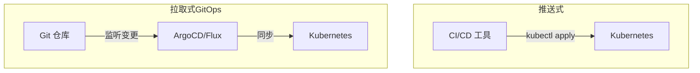
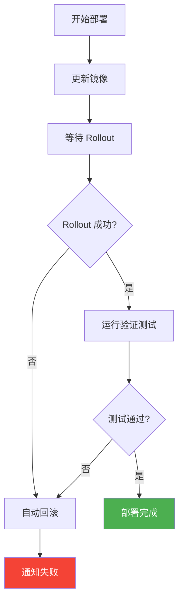
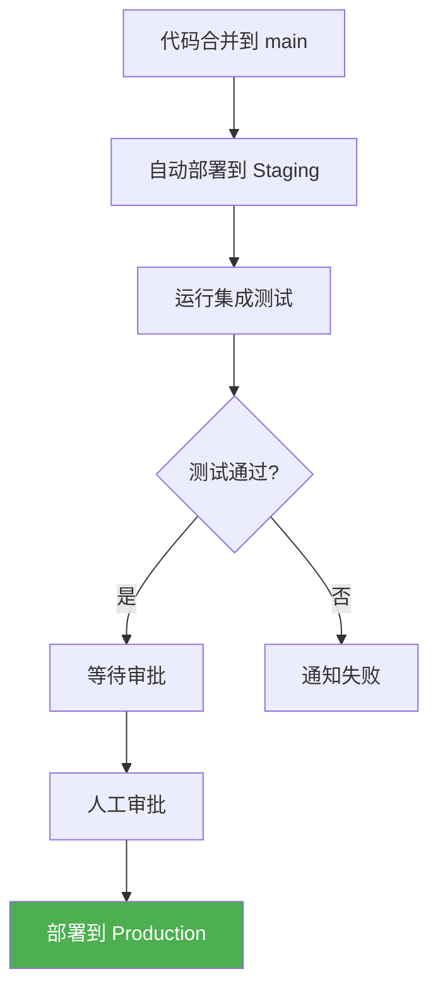

# 部署到 Kubernetes

本节学习如何将 CI/CD 流水线与 Kubernetes 集成，实现自动化部署。

## 前置知识

> 💡 阅读本章前，请确保已完成：
> - [GitHub Actions](/ops/kubernetes/cicd/github-actions) - 掌握 CI/CD 工作流配置
> - [Deployment 详解](/ops/kubernetes/workloads/deployment) - 理解 Deployment 概念

## 部署方式概览



| 方式 | 工具 | 特点 |
|------|------|------|
| 推送式 | kubectl, Helm | 简单直接，适合入门 |
| GitOps | ArgoCD, Flux | 声明式，可追溯，生产推荐 |

本教程使用 **kubectl 推送式** 部署，适合学习和小型项目。

## Kubernetes 清单文件

### 目录结构

```
k8s/
├── base/
│   ├── deployment.yaml
│   ├── service.yaml
│   └── kustomization.yaml
└── overlays/
    ├── staging/
    │   └── kustomization.yaml
    └── production/
        └── kustomization.yaml
```

### Deployment 配置

```yaml
# k8s/base/deployment.yaml
apiVersion: apps/v1
kind: Deployment
metadata:
  name: myapp
  labels:
    app: myapp
spec:
  replicas: 3
  selector:
    matchLabels:
      app: myapp
  template:
    metadata:
      labels:
        app: myapp
    spec:
      containers:
      - name: myapp
        image: username/myapp:latest    # 镜像会被 CI/CD 更新
        ports:
        - containerPort: 3000
        resources:
          requests:
            cpu: 100m
            memory: 128Mi
          limits:
            cpu: 500m
            memory: 512Mi
        livenessProbe:
          httpGet:
            path: /health
            port: 3000
          initialDelaySeconds: 10
          periodSeconds: 10
        readinessProbe:
          httpGet:
            path: /ready
            port: 3000
          initialDelaySeconds: 5
          periodSeconds: 5
```

### Service 配置

```yaml
# k8s/base/service.yaml
apiVersion: v1
kind: Service
metadata:
  name: myapp
spec:
  selector:
    app: myapp
  ports:
  - port: 80
    targetPort: 3000
  type: ClusterIP
```

## 配置 kubectl 访问

### 方式 1：使用 kubeconfig

```yaml
# GitHub Actions 中配置
steps:
  - name: Configure kubectl
    run: |
      mkdir -p ~/.kube
      echo "${{ secrets.KUBE_CONFIG }}" | base64 -d > ~/.kube/config
```

生成 KUBE_CONFIG Secret：

```bash
# 将 kubeconfig 编码为 base64
cat ~/.kube/config | base64 -w 0
```

### 方式 2：使用云服务商 Action

```yaml
# Azure AKS
- uses: azure/aks-set-context@v3
  with:
    resource-group: myResourceGroup
    cluster-name: myAKSCluster

# AWS EKS
- uses: aws-actions/configure-aws-credentials@v4
  with:
    aws-access-key-id: ${{ secrets.AWS_ACCESS_KEY_ID }}
    aws-secret-access-key: ${{ secrets.AWS_SECRET_ACCESS_KEY }}
    aws-region: us-east-1

- run: aws eks update-kubeconfig --name my-cluster

# GCP GKE
- uses: google-github-actions/get-gke-credentials@v2
  with:
    cluster_name: my-cluster
    location: us-central1
```

## 部署策略

### 1. 直接更新镜像

最简单的方式，适合开发环境：

```yaml
- name: Deploy
  run: |
    kubectl set image deployment/myapp \
      myapp=username/myapp:${{ github.sha }}
```

### 2. 应用完整清单

```yaml
- name: Deploy
  run: |
    # 替换镜像标签
    sed -i "s|image:.*|image: username/myapp:${{ github.sha }}|" k8s/deployment.yaml

    # 应用配置
    kubectl apply -f k8s/
```

### 3. 使用 Kustomize

```yaml
# k8s/base/kustomization.yaml
apiVersion: kustomize.config.k8s.io/v1beta1
kind: Kustomization

resources:
  - deployment.yaml
  - service.yaml
```

```yaml
# k8s/overlays/production/kustomization.yaml
apiVersion: kustomize.config.k8s.io/v1beta1
kind: Kustomization

resources:
  - ../../base

images:
  - name: username/myapp
    newTag: latest    # 会被 CI/CD 替换

replicas:
  - name: myapp
    count: 5
```

```yaml
# GitHub Actions
- name: Deploy with Kustomize
  run: |
    cd k8s/overlays/production
    kustomize edit set image username/myapp=username/myapp:${{ github.sha }}
    kubectl apply -k .
```

## 部署验证

### 等待 Rollout 完成

```yaml
- name: Wait for deployment
  run: |
    kubectl rollout status deployment/myapp --timeout=300s
```

### 验证部署健康

```yaml
- name: Verify deployment
  run: |
    # 检查 Pod 状态
    kubectl get pods -l app=myapp

    # 检查 Pod 是否 Ready
    kubectl wait --for=condition=ready pod -l app=myapp --timeout=120s

    # 检查副本数
    READY=$(kubectl get deployment myapp -o jsonpath='{.status.readyReplicas}')
    DESIRED=$(kubectl get deployment myapp -o jsonpath='{.spec.replicas}')

    if [ "$READY" != "$DESIRED" ]; then
      echo "Deployment not healthy: $READY/$DESIRED ready"
      exit 1
    fi
```

### 运行冒烟测试

```yaml
- name: Smoke test
  run: |
    # 端口转发
    kubectl port-forward svc/myapp 8080:80 &
    sleep 5

    # 健康检查
    curl -f http://localhost:8080/health || exit 1

    # 清理
    pkill -f "port-forward"
```

## 回滚机制

### 自动回滚

```yaml
- name: Deploy with auto-rollback
  run: |
    # 记录当前版本
    CURRENT_IMAGE=$(kubectl get deployment myapp -o jsonpath='{.spec.template.spec.containers[0].image}')

    # 更新镜像
    kubectl set image deployment/myapp myapp=username/myapp:${{ github.sha }}

    # 等待 rollout，失败则回滚
    if ! kubectl rollout status deployment/myapp --timeout=300s; then
      echo "Deployment failed, rolling back..."
      kubectl rollout undo deployment/myapp
      exit 1
    fi
```

### 部署流程图



## 完整部署工作流

```yaml
# .github/workflows/deploy.yml
name: Deploy to Kubernetes

on:
  push:
    branches: [main]

env:
  REGISTRY: docker.io
  IMAGE_NAME: myapp

jobs:
  build:
    runs-on: ubuntu-latest
    outputs:
      image-tag: ${{ steps.meta.outputs.tags }}

    steps:
    - uses: actions/checkout@v4

    - uses: docker/setup-buildx-action@v3

    - uses: docker/login-action@v3
      with:
        username: ${{ secrets.DOCKERHUB_USERNAME }}
        password: ${{ secrets.DOCKERHUB_TOKEN }}

    - id: meta
      uses: docker/metadata-action@v5
      with:
        images: ${{ env.REGISTRY }}/${{ secrets.DOCKERHUB_USERNAME }}/${{ env.IMAGE_NAME }}
        tags: type=sha

    - uses: docker/build-push-action@v5
      with:
        context: .
        push: true
        tags: ${{ steps.meta.outputs.tags }}
        cache-from: type=gha
        cache-to: type=gha,mode=max

  deploy:
    needs: build
    runs-on: ubuntu-latest
    environment: production

    steps:
    - uses: actions/checkout@v4

    - uses: azure/setup-kubectl@v3

    - name: Configure kubectl
      run: |
        mkdir -p ~/.kube
        echo "${{ secrets.KUBE_CONFIG }}" | base64 -d > ~/.kube/config

    - name: Deploy
      run: |
        kubectl set image deployment/myapp \
          myapp=${{ needs.build.outputs.image-tag }}

    - name: Wait for rollout
      run: |
        kubectl rollout status deployment/myapp --timeout=300s

    - name: Verify deployment
      run: |
        kubectl get pods -l app=myapp
        kubectl wait --for=condition=ready pod -l app=myapp --timeout=120s

    - name: Rollback on failure
      if: failure()
      run: |
        kubectl rollout undo deployment/myapp
        echo "::error::Deployment failed, rolled back to previous version"
```

## 环境管理

### 多环境部署

```yaml
jobs:
  deploy-staging:
    runs-on: ubuntu-latest
    environment: staging
    steps:
      - name: Deploy to staging
        run: kubectl apply -k k8s/overlays/staging

  deploy-production:
    needs: deploy-staging
    runs-on: ubuntu-latest
    environment: production
    steps:
      - name: Deploy to production
        run: kubectl apply -k k8s/overlays/production
```

### 环境保护规则

在 GitHub 仓库设置中配置：

1. Settings → Environments → New environment
2. 配置保护规则：
   - Required reviewers（需要审批）
   - Wait timer（等待时间）
   - Deployment branches（限制分支）



## 部署通知

### Slack 通知

```yaml
- name: Notify Slack
  if: always()
  uses: 8398a7/action-slack@v3
  with:
    status: ${{ job.status }}
    fields: repo,message,commit,author,action,eventName,ref,workflow
  env:
    SLACK_WEBHOOK_URL: ${{ secrets.SLACK_WEBHOOK }}
```

### 部署状态徽章

在 README.md 中添加：

```markdown

```

## 实战练习

### 完整示例项目结构

```
myapp/
├── .github/
│   └── workflows/
│       └── ci-cd.yml
├── k8s/
│   ├── deployment.yaml
│   └── service.yaml
├── src/
│   └── index.js
├── Dockerfile
├── package.json
└── README.md
```

### 部署清单

```yaml
# k8s/deployment.yaml
apiVersion: apps/v1
kind: Deployment
metadata:
  name: myapp
spec:
  replicas: 2
  selector:
    matchLabels:
      app: myapp
  template:
    metadata:
      labels:
        app: myapp
    spec:
      containers:
      - name: myapp
        image: username/myapp:latest
        ports:
        - containerPort: 3000
        env:
        - name: NODE_ENV
          value: production
---
apiVersion: v1
kind: Service
metadata:
  name: myapp
spec:
  selector:
    app: myapp
  ports:
  - port: 80
    targetPort: 3000
  type: LoadBalancer
```

### 本地测试部署

```bash
# 1. 构建镜像
docker build -t myapp:test .

# 2. 加载到 Minikube
minikube image load myapp:test

# 3. 更新清单中的镜像
sed -i 's|username/myapp:latest|myapp:test|' k8s/deployment.yaml

# 4. 部署
kubectl apply -f k8s/

# 5. 验证
kubectl get pods
kubectl get svc

# 6. 访问应用（Minikube）
minikube service myapp
```

## 小结

- **kubectl** 是最简单的部署方式，适合学习
- 配置 **kubeconfig** 或使用云服务商 Action 连接集群
- 使用 **rollout status** 等待部署完成
- 实现 **自动回滚** 保证部署安全
- **环境保护** 确保生产部署可控
- 添加 **通知** 及时了解部署状态

## 下一步

恭喜你完成了 CI/CD 章节！现在你已经掌握了从代码到部署的完整流程。

建议接下来：
1. 在实际项目中实践 CI/CD 流水线
2. 探索 GitOps 工具（ArgoCD、Flux）
3. 学习 Kubernetes 监控和日志

[返回 Kubernetes 教程首页](/ops/kubernetes/)
