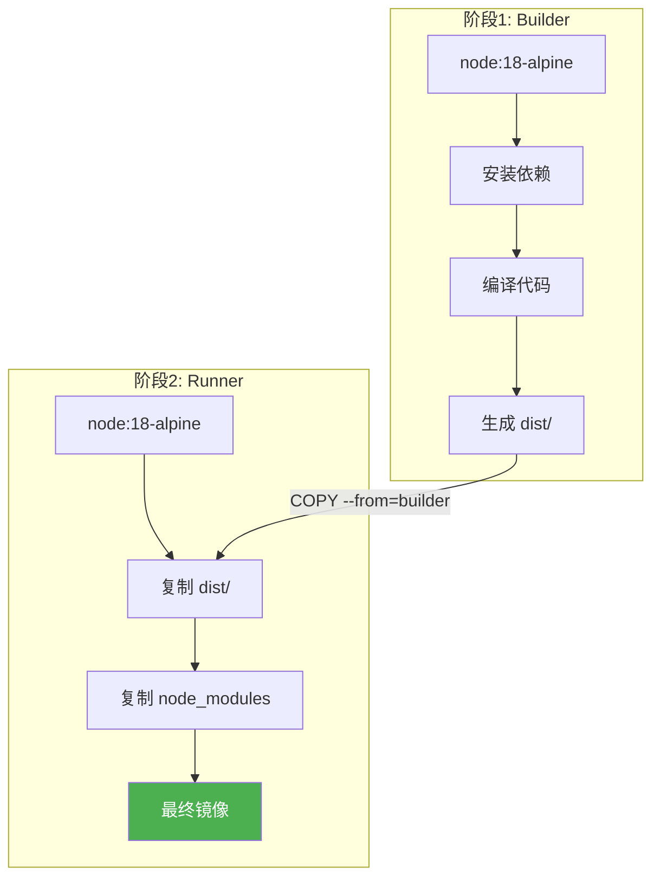

# Docker 镜像构建

Docker 镜像是 Kubernetes 部署的基础。本节学习如何编写高质量的 Dockerfile。

## 前置知识

> 💡 阅读本章前，请确保已完成：
> - [CI/CD 概览](/ops/kubernetes/cicd/overview) - 理解 CI/CD 基本概念

## Dockerfile 基础

### 什么是 Dockerfile

> 💡 **类比**：Dockerfile 就像"菜谱"，描述如何从原材料制作出成品

**Dockerfile** 是一个文本文件，包含构建 Docker 镜像的所有指令。

### 基本结构

```dockerfile
# 基础镜像
FROM node:18-alpine

# 设置工作目录
WORKDIR /app

# 复制依赖文件
COPY package*.json ./

# 安装依赖
RUN npm install

# 复制源代码
COPY . .

# 暴露端口
EXPOSE 3000

# 启动命令
CMD ["npm", "start"]
```

### 常用指令

| 指令 | 说明 | 示例 |
|------|------|------|
| `FROM` | 指定基础镜像 | `FROM node:18-alpine` |
| `WORKDIR` | 设置工作目录 | `WORKDIR /app` |
| `COPY` | 复制文件 | `COPY . .` |
| `RUN` | 执行命令 | `RUN npm install` |
| `ENV` | 设置环境变量 | `ENV NODE_ENV=production` |
| `EXPOSE` | 声明端口 | `EXPOSE 3000` |
| `CMD` | 容器启动命令 | `CMD ["npm", "start"]` |
| `ENTRYPOINT` | 入口点 | `ENTRYPOINT ["node"]` |

## 构建镜像

### 基本构建命令

```bash
# 构建镜像
docker build -t myapp:v1 .

# 指定 Dockerfile 路径
docker build -t myapp:v1 -f Dockerfile.prod .

# 构建时传递参数
docker build --build-arg NODE_ENV=production -t myapp:v1 .
```

### 查看和管理镜像

```bash
# 查看本地镜像
docker images

# 查看镜像详情
docker inspect myapp:v1

# 删除镜像
docker rmi myapp:v1

# 清理悬空镜像
docker image prune
```

## 多阶段构建

### 为什么需要多阶段构建

单阶段构建的问题：

```dockerfile
# 单阶段构建 - 镜像很大
FROM node:18

WORKDIR /app
COPY . .
RUN npm install
RUN npm run build

# 镜像包含了构建工具、源码、node_modules
# 实际只需要构建产物
CMD ["node", "dist/main.js"]
```

### 多阶段构建示例

```dockerfile
# 阶段 1：构建
FROM node:18-alpine AS builder

WORKDIR /app
COPY package*.json ./
RUN npm ci
COPY . .
RUN npm run build

# 阶段 2：运行
FROM node:18-alpine AS runner

WORKDIR /app

# 只复制需要的文件
COPY --from=builder /app/dist ./dist
COPY --from=builder /app/node_modules ./node_modules
COPY --from=builder /app/package.json ./

EXPOSE 3000
CMD ["node", "dist/main.js"]
```

### 多阶段构建流程



### 镜像大小对比

| 构建方式 | 镜像大小 |
|----------|----------|
| 单阶段构建 | ~1.2 GB |
| 多阶段构建 | ~200 MB |
| 多阶段 + Alpine | ~100 MB |

## Dockerfile 最佳实践

### 1. 使用精简基础镜像

```dockerfile
# ❌ 不推荐 - 镜像大
FROM node:18

# ✅ 推荐 - Alpine 镜像小
FROM node:18-alpine

# ✅ 生产环境 - 使用 slim
FROM node:18-slim
```

### 2. 优化层缓存

```dockerfile
# ❌ 不推荐 - 每次代码变更都重新安装依赖
COPY . .
RUN npm install

# ✅ 推荐 - 利用缓存，依赖不变则不重装
COPY package*.json ./
RUN npm install
COPY . .
```

### 3. 合并 RUN 命令

```dockerfile
# ❌ 不推荐 - 多层
RUN apt-get update
RUN apt-get install -y curl
RUN apt-get clean

# ✅ 推荐 - 单层
RUN apt-get update && \
    apt-get install -y curl && \
    apt-get clean && \
    rm -rf /var/lib/apt/lists/*
```

### 4. 使用 .dockerignore

```text
# .dockerignore
node_modules
npm-debug.log
Dockerfile
.dockerignore
.git
.gitignore
README.md
.env
coverage
.nyc_output
```

### 5. 不以 root 运行

```dockerfile
FROM node:18-alpine

# 创建非 root 用户
RUN addgroup -g 1001 -S nodejs && \
    adduser -S nextjs -u 1001

WORKDIR /app
COPY --chown=nextjs:nodejs . .

# 切换用户
USER nextjs

CMD ["node", "server.js"]
```

### 6. 使用特定版本标签

```dockerfile
# ❌ 不推荐 - latest 不确定
FROM node:latest

# ✅ 推荐 - 指定版本
FROM node:18.19.0-alpine3.19
```

## 不同语言示例

### Node.js 应用

```dockerfile
FROM node:18-alpine AS builder
WORKDIR /app
COPY package*.json ./
RUN npm ci --only=production
COPY . .
RUN npm run build

FROM node:18-alpine
WORKDIR /app
COPY --from=builder /app/dist ./dist
COPY --from=builder /app/node_modules ./node_modules
EXPOSE 3000
CMD ["node", "dist/index.js"]
```

### Python 应用

```dockerfile
FROM python:3.11-slim AS builder
WORKDIR /app
COPY requirements.txt .
RUN pip install --user -r requirements.txt
COPY . .

FROM python:3.11-slim
WORKDIR /app
COPY --from=builder /root/.local /root/.local
COPY --from=builder /app .
ENV PATH=/root/.local/bin:$PATH
EXPOSE 8000
CMD ["python", "app.py"]
```

### Go 应用

```dockerfile
FROM golang:1.21-alpine AS builder
WORKDIR /app
COPY go.* ./
RUN go mod download
COPY . .
RUN CGO_ENABLED=0 GOOS=linux go build -o main .

FROM alpine:3.19
RUN apk --no-cache add ca-certificates
WORKDIR /root/
COPY --from=builder /app/main .
EXPOSE 8080
CMD ["./main"]
```

## 实战练习

### 构建 Node.js 应用镜像

1. 创建示例应用：

```javascript
// server.js
const http = require('http');

const server = http.createServer((req, res) => {
  res.writeHead(200, { 'Content-Type': 'text/plain' });
  res.end('Hello from Docker!\n');
});

server.listen(3000, () => {
  console.log('Server running on port 3000');
});
```

```json
// package.json
{
  "name": "docker-demo",
  "version": "1.0.0",
  "main": "server.js",
  "scripts": {
    "start": "node server.js"
  }
}
```

2. 创建 Dockerfile：

```dockerfile
FROM node:18-alpine
WORKDIR /app
COPY package*.json ./
RUN npm install --production
COPY server.js .
EXPOSE 3000
USER node
CMD ["npm", "start"]
```

3. 构建和运行：

```bash
# 构建镜像
docker build -t docker-demo:v1 .

# 运行容器
docker run -d -p 3000:3000 docker-demo:v1

# 测试
curl http://localhost:3000

# 查看镜像大小
docker images docker-demo:v1
```

## 镜像仓库

### 推送到 Docker Hub

```bash
# 登录
docker login

# 标记镜像
docker tag docker-demo:v1 username/docker-demo:v1

# 推送
docker push username/docker-demo:v1
```

### 使用私有仓库

```bash
# 标记为私有仓库地址
docker tag docker-demo:v1 registry.example.com/myapp:v1

# 推送到私有仓库
docker push registry.example.com/myapp:v1
```

## 小结

- **Dockerfile** 定义镜像构建步骤
- **多阶段构建** 减小镜像体积
- **最佳实践**：精简基础镜像、优化缓存、非 root 运行
- 使用 **.dockerignore** 排除不必要文件
- 使用**特定版本标签**确保可重复构建

## 下一步

掌握 Docker 镜像构建后，让我们学习如何用 GitHub Actions 自动化构建流程。

[下一节：GitHub Actions](/ops/kubernetes/cicd/github-actions)
