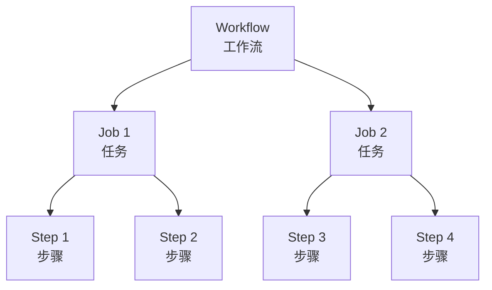
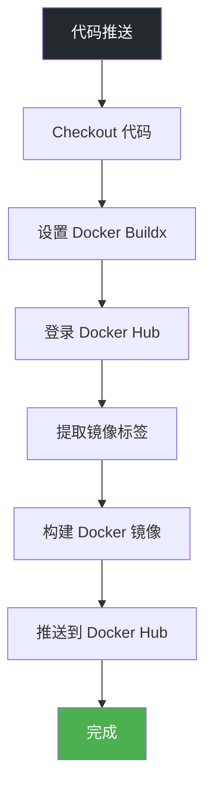
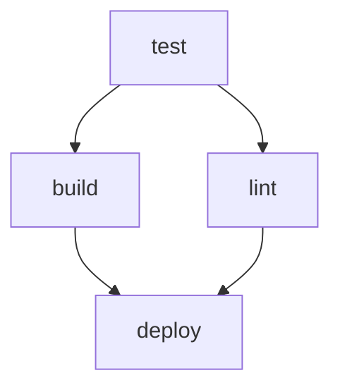

# GitHub Actions

**GitHub Actions** 是 GitHub 提供的 CI/CD 服务，可以自动化构建、测试和部署流程。

## 前置知识

> 💡 阅读本章前，请确保已完成：
> - [Docker 镜像构建](/ops/kubernetes/cicd/docker-build) - 掌握 Dockerfile 编写

## GitHub Actions 概念

### 核心概念



| 概念 | 说明 |
|------|------|
| **Workflow** | 工作流，一个自动化流程，定义在 YAML 文件中 |
| **Event** | 触发事件，如 push、pull_request |
| **Job** | 任务，包含多个步骤，可并行执行 |
| **Step** | 步骤，执行具体操作 |
| **Action** | 可复用的操作单元 |
| **Runner** | 执行任务的虚拟机 |

### 工作流文件位置

```
.github/
└── workflows/
    ├── ci.yml           # CI 工作流
    ├── cd.yml           # CD 工作流
    └── release.yml      # 发布工作流
```

## 基础工作流

### 最简示例

```yaml
# .github/workflows/ci.yml
name: CI

# 触发条件
on:
  push:
    branches: [main]
  pull_request:
    branches: [main]

# 任务定义
jobs:
  build:
    runs-on: ubuntu-latest

    steps:
    - name: Checkout code
      uses: actions/checkout@v4

    - name: Run tests
      run: echo "Running tests..."
```

### 触发事件

```yaml
on:
  # 推送时触发
  push:
    branches: [main, develop]
    paths:
      - 'src/**'          # 只有 src 目录变更才触发

  # PR 时触发
  pull_request:
    branches: [main]

  # 定时触发
  schedule:
    - cron: '0 0 * * *'   # 每天 UTC 0点

  # 手动触发
  workflow_dispatch:
    inputs:
      environment:
        description: 'Deploy environment'
        required: true
        default: 'staging'
```

## Node.js CI 工作流

```yaml
# .github/workflows/ci.yml
name: Node.js CI

on:
  push:
    branches: [main]
  pull_request:
    branches: [main]

jobs:
  test:
    runs-on: ubuntu-latest

    strategy:
      matrix:
        node-version: [18.x, 20.x]

    steps:
    - name: Checkout
      uses: actions/checkout@v4

    - name: Setup Node.js ${{ matrix.node-version }}
      uses: actions/setup-node@v4
      with:
        node-version: ${{ matrix.node-version }}
        cache: 'npm'

    - name: Install dependencies
      run: npm ci

    - name: Run linter
      run: npm run lint

    - name: Run tests
      run: npm test

    - name: Build
      run: npm run build
```

## Docker 构建工作流

### 构建并推送到 Docker Hub

```yaml
# .github/workflows/docker.yml
name: Docker Build

on:
  push:
    branches: [main]
    tags: ['v*']

env:
  REGISTRY: docker.io
  IMAGE_NAME: ${{ github.repository }}

jobs:
  build:
    runs-on: ubuntu-latest

    steps:
    - name: Checkout
      uses: actions/checkout@v4

    - name: Set up Docker Buildx
      uses: docker/setup-buildx-action@v3

    - name: Login to Docker Hub
      uses: docker/login-action@v3
      with:
        username: ${{ secrets.DOCKERHUB_USERNAME }}
        password: ${{ secrets.DOCKERHUB_TOKEN }}

    - name: Extract metadata
      id: meta
      uses: docker/metadata-action@v5
      with:
        images: ${{ env.REGISTRY }}/${{ env.IMAGE_NAME }}
        tags: |
          type=ref,event=branch
          type=semver,pattern={{version}}
          type=sha,prefix=

    - name: Build and push
      uses: docker/build-push-action@v5
      with:
        context: .
        push: true
        tags: ${{ steps.meta.outputs.tags }}
        labels: ${{ steps.meta.outputs.labels }}
        cache-from: type=gha
        cache-to: type=gha,mode=max
```

### 工作流可视化



## Secrets 管理

### 添加 Secrets

1. 进入 GitHub 仓库 → Settings → Secrets and variables → Actions
2. 点击 "New repository secret"
3. 添加以下 Secrets：

| Secret 名称 | 说明 |
|-------------|------|
| `DOCKERHUB_USERNAME` | Docker Hub 用户名 |
| `DOCKERHUB_TOKEN` | Docker Hub Access Token |
| `KUBE_CONFIG` | Kubernetes 配置文件 (base64) |

### 使用 Secrets

```yaml
steps:
  - name: Login to Docker Hub
    uses: docker/login-action@v3
    with:
      username: ${{ secrets.DOCKERHUB_USERNAME }}
      password: ${{ secrets.DOCKERHUB_TOKEN }}
```

> ⚠️ **安全提示**：
> - 永远不要在代码中硬编码敏感信息
> - 使用 Docker Hub Access Token 而非密码
> - 定期轮换 Secrets

## 环境变量

### 工作流级别

```yaml
env:
  NODE_ENV: production
  REGISTRY: docker.io

jobs:
  build:
    runs-on: ubuntu-latest
    steps:
      - run: echo $NODE_ENV
```

### Job 级别

```yaml
jobs:
  build:
    runs-on: ubuntu-latest
    env:
      DATABASE_URL: postgres://localhost:5432/test
```

### Step 级别

```yaml
steps:
  - name: Deploy
    env:
      API_KEY: ${{ secrets.API_KEY }}
    run: ./deploy.sh
```

## 条件执行

```yaml
jobs:
  deploy:
    runs-on: ubuntu-latest
    # 只在 main 分支执行
    if: github.ref == 'refs/heads/main'

    steps:
    - name: Deploy to production
      if: github.event_name == 'push'
      run: ./deploy.sh production

    - name: Deploy to staging
      if: github.event_name == 'pull_request'
      run: ./deploy.sh staging
```

## Job 依赖

```yaml
jobs:
  test:
    runs-on: ubuntu-latest
    steps:
      - run: npm test

  build:
    needs: test              # 依赖 test job
    runs-on: ubuntu-latest
    steps:
      - run: npm run build

  deploy:
    needs: [test, build]     # 依赖多个 job
    runs-on: ubuntu-latest
    steps:
      - run: ./deploy.sh
```

### 依赖关系图



## 构件管理

### 上传构件

```yaml
steps:
  - name: Build
    run: npm run build

  - name: Upload artifact
    uses: actions/upload-artifact@v4
    with:
      name: build-output
      path: dist/
      retention-days: 5
```

### 下载构件

```yaml
jobs:
  deploy:
    needs: build
    steps:
      - name: Download artifact
        uses: actions/download-artifact@v4
        with:
          name: build-output
          path: dist/
```

## 完整 CI/CD 工作流示例

```yaml
# .github/workflows/ci-cd.yml
name: CI/CD Pipeline

on:
  push:
    branches: [main]
  pull_request:
    branches: [main]

env:
  REGISTRY: docker.io
  IMAGE_NAME: myapp

jobs:
  # Job 1: 测试
  test:
    runs-on: ubuntu-latest
    steps:
    - uses: actions/checkout@v4

    - uses: actions/setup-node@v4
      with:
        node-version: '20'
        cache: 'npm'

    - run: npm ci
    - run: npm run lint
    - run: npm test

  # Job 2: 构建镜像
  build:
    needs: test
    runs-on: ubuntu-latest
    outputs:
      image-tag: ${{ steps.meta.outputs.tags }}

    steps:
    - uses: actions/checkout@v4

    - uses: docker/setup-buildx-action@v3

    - uses: docker/login-action@v3
      with:
        username: ${{ secrets.DOCKERHUB_USERNAME }}
        password: ${{ secrets.DOCKERHUB_TOKEN }}

    - id: meta
      uses: docker/metadata-action@v5
      with:
        images: ${{ env.REGISTRY }}/${{ secrets.DOCKERHUB_USERNAME }}/${{ env.IMAGE_NAME }}
        tags: |
          type=sha,prefix=

    - uses: docker/build-push-action@v5
      with:
        context: .
        push: ${{ github.event_name == 'push' }}
        tags: ${{ steps.meta.outputs.tags }}
        cache-from: type=gha
        cache-to: type=gha,mode=max

  # Job 3: 部署（仅 main 分支）
  deploy:
    needs: build
    runs-on: ubuntu-latest
    if: github.ref == 'refs/heads/main' && github.event_name == 'push'

    steps:
    - uses: actions/checkout@v4

    - name: Set up kubectl
      uses: azure/setup-kubectl@v3

    - name: Configure kubectl
      run: |
        mkdir -p ~/.kube
        echo "${{ secrets.KUBE_CONFIG }}" | base64 -d > ~/.kube/config

    - name: Deploy to Kubernetes
      run: |
        kubectl set image deployment/myapp \
          myapp=${{ needs.build.outputs.image-tag }}
```

## 调试工作流

### 查看运行日志

1. 进入仓库 → Actions 标签页
2. 点击具体的工作流运行
3. 展开各个步骤查看日志

### 启用调试日志

在仓库 Secrets 中添加：

| Secret | 值 |
|--------|-----|
| `ACTIONS_RUNNER_DEBUG` | `true` |
| `ACTIONS_STEP_DEBUG` | `true` |

### 本地测试

使用 [act](https://github.com/nektos/act) 在本地运行 GitHub Actions：

```bash
# 安装 act
brew install act

# 运行工作流
act push

# 运行特定 job
act -j build
```

## 小结

- **Workflow** 定义在 `.github/workflows/` 目录
- **Event** 触发工作流执行（push、PR、定时等）
- **Secrets** 安全存储敏感信息
- **Matrix** 支持多版本/多平台并行测试
- **Artifacts** 在 Job 间共享文件

## 下一步

掌握 GitHub Actions 后，让我们学习如何将应用部署到 Kubernetes。

[下一节：部署到 K8s](/ops/kubernetes/cicd/deploy-to-k8s)
