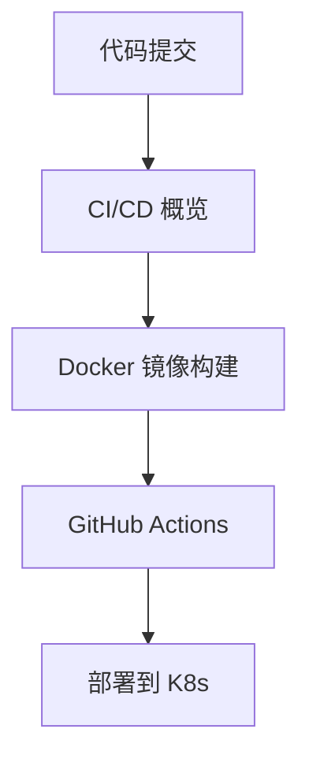

# CI/CD

本章帮助你构建完整的 CI/CD 流水线，实现从代码提交到 K8s 部署的自动化。

## 前置知识

> 💡 阅读本章前，请确保已完成：
> - [工作负载](/ops/kubernetes/workloads/) - 理解 Deployment 的使用
> - [配置与存储](/ops/kubernetes/storage/) - 理解配置管理

## 本章内容

**CI/CD**（Continuous Integration/Continuous Deployment，持续集成/持续部署）是 DevOps 的核心实践：

### 学习路径

1. **[CI/CD 概览](/ops/kubernetes/cicd/overview)** - 理解持续集成/持续部署的概念
2. **[Docker 镜像构建](/ops/kubernetes/cicd/docker-build)** - 构建高效的容器镜像
3. **[GitHub Actions](/ops/kubernetes/cicd/github-actions)** - 配置自动化工作流
4. **[部署到 K8s](/ops/kubernetes/cicd/deploy-to-k8s)** - 实现自动化部署

## 学习目标

完成本章后，你将能够：

- 理解 CI/CD 的概念和价值
- 编写高效的 Dockerfile
- 配置 GitHub Actions 工作流
- 实现代码提交后自动部署到 K8s

## 预计时间

约 1.5-2 小时

## 下一步

首先了解 CI/CD 的基本概念。

[开始：CI/CD 概览](/ops/kubernetes/cicd/overview)
