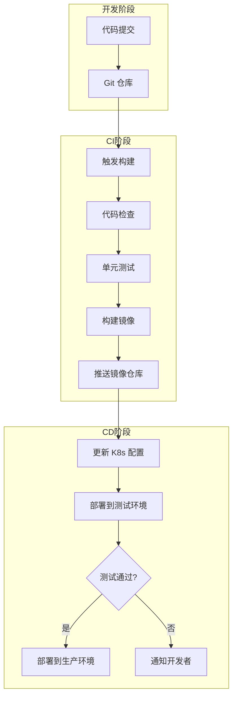
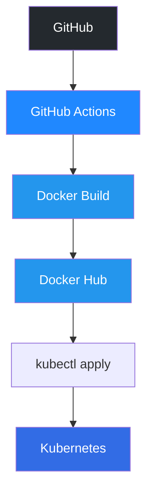
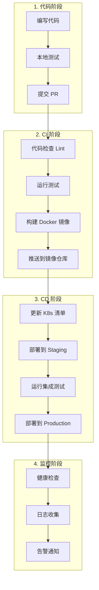
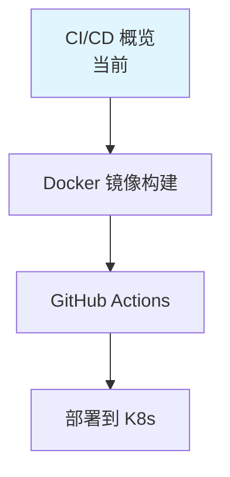

# CI/CD 概览

**CI/CD**（持续集成/持续部署）是云原生开发的核心实践，实现代码提交到生产部署的自动化。

## 前置知识

> 💡 阅读本章前，请确保已完成：
> - [Deployment 详解](/ops/kubernetes/workloads/deployment) - 理解 Deployment 管理
> - [持久化存储](/ops/kubernetes/storage/persistent-volume) - 理解配置和存储

## 什么是 CI/CD

### CI（持续集成）

> 💡 **类比**：CI 就像"自动化质检流水线"，每次代码变更都自动检测

**Continuous Integration**（持续集成）：
- 开发者频繁合并代码到主分支
- 每次合并自动触发构建和测试
- 快速发现和修复问题

### CD（持续部署/交付）

> 💡 **类比**：CD 就像"自动化物流系统"，产品检验合格后自动发货

**Continuous Delivery**（持续交付）：
- 代码随时可以部署到生产环境
- 需要手动触发部署

**Continuous Deployment**（持续部署）：
- 代码自动部署到生产环境
- 完全自动化，无需人工干预

## 云原生 CI/CD 架构

## CI/CD 工具生态

### CI 工具

| 工具 | 类型 | 特点 |
|------|------|------|
| GitHub Actions | 云服务 | GitHub 原生，配置简单 |
| GitLab CI | 云服务/自托管 | GitLab 集成，功能全面 |
| Jenkins | 自托管 | 插件丰富，高度可定制 |
| CircleCI | 云服务 | 快速，并行构建 |

### CD 工具

| 工具 | 类型 | 特点 |
|------|------|------|
| ArgoCD | GitOps | 声明式，K8s 原生 |
| Flux | GitOps | 轻量级，CNCF 项目 |
| Spinnaker | 多云 | Netflix 开源，企业级 |
| kubectl | 命令行 | 简单直接，适合入门 |

## 本教程技术栈

我们将使用以下工具构建 CI/CD 流水线：

### 选择理由

| 工具 | 选择原因 |
|------|----------|
| GitHub Actions | 免费、配置简单、与 GitHub 深度集成 |
| Docker | 容器标准、广泛支持 |
| Docker Hub | 免费公开镜像仓库 |
| kubectl | 简单直接，适合学习 |

## CI/CD 流水线流程

### 完整流程示意

### 各阶段详解

#### 1. 代码阶段

- **编写代码**：开发新功能或修复 Bug
- **本地测试**：在开发环境验证
- **提交 PR**：创建 Pull Request 进行代码审查

#### 2. CI 阶段

- **代码检查**：ESLint、Prettier、静态分析
- **运行测试**：单元测试、集成测试
- **构建镜像**：打包应用为 Docker 镜像
- **推送镜像**：上传到镜像仓库

#### 3. CD 阶段

- **更新配置**：修改 K8s Deployment 的镜像版本
- **部署测试**：先部署到 Staging 环境
- **集成测试**：运行端到端测试
- **生产部署**：部署到 Production 环境

#### 4. 监控阶段

- **健康检查**：验证服务正常运行
- **日志收集**：收集应用日志
- **告警通知**：异常时发送通知

## 本章学习路径

| 章节 | 内容 |
|------|------|
| [Docker 镜像构建](/ops/kubernetes/cicd/docker-build) | Dockerfile 编写、多阶段构建 |
| [GitHub Actions](/ops/kubernetes/cicd/github-actions) | 工作流配置、自动化构建 |
| [部署到 K8s](/ops/kubernetes/cicd/deploy-to-k8s) | kubectl 自动化、部署策略 |

## 小结

- **CI** 实现代码的自动化构建和测试
- **CD** 实现应用的自动化部署
- 云原生 CI/CD 以 **容器** 和 **K8s** 为核心
- 本教程使用 **GitHub Actions + Docker + kubectl** 构建流水线

## 下一步

了解 CI/CD 概念后，让我们从 Docker 镜像构建开始实践。

[下一节：Docker 镜像构建](/ops/kubernetes/cicd/docker-build)
