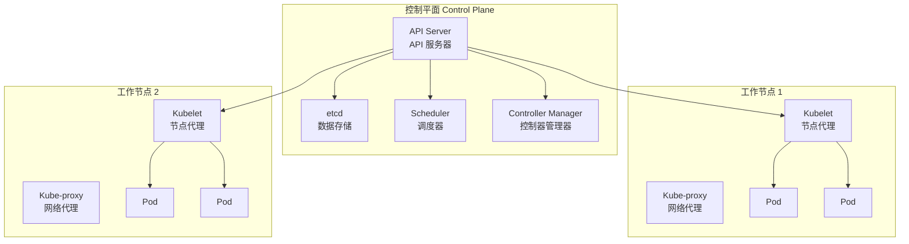
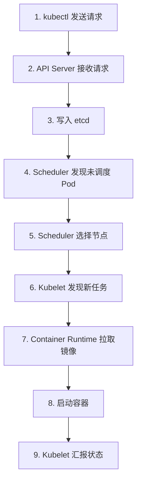

# 架构概览

本节帮助你理解 Kubernetes 集群的整体架构，了解各个组件如何协作。

## 前置知识

> 💡 阅读本章前，请确保已完成：
> - [K8s 是什么](/ops/kubernetes/concepts/what-is-k8s) - 理解 K8s 的作用

## K8s 集群架构

一个 Kubernetes 集群由两部分组成：

1. **控制平面（Control Plane）**：集群的"大脑"，负责决策和管理
2. **工作节点（Worker Node）**：集群的"手脚"，负责实际运行容器



## 控制平面组件

控制平面负责集群的全局决策和事件响应。

### 1. API Server（API 服务器）

> 💡 **类比**：餐厅的前台接待，所有请求都要经过它

**API Server**（API 服务器，K8s 的 RESTful API 入口）是控制平面的前端，负责：

- 接收所有的 API 请求
- 验证请求的合法性
- 处理请求并更新 etcd

```bash
# 所有 kubectl 命令都是通过 API Server 执行的
kubectl get pods  # 实际上是调用 API Server 的 /api/v1/pods
```

### 2. etcd（数据存储）

> 💡 **类比**：餐厅的账本，记录所有订单和员工信息

**etcd**（分布式键值存储，K8s 的"数据库"）负责：

- 存储集群的所有配置数据
- 存储集群的当前状态
- 提供可靠的分布式存储

### 3. Scheduler（调度器）

> 💡 **类比**：餐厅的排班经理，决定谁干什么活

**Scheduler**（调度器，决定 Pod 运行在哪个节点）负责：

- 监听新创建但未分配节点的 Pod
- 根据资源需求、策略限制选择最优节点
- 将调度决策告知 API Server

### 4. Controller Manager（控制器管理器）

> 💡 **类比**：餐厅的各部门主管

**Controller Manager**（控制器管理器，运行各种控制器）包含多个控制器：

| 控制器 | 职责 |
|--------|------|
| Node Controller | 监控节点状态，节点故障时响应 |
| Replication Controller | 确保 Pod 副本数符合预期 |
| Endpoints Controller | 维护 Service 和 Pod 的关联 |
| Service Account Controller | 管理命名空间的默认账号 |

## 工作节点组件

工作节点运行实际的应用负载。

### 1. Kubelet（节点代理）

> 💡 **类比**：每个厨师身边的助手，确保厨师按要求工作

**Kubelet**（节点代理，确保容器在 Pod 中运行）负责：

- 接收 PodSpec
- 确保容器按规范运行
- 汇报节点和 Pod 状态

### 2. Kube-proxy（网络代理）

> 💡 **类比**：餐厅的传菜员，把菜送到正确的桌子

**Kube-proxy**（网络代理，维护节点上的网络规则）负责：

- 维护网络规则
- 实现 Service 的负载均衡
- 转发网络流量

### 3. Container Runtime（容器运行时）

> 💡 **类比**：厨房的灶台，实际做菜的地方

**Container Runtime**（容器运行时，如 containerd、Docker）负责：

- 拉取容器镜像
- 创建和运行容器
- 管理容器生命周期

## 组件协作流程

当你执行 `kubectl run nginx --image=nginx` 时：



## 核心概念映射

| 概念 | 作用 | 类比 |
|------|------|------|
| Cluster | 整个 K8s 系统 | 整个餐厅 |
| Control Plane | 管理决策 | 餐厅管理层 |
| Node | 运行容器的机器 | 厨房工作台 |
| Pod | 最小部署单元 | 一个菜品订单 |

## 小结

- K8s 集群由**控制平面**和**工作节点**组成
- **控制平面**负责全局决策：API Server、etcd、Scheduler、Controller Manager
- **工作节点**负责运行负载：Kubelet、Kube-proxy、Container Runtime
- 所有操作都通过 **API Server** 进行，数据存储在 **etcd** 中

## 下一步

了解了整体架构后，让我们深入学习 K8s 中最重要的概念——Pod。

[下一节：Pod 详解](/ops/kubernetes/concepts/pod)
