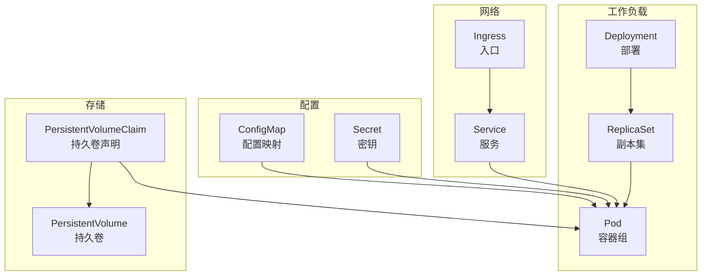
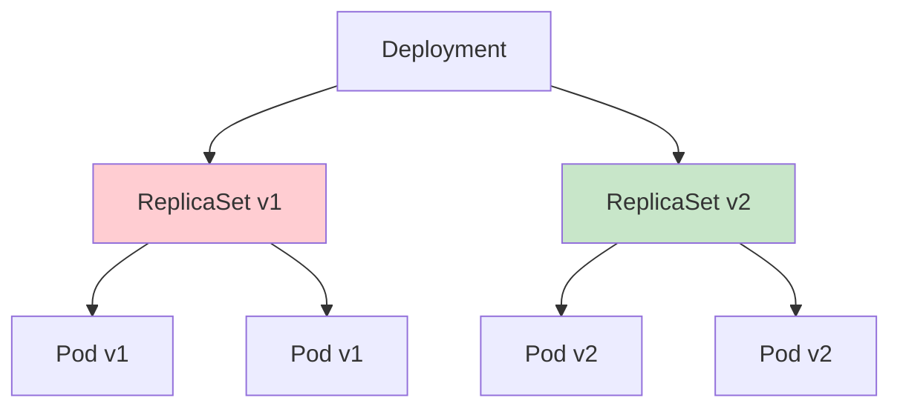
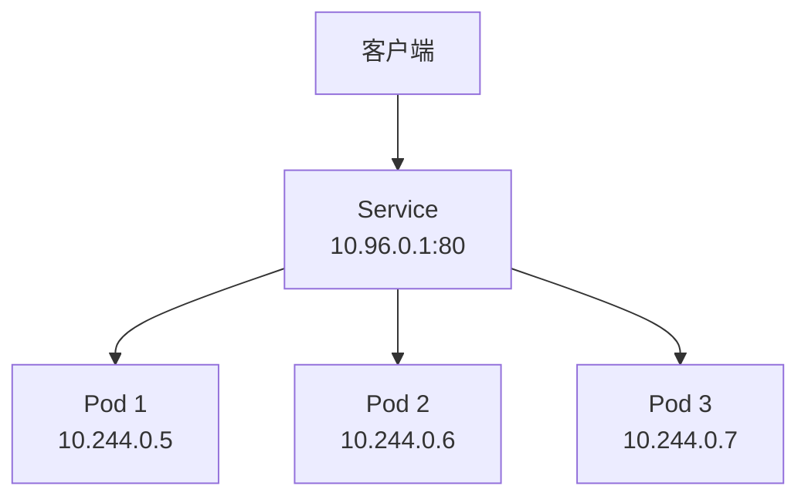
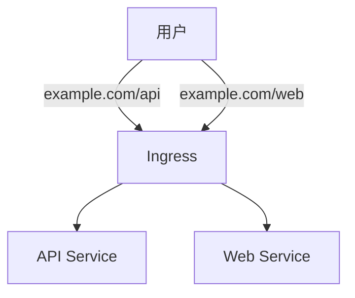
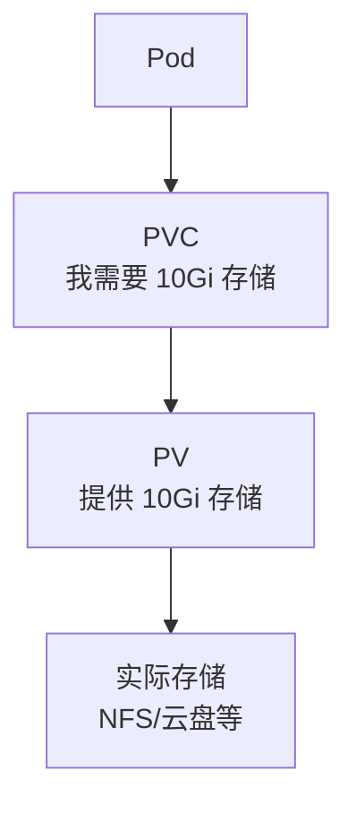

# 核心组件

本节帮助你认识 Kubernetes 的核心组件，理解它们各自的作用和相互关系。

## 前置知识

> 💡 阅读本章前，请确保已完成：
> - [Pod 生命周期](/ops/kubernetes/concepts/pod-lifecycle) - 理解 Pod 的生命周期

## 组件概览

K8s 有很多组件，但作为初学者，你需要重点掌握以下核心组件：



## 工作负载组件

### Pod（容器组）

> 💡 **类比**：一个房间，里面住着一个或多个室友（容器）

**Pod** 是 K8s 最小的部署单元，已在前面章节详细介绍。

### ReplicaSet（副本集）

> 💡 **类比**：确保餐厅始终有指定数量厨师在岗的规则

**ReplicaSet**（副本集，确保指定数量的 Pod 运行）负责：

- 维护指定数量的 Pod 副本
- Pod 挂掉时自动创建新的
- Pod 多了时自动删除

```yaml
apiVersion: apps/v1
kind: ReplicaSet
metadata:
  name: nginx-rs
spec:
  replicas: 3                # 期望副本数
  selector:
    matchLabels:
      app: nginx             # 选择管理的 Pod
  template:                  # Pod 模板
    metadata:
      labels:
        app: nginx
    spec:
      containers:
      - name: nginx
        image: nginx:1.21
```

> ⚠️ **注意**：实际使用中很少直接创建 ReplicaSet，而是使用 Deployment。

### Deployment（部署）

> 💡 **类比**：餐厅经理，不仅管理厨师数量，还负责培训新人（滚动更新）

**Deployment**（部署，声明式管理 Pod 和 ReplicaSet）是最常用的工作负载资源：

- 管理 ReplicaSet
- 支持滚动更新
- 支持版本回滚



```yaml
apiVersion: apps/v1
kind: Deployment
metadata:
  name: nginx-deployment
spec:
  replicas: 3
  selector:
    matchLabels:
      app: nginx
  template:
    metadata:
      labels:
        app: nginx
    spec:
      containers:
      - name: nginx
        image: nginx:1.21
```

## 网络组件

### Service（服务）

> 💡 **类比**：餐厅的前台，接待顾客并分配给空闲的厨师

**Service**（服务，为 Pod 提供稳定的访问入口）解决：

- Pod IP 不固定的问题
- 负载均衡
- 服务发现



Service 类型：

| 类型 | 说明 | 访问方式 |
|------|------|----------|
| ClusterIP | 集群内部访问（默认） | 集群内 IP |
| NodePort | 通过节点端口访问 | 节点IP:端口 |
| LoadBalancer | 云厂商负载均衡 | 外部 IP |

### Ingress（入口）

> 💡 **类比**：餐厅的门牌和路标，指引顾客去正确的位置

**Ingress**（入口，HTTP/HTTPS 路由规则）提供：

- 域名路由
- HTTPS 终止
- 路径重写



## 配置组件

### ConfigMap（配置映射）

> 💡 **类比**：餐厅的菜单配置，所有人都能看到

**ConfigMap**（配置映射，存储非敏感配置数据）用于：

- 环境变量
- 配置文件
- 命令行参数

```yaml
apiVersion: v1
kind: ConfigMap
metadata:
  name: app-config
data:
  DATABASE_URL: "mysql://localhost:3306"
  LOG_LEVEL: "info"
```

### Secret（密钥）

> 💡 **类比**：餐厅的保险柜，存放贵重物品

**Secret**（密钥，存储敏感数据）用于：

- 密码
- API 密钥
- 证书

```yaml
apiVersion: v1
kind: Secret
metadata:
  name: app-secret
type: Opaque
data:
  password: cGFzc3dvcmQxMjM=  # base64 编码
```

> ⚠️ **注意**：Secret 默认只是 base64 编码，不是加密。生产环境需要额外的安全措施。

## 存储组件

### PersistentVolume（持久卷）

> 💡 **类比**：餐厅的储物柜

**PersistentVolume**（持久卷，集群级别的存储资源）是管理员预先配置的存储。

### PersistentVolumeClaim（持久卷声明）

> 💡 **类比**：员工申请使用储物柜

**PersistentVolumeClaim**（持久卷声明，用户对存储的请求）是用户对存储的请求。



## 组件术语表

| 术语 | 中文名 | 简介 | 类比 |
|------|--------|------|------|
| Pod | 容器组 | 最小部署单元 | 合租公寓 |
| ReplicaSet | 副本集 | 维护 Pod 副本数 | 保持员工数量的规则 |
| Deployment | 部署 | 声明式管理 Pod | 餐厅经理 |
| Service | 服务 | 稳定的访问入口 | 前台接待 |
| Ingress | 入口 | HTTP 路由 | 门牌路标 |
| ConfigMap | 配置映射 | 非敏感配置 | 公开的菜单 |
| Secret | 密钥 | 敏感数据 | 保险柜 |
| PV | 持久卷 | 存储资源 | 储物柜 |
| PVC | 持久卷声明 | 存储请求 | 申请储物柜 |
| Namespace | 命名空间 | 资源隔离 | 餐厅的不同楼层 |

## 小结

- **工作负载**：Pod → ReplicaSet → Deployment（最常用）
- **网络**：Service（负载均衡）、Ingress（HTTP 路由）
- **配置**：ConfigMap（非敏感）、Secret（敏感）
- **存储**：PV（存储资源）、PVC（存储请求）

## 下一步

恭喜你完成了基础概念的学习！现在你已经对 K8s 有了整体认知。

接下来，让我们搭建本地环境，开始动手实践！

[下一章：环境搭建](/ops/kubernetes/setup/)
