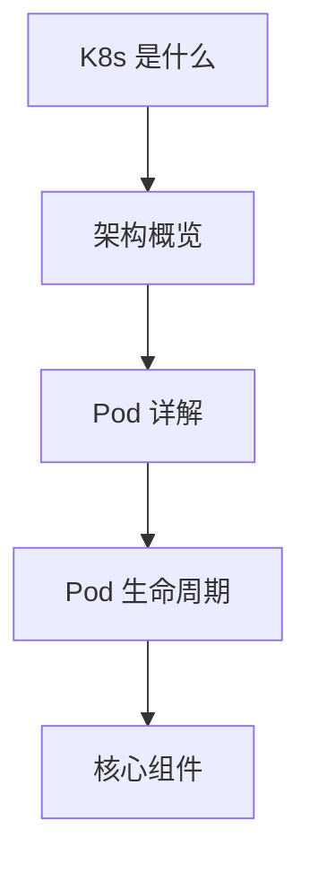

# 基础概念

本章帮助你理解 Kubernetes 的核心概念和工作原理，为后续的实践打下基础。

## 本章内容

在开始动手实践之前，我们需要先理解 K8s 的"世界观"：

### 学习路径

1. **[K8s 是什么](/ops/kubernetes/concepts/what-is-k8s)** - 了解 Kubernetes 解决什么问题，为什么需要它
2. **[架构概览](/ops/kubernetes/concepts/architecture)** - 理解 K8s 的整体架构，控制平面与工作节点
3. **[Pod 详解](/ops/kubernetes/concepts/pod)** - 深入理解 K8s 最小部署单元
4. **[Pod 生命周期](/ops/kubernetes/concepts/pod-lifecycle)** - 掌握 Pod 的状态转换
5. **[核心组件](/ops/kubernetes/concepts/components)** - 认识 K8s 的各个核心组件

## 学习目标

完成本章后，你将能够：

- 用自己的话解释 Kubernetes 是什么、解决什么问题
- 理解 K8s 集群的基本架构
- 解释 Pod 与容器的关系
- 描述 Pod 从创建到销毁的生命周期
- 列举并解释 K8s 的核心组件及其作用

## 预计时间

约 1-2 小时

## 下一步

准备好了吗？让我们从理解 K8s 是什么开始！

[开始学习：K8s 是什么](/ops/kubernetes/concepts/what-is-k8s)
