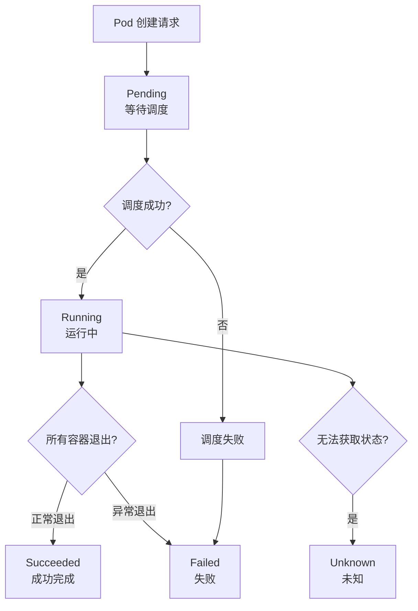
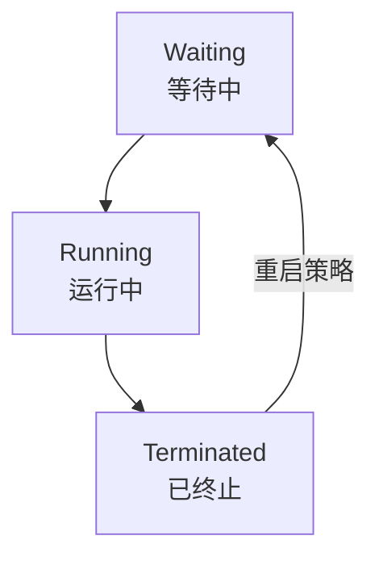
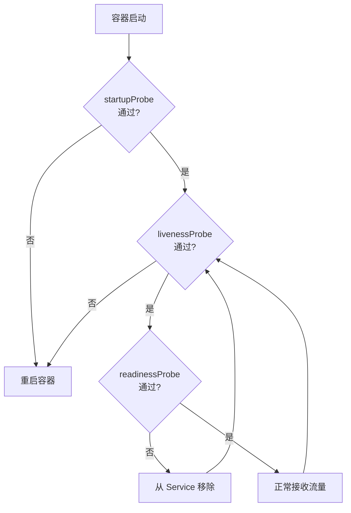

# Pod 生命周期

本节帮助你理解 Pod 从创建到销毁的完整生命周期。

## 前置知识

> 💡 阅读本章前，请确保已完成：
> - [Pod 详解](/ops/kubernetes/concepts/pod) - 理解 Pod 的基本概念

## Pod 的生命周期阶段

Pod 的生命周期有以下几个阶段（Phase）：



## 各阶段详解

### 1. Pending（等待中）

Pod 已被 Kubernetes 接受，但容器还未创建。可能原因：

| 原因 | 说明 |
|------|------|
| 等待调度 | Scheduler 正在选择节点 |
| 镜像拉取 | 正在从仓库下载镜像 |
| 资源不足 | 没有节点满足资源要求 |

```bash
# 查看 Pending 原因
kubectl describe pod <pod-name>
```

### 2. Running（运行中）

Pod 已绑定到节点，所有容器已创建，至少有一个容器正在运行。

> 💡 **注意**：Running 不等于"健康"。容器可能在运行但服务不可用。

### 3. Succeeded（成功）

Pod 中的所有容器都已成功终止（退出码为 0），不会重启。

常见于：
- 一次性任务（Job）
- 数据迁移脚本
- 批处理作业

### 4. Failed（失败）

Pod 中的所有容器都已终止，且至少有一个容器以非零状态退出。

```bash
# 查看容器退出码
kubectl get pod <pod-name> -o jsonpath='{.status.containerStatuses[0].state.terminated.exitCode}'
```

### 5. Unknown（未知）

无法获取 Pod 状态，通常是与节点通信失败。

## 容器状态

Pod 阶段是宏观状态，容器也有自己的微观状态：



### Waiting（等待中）

容器正在执行启动前的操作：
- 拉取镜像
- 应用 Secret
- 等待依赖

### Running（运行中）

容器正在执行中，没有问题。

### Terminated（已终止）

容器已经执行完毕或因故障停止：
- 正常完成（退出码 0）
- 出错退出（退出码非 0）
- 被 OOM 杀死

## 重启策略

Pod 的 `restartPolicy` 决定容器终止后的行为：

| 策略 | 说明 | 适用场景 |
|------|------|----------|
| `Always` | 总是重启（默认） | 长期运行的服务 |
| `OnFailure` | 失败时重启 | 批处理任务 |
| `Never` | 从不重启 | 一次性任务 |

```yaml
apiVersion: v1
kind: Pod
metadata:
  name: restart-demo
spec:
  restartPolicy: OnFailure   # 只在失败时重启
  containers:
  - name: demo
    image: busybox
    command: ['sh', '-c', 'exit 1']  # 模拟失败
```

## 健康检查探针

K8s 提供三种探针来检测容器健康状态：

### 1. livenessProbe（存活探针）

检测容器是否在运行。失败则**重启容器**。

```yaml
livenessProbe:
  httpGet:
    path: /healthz        # 健康检查端点
    port: 8080
  initialDelaySeconds: 3  # 启动后等待时间
  periodSeconds: 3        # 检查间隔
```

### 2. readinessProbe（就绪探针）

检测容器是否准备好接收流量。失败则**从 Service 中移除**。

```yaml
readinessProbe:
  httpGet:
    path: /ready
    port: 8080
  initialDelaySeconds: 5
  periodSeconds: 5
```

### 3. startupProbe（启动探针）

检测应用是否已启动。失败则**重启容器**。

```yaml
startupProbe:
  httpGet:
    path: /startup
    port: 8080
  failureThreshold: 30    # 最多失败 30 次
  periodSeconds: 10       # 每 10 秒检查一次
```

### 探针工作流程



## 常见探针配置

```yaml
apiVersion: v1
kind: Pod
metadata:
  name: probe-demo
spec:
  containers:
  - name: web
    image: nginx:1.21
    ports:
    - containerPort: 80

    # 存活探针：检测容器是否运行
    livenessProbe:
      httpGet:
        path: /
        port: 80
      initialDelaySeconds: 5   # 启动后 5 秒开始检查
      periodSeconds: 10        # 每 10 秒检查一次
      timeoutSeconds: 1        # 超时时间 1 秒
      failureThreshold: 3      # 连续失败 3 次则重启

    # 就绪探针：检测容器是否准备好接收流量
    readinessProbe:
      httpGet:
        path: /
        port: 80
      initialDelaySeconds: 5
      periodSeconds: 5
```

## 小结

- Pod 生命周期：**Pending → Running → Succeeded/Failed**
- 容器状态：**Waiting → Running → Terminated**
- 重启策略：**Always**（默认）、**OnFailure**、**Never**
- 三种探针：**liveness**（存活）、**readiness**（就绪）、**startup**（启动）

## 下一步

了解了 Pod 的生命周期后，让我们来认识 K8s 的其他核心组件。

[下一节：核心组件](/ops/kubernetes/concepts/components)
