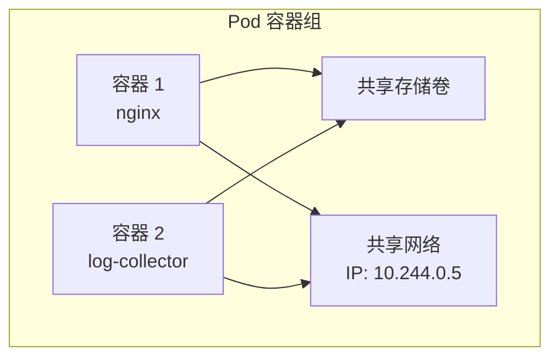
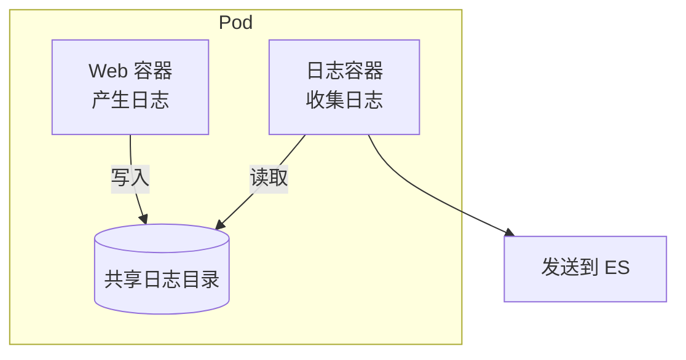
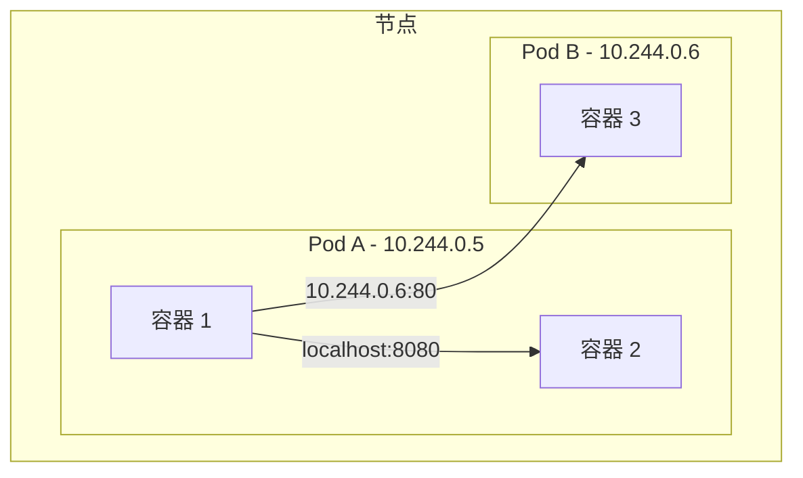

# Pod 详解

**Pod**（容器组，K8s 最小的可部署单元）是 Kubernetes 中最核心的概念。本节帮助你深入理解 Pod。

## 前置知识

> 💡 阅读本章前，请确保已完成：
> - [架构概览](/ops/kubernetes/concepts/architecture) - 理解 K8s 的整体架构

## 什么是 Pod？

**Pod** 是 Kubernetes 中最小的可部署和管理单元。

> 💡 **类比**：Pod 就像一个"合租公寓"，里面可以住一个或多个"室友"（容器）。这些室友：
> - 共享同一个地址（IP 地址）
> - 共享同一个冰箱（存储卷）
> - 可以直接喊话交流（localhost 通信）



## Pod 与容器的关系

| 特性 | 容器 | Pod |
|------|------|-----|
| 定位 | 打包应用的方式 | K8s 管理的最小单元 |
| 网络 | 独立网络命名空间 | 共享网络命名空间 |
| 存储 | 独立文件系统 | 可共享存储卷 |
| 数量 | - | 包含一个或多个容器 |

### 为什么需要 Pod？

为什么不直接管理容器？因为有些应用需要多个容器紧密协作：

**示例：Web 应用 + 日志收集器**



这种模式叫做 **Sidecar Pattern（边车模式）**。

## 创建 Pod

### Pod 定义文件

```yaml
# nginx-pod.yaml
apiVersion: v1              # API 版本：v1 是 Pod 的核心 API 版本
kind: Pod                   # 资源类型：Pod（容器组）
metadata:                   # 元数据部分
  name: nginx-pod           # Pod 名称，在命名空间内必须唯一
  labels:                   # 标签：用于组织和选择资源
    app: nginx              # 自定义标签键值对
spec:                       # 规格说明：定义 Pod 的期望状态
  containers:               # 容器列表（一个 Pod 可包含多个容器）
  - name: nginx             # 容器名称
    image: nginx:1.21       # 容器镜像（镜像名:版本标签）
    ports:                  # 端口列表
    - containerPort: 80     # 容器监听的端口号
```

### 常用 kubectl 命令

```bash
# 创建 Pod
kubectl apply -f nginx-pod.yaml

# 查看 Pod 列表
kubectl get pods

# 查看 Pod 详细信息
kubectl describe pod nginx-pod

# 查看 Pod 日志
kubectl logs nginx-pod

# 进入 Pod 容器
kubectl exec -it nginx-pod -- /bin/bash

# 删除 Pod
kubectl delete pod nginx-pod
```

## Pod 的网络

每个 Pod 都有一个唯一的 IP 地址：

- **Pod 内部**：容器之间通过 `localhost` 通信
- **Pod 之间**：通过 Pod IP 直接通信
- **外部访问**：需要通过 Service 暴露



## Pod 的存储

Pod 中的容器可以共享存储卷：

```yaml
apiVersion: v1
kind: Pod
metadata:
  name: shared-storage-pod
spec:
  containers:
  - name: writer              # 写入容器
    image: busybox
    command: ['sh', '-c', 'echo Hello > /data/hello.txt && sleep 3600']
    volumeMounts:             # 挂载存储卷
    - name: shared-data       # 存储卷名称
      mountPath: /data        # 挂载路径
  - name: reader              # 读取容器
    image: busybox
    command: ['sh', '-c', 'cat /data/hello.txt && sleep 3600']
    volumeMounts:
    - name: shared-data
      mountPath: /data
  volumes:                    # 定义存储卷
  - name: shared-data
    emptyDir: {}              # 空目录卷（Pod 删除后数据丢失）
```

## 单容器 vs 多容器 Pod

### 何时使用单容器 Pod

**大多数情况**下，一个 Pod 只运行一个容器。这是最常见的用法。

### 何时使用多容器 Pod

当容器之间需要**紧密协作**时：

| 模式 | 说明 | 示例 |
|------|------|------|
| Sidecar | 辅助主容器 | 日志收集、配置同步 |
| Ambassador | 代理外部服务 | 数据库代理 |
| Adapter | 标准化输出 | 统一监控格式 |

## Pod 的限制

Pod 有一些重要限制需要了解：

1. **Pod 是临时的**：Pod 随时可能被删除和重建
2. **IP 不固定**：重建后 IP 会变化
3. **不要直接创建 Pod**：应该使用 Deployment 等控制器管理

> ⚠️ **重要提示**：永远不要直接在生产环境创建"裸 Pod"。应该使用 Deployment 或其他控制器来管理 Pod，这样才能保证高可用。

## 小结

- **Pod** 是 K8s 最小的部署单元，包含一个或多个容器
- Pod 内的容器共享**网络**和**存储**
- Pod 是**临时的**，IP 不固定
- 大多数情况下使用**单容器 Pod**
- 生产环境应使用 **Deployment** 管理 Pod，而不是直接创建

## 下一步

了解了 Pod 是什么后，让我们来看看 Pod 的生命周期。

[下一节：Pod 生命周期](/ops/kubernetes/concepts/pod-lifecycle)
