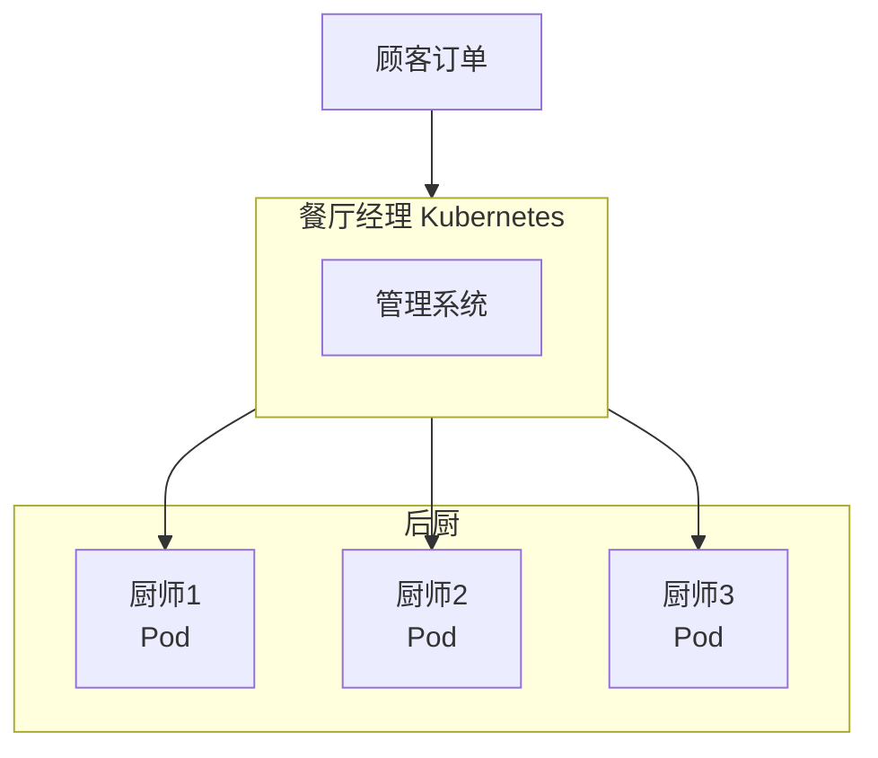

# K8s 是什么

**Kubernetes**（简称 K8s，读作 "koo-ber-NEH-teez"）是一个开源的容器编排平台，用于自动化部署、扩展和管理容器化应用程序。

> 💡 **为什么叫 K8s？** 因为 "Kubernetes" 中间有 8 个字母（ubernete），所以简称 K8s。这个名字来源于希腊语，意思是"舵手"或"飞行员"。

## 为什么需要 Kubernetes？

想象你开了一家餐厅...

### 场景一：只有一个厨师

刚开业时，餐厅只有一个厨师（一个服务器运行一个应用）。一切都很简单：

- 厨师休息 = 餐厅停业
- 客人太多 = 厨师忙不过来
- 厨师生病 = 餐厅关门

### 场景二：雇佣多个厨师

生意变好了，你雇佣了多个厨师（多个服务器），但新问题来了：

- 谁来分配订单给不同的厨师？
- 如果一个厨师突然离开，谁来接手他的订单？
- 高峰期需要临时请人，低谷期又要让人休息，谁来管理？

### 场景三：请一个餐厅经理（Kubernetes）

这时候，你需要一个**餐厅经理（Kubernetes）**：

餐厅经理（K8s）会：

- **自动分配任务**：根据每个厨师的忙闲程度分配订单
- **自动补位**：厨师请假时，自动安排其他厨师接手
- **弹性调度**：高峰期多请人，低谷期让人休息
- **健康检查**：发现厨师状态不佳，及时安排休息和替换

## Kubernetes 解决的核心问题

| 问题 | 没有 K8s | 有了 K8s |
|------|----------|----------|
| 服务器宕机 | 服务中断，需要手动恢复 | 自动在其他服务器重启服务 |
| 流量激增 | 手动增加服务器 | 自动扩容 |
| 流量下降 | 资源浪费 | 自动缩容，节省成本 |
| 版本更新 | 需要停服维护 | 滚动更新，零停机 |
| 配置管理 | 散落在各处 | 统一管理 |

## K8s 的核心能力

### 1. 服务发现和负载均衡

K8s 可以使用 DNS 名称或 IP 地址暴露容器。如果到某个容器的流量过高，K8s 能够自动分配网络流量。

### 2. 自动部署和回滚

你可以使用 K8s 声明你希望的部署状态，K8s 会以可控的速率将实际状态更改为期望状态。

### 3. 自我修复

K8s 会重启失败的容器、替换容器、杀死不响应健康检查的容器。

### 4. 密钥和配置管理

K8s 允许你存储和管理敏感信息（如密码、令牌），无需在镜像中暴露。

## K8s 不是什么

为了避免误解，K8s **不是**：

- ❌ **不是 PaaS**：K8s 在容器层面运行，不限定编程语言或框架
- ❌ **不是 CI/CD 工具**：K8s 不负责构建镜像，只负责运行
- ❌ **不是容器运行时**：K8s 使用 containerd/Docker 等容器运行时
- ❌ **不是虚拟机管理器**：K8s 管理的是容器，不是虚拟机

## 小结

- **Kubernetes** 是一个容器编排平台，帮助你自动化管理容器化应用
- 它解决的核心问题是：**自动化部署、扩缩容、负载均衡、故障恢复**
- 可以把 K8s 理解为"容器的餐厅经理"，负责调度和管理所有"厨师"（容器）

## 下一步

理解了 K8s 的作用后，让我们来看看它的整体架构是什么样的。

[下一节：架构概览](/ops/kubernetes/concepts/architecture)
