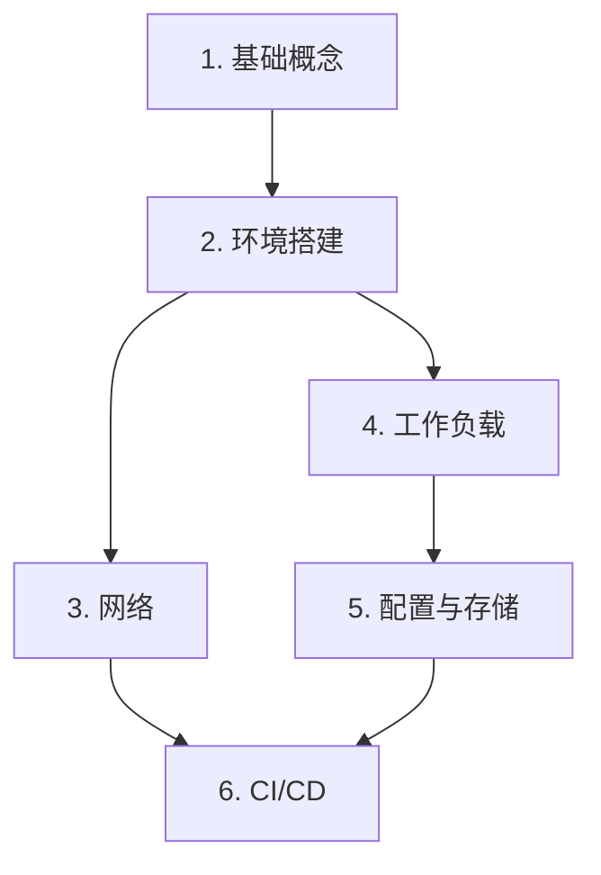

# Kubernetes 教程

从零开始学习 Kubernetes（简称 K8s），掌握容器编排技术，构建云原生应用。

## 什么是 Kubernetes？

**Kubernetes**（容器编排平台，读作 "koo-ber-NEH-teez"）是一个开源系统，用于自动化部署、扩展和管理容器化应用程序。

> 💡 **类比**: 如果把容器比作"集装箱"，那么 Kubernetes 就是"港口调度系统"——它负责决定每个集装箱放在哪艘船上、什么时候装卸、如何处理损坏的货物。

## 学习路径

本教程按照从简单到复杂的顺序组织，建议按顺序学习：

### 1. 基础概念 (P1)

理解 K8s 的核心组件和工作原理。

- [K8s 是什么](/ops/kubernetes/concepts/what-is-k8s) - 了解 K8s 解决的问题
- [架构概览](/ops/kubernetes/concepts/architecture) - 理解控制平面和工作节点
- [Pod 详解](/ops/kubernetes/concepts/pod) - 掌握最小部署单元
- [Pod 生命周期](/ops/kubernetes/concepts/pod-lifecycle) - 理解 Pod 状态转换
- [核心组件](/ops/kubernetes/concepts/components) - 认识 K8s 的各个组件

### 2. 环境搭建 (P2)

在本地搭建 K8s 开发环境。

- [前置要求](/ops/kubernetes/setup/prerequisites) - 硬件和软件准备
- [Windows 安装](/ops/kubernetes/setup/minikube-windows) - Windows 系统安装指南
- [macOS 安装](/ops/kubernetes/setup/minikube-macos) - macOS 系统安装指南
- [kubectl 基础](/ops/kubernetes/setup/kubectl-basics) - 掌握核心命令
- [第一个 Pod](/ops/kubernetes/setup/first-pod) - 部署你的第一个应用
- [故障排查](/ops/kubernetes/setup/troubleshooting) - 常见问题解决

### 3. 网络 (P3)

理解 K8s 网络模型和服务发现。

- [网络模型](/ops/kubernetes/networking/network-model) - 理解 K8s 网络架构
- [ClusterIP Service](/ops/kubernetes/networking/service-clusterip) - 集群内部服务
- [NodePort Service](/ops/kubernetes/networking/service-nodeport) - 外部访问服务
- [Ingress 入门](/ops/kubernetes/networking/ingress) - HTTP 路由配置

### 4. 工作负载 (P4)

使用 Deployment 管理应用的生命周期。

- [Deployment 详解](/ops/kubernetes/workloads/deployment) - 声明式应用管理
- [滚动更新](/ops/kubernetes/workloads/rolling-update) - 零停机更新
- [版本回滚](/ops/kubernetes/workloads/rollback) - 快速恢复
- [扩缩容](/ops/kubernetes/workloads/scaling) - 弹性伸缩

### 5. 配置与存储 (P5)

管理应用配置和持久化数据。

- [ConfigMap](/ops/kubernetes/storage/configmap) - 配置管理
- [Secret](/ops/kubernetes/storage/secret) - 敏感信息存储
- [持久化存储](/ops/kubernetes/storage/persistent-volume) - 数据持久化

### 6. CI/CD (P6)

构建自动化部署流水线。

- [CI/CD 概览](/ops/kubernetes/cicd/overview) - 理解持续集成/部署
- [Docker 镜像构建](/ops/kubernetes/cicd/docker-build) - 构建容器镜像
- [GitHub Actions](/ops/kubernetes/cicd/github-actions) - 配置自动化流水线
- [部署到 K8s](/ops/kubernetes/cicd/deploy-to-k8s) - 自动化部署

## 开始学习

准备好了吗？让我们从理解 Kubernetes 是什么开始！

[开始学习：K8s 是什么](/ops/kubernetes/concepts/what-is-k8s)

## 学习建议

- **预计时间**: 完成全部内容约需 8-12 小时
- **学习方式**: 建议边看教程边动手实践
- **环境要求**: 4GB 内存、2 CPU 以上的电脑
