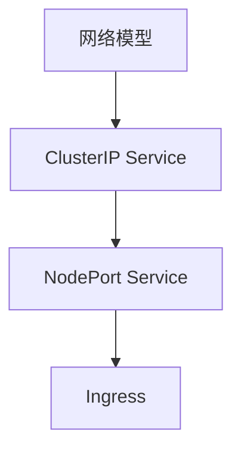

# 网络

本章帮助你理解 Kubernetes 的网络模型，学习如何暴露服务供外部访问。

## 前置知识

> 💡 阅读本章前，请确保已完成：
> - [基础概念](/ops/kubernetes/concepts/) - 理解 K8s 的核心概念
> - [环境搭建](/ops/kubernetes/setup/) - 已有可用的本地 K8s 环境

## 本章内容

K8s 网络是最复杂但也最核心的部分之一：

### 学习路径

1. **[网络模型](/ops/kubernetes/networking/network-model)** - 理解 K8s 网络架构和原理
2. **[ClusterIP Service](/ops/kubernetes/networking/service-clusterip)** - 集群内部服务发现
3. **[NodePort Service](/ops/kubernetes/networking/service-nodeport)** - 通过节点端口暴露服务
4. **[Ingress 入门](/ops/kubernetes/networking/ingress)** - HTTP/HTTPS 路由配置

## 学习目标

完成本章后，你将能够：

- 解释 K8s 的网络模型和 Pod 如何通信
- 创建 ClusterIP Service 实现集群内服务发现
- 创建 NodePort Service 从外部访问服务
- 配置 Ingress 实现 HTTP 路由

## 预计时间

约 1-1.5 小时

## 下一步

首先了解 K8s 的网络模型。

[开始：网络模型](/ops/kubernetes/networking/network-model)
