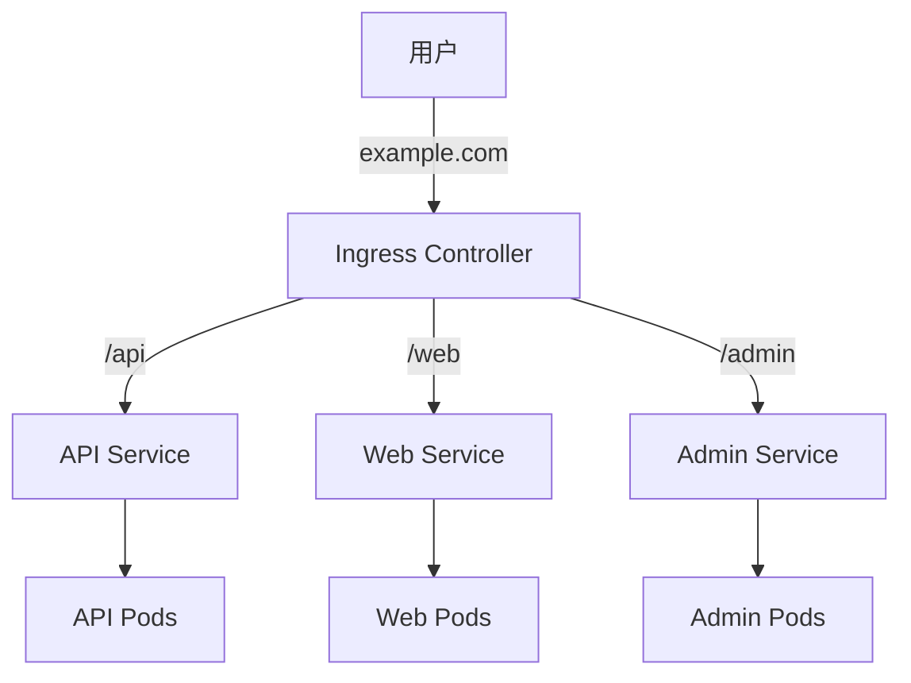

# Ingress 入门

**Ingress** 提供 HTTP/HTTPS 路由功能，可以通过域名和路径将请求转发到不同的 Service。

## 前置知识

> 💡 阅读本章前，请确保已完成：
> - [NodePort Service](/ops/kubernetes/networking/service-nodeport) - 理解外部访问方式

## 什么是 Ingress

**Ingress**（入口，K8s 的 HTTP 路由规则）不是一种 Service 类型，而是独立的资源，它定义了从集群外部到内部 Service 的 HTTP/HTTPS 路由规则。

[🔗 Kubernetes 官方文档 - Ingress](https://kubernetes.io/docs/concepts/services-networking/ingress/){target="_blank" rel="noopener"}



## Ingress vs NodePort vs LoadBalancer

| 特性 | NodePort | LoadBalancer | Ingress |
|------|----------|--------------|---------|
| 协议 | TCP/UDP | TCP/UDP | HTTP/HTTPS |
| 路由 | 按端口 | 按端口 | 按域名/路径 |
| 证书 | 不支持 | 不支持 | 支持 TLS |
| 成本 | 低 | 高（云厂商收费） | 低 |
| 适用 | 测试 | 简单服务 | 生产环境 |

## Ingress Controller

Ingress 资源本身只是配置，需要 **Ingress Controller** 来实现：

常见的 Ingress Controller：
- **NGINX Ingress Controller**（最常用）
- Traefik
- HAProxy
- Kong

### 在 Minikube 中启用 NGINX Ingress

```bash
# 启用 ingress 插件
minikube addons enable ingress

# 验证 Ingress Controller 运行状态
kubectl get pods -n ingress-nginx

# 输出示例：
# NAME                                        READY   STATUS    RESTARTS   AGE
# ingress-nginx-controller-xxxxx-xxxxx        1/1     Running   0          1m
```

## 创建 Ingress

### 步骤 1：准备后端服务

```yaml
# backend-services.yaml
---
# Web Service
apiVersion: apps/v1
kind: Deployment
metadata:
  name: web
spec:
  replicas: 2
  selector:
    matchLabels:
      app: web
  template:
    metadata:
      labels:
        app: web
    spec:
      containers:
      - name: web
        image: nginx:1.21
        ports:
        - containerPort: 80
---
apiVersion: v1
kind: Service
metadata:
  name: web-service
spec:
  selector:
    app: web
  ports:
  - port: 80
---
# API Service
apiVersion: apps/v1
kind: Deployment
metadata:
  name: api
spec:
  replicas: 2
  selector:
    matchLabels:
      app: api
  template:
    metadata:
      labels:
        app: api
    spec:
      containers:
      - name: api
        image: nginx:1.21
        ports:
        - containerPort: 80
---
apiVersion: v1
kind: Service
metadata:
  name: api-service
spec:
  selector:
    app: api
  ports:
  - port: 80
```

```bash
kubectl apply -f backend-services.yaml
```

### 步骤 2：创建 Ingress

```yaml
# ingress.yaml
apiVersion: networking.k8s.io/v1
kind: Ingress
metadata:
  name: my-ingress
  annotations:
    nginx.ingress.kubernetes.io/rewrite-target: /
spec:
  ingressClassName: nginx          # 指定 Ingress Controller
  rules:
  - host: example.local            # 域名
    http:
      paths:
      - path: /web                 # 路径
        pathType: Prefix
        backend:
          service:
            name: web-service      # 后端 Service
            port:
              number: 80
      - path: /api
        pathType: Prefix
        backend:
          service:
            name: api-service
            port:
              number: 80
```

```bash
kubectl apply -f ingress.yaml
```

### 步骤 3：配置本地 hosts

```bash
# 获取 Minikube IP
minikube ip

# 添加到 hosts 文件
# Windows: C:\Windows\System32\drivers\etc\hosts
# macOS/Linux: /etc/hosts

# 添加以下行（替换为实际 IP）
192.168.49.2 example.local
```

### 步骤 4：访问服务

```bash
# 访问 web 服务
curl http://example.local/web

# 访问 api 服务
curl http://example.local/api
```

## 路径类型

Ingress 支持三种路径类型：

| pathType | 说明 | 示例 |
|----------|------|------|
| `Exact` | 精确匹配 | `/foo` 只匹配 `/foo` |
| `Prefix` | 前缀匹配 | `/foo` 匹配 `/foo`、`/foo/bar` |
| `ImplementationSpecific` | 由 Controller 决定 | - |

```yaml
paths:
- path: /api
  pathType: Prefix       # /api, /api/users, /api/v1 都匹配
- path: /login
  pathType: Exact        # 只匹配 /login
```

## 多域名配置

```yaml
spec:
  rules:
  - host: web.example.com
    http:
      paths:
      - path: /
        pathType: Prefix
        backend:
          service:
            name: web-service
            port:
              number: 80
  - host: api.example.com
    http:
      paths:
      - path: /
        pathType: Prefix
        backend:
          service:
            name: api-service
            port:
              number: 80
```

## 默认后端

当没有匹配规则时，请求发送到默认后端：

```yaml
spec:
  defaultBackend:
    service:
      name: default-service
      port:
        number: 80
  rules:
  - host: example.local
    http:
      paths:
      # ...
```

## TLS/HTTPS 配置

### 创建 TLS Secret

```bash
# 生成自签名证书（测试用）
openssl req -x509 -nodes -days 365 -newkey rsa:2048 \
  -keyout tls.key -out tls.crt \
  -subj "/CN=example.local"

# 创建 Secret
kubectl create secret tls example-tls \
  --cert=tls.crt \
  --key=tls.key
```

### 配置 Ingress 使用 TLS

```yaml
apiVersion: networking.k8s.io/v1
kind: Ingress
metadata:
  name: tls-ingress
spec:
  ingressClassName: nginx
  tls:
  - hosts:
    - example.local
    secretName: example-tls        # TLS Secret
  rules:
  - host: example.local
    http:
      paths:
      - path: /
        pathType: Prefix
        backend:
          service:
            name: web-service
            port:
              number: 80
```

## 常用 Annotations

```yaml
metadata:
  annotations:
    # URL 重写
    nginx.ingress.kubernetes.io/rewrite-target: /

    # SSL 重定向
    nginx.ingress.kubernetes.io/ssl-redirect: "true"

    # 代理超时
    nginx.ingress.kubernetes.io/proxy-connect-timeout: "30"

    # 限流
    nginx.ingress.kubernetes.io/limit-rps: "10"

    # 自定义 nginx 配置
    nginx.ingress.kubernetes.io/configuration-snippet: |
      add_header X-Custom-Header "value";
```

## 实战练习

创建一个完整的 Ingress 示例：

```yaml
# complete-ingress.yaml
---
# Frontend Deployment
apiVersion: apps/v1
kind: Deployment
metadata:
  name: frontend
spec:
  replicas: 2
  selector:
    matchLabels:
      app: frontend
  template:
    metadata:
      labels:
        app: frontend
    spec:
      containers:
      - name: nginx
        image: nginx:1.21
        ports:
        - containerPort: 80
---
apiVersion: v1
kind: Service
metadata:
  name: frontend
spec:
  selector:
    app: frontend
  ports:
  - port: 80
---
# Ingress
apiVersion: networking.k8s.io/v1
kind: Ingress
metadata:
  name: complete-ingress
  annotations:
    nginx.ingress.kubernetes.io/rewrite-target: /
spec:
  ingressClassName: nginx
  rules:
  - host: myapp.local
    http:
      paths:
      - path: /
        pathType: Prefix
        backend:
          service:
            name: frontend
            port:
              number: 80
```

```bash
# 部署
kubectl apply -f complete-ingress.yaml

# 查看 Ingress
kubectl get ingress

# 配置 hosts 后访问
# echo "$(minikube ip) myapp.local" | sudo tee -a /etc/hosts
curl http://myapp.local
```

## 小结

- **Ingress** 提供 HTTP/HTTPS 层的路由功能
- 需要 **Ingress Controller**（如 NGINX）才能工作
- 支持**域名路由**和**路径路由**
- 支持 **TLS/HTTPS** 终止
- 通过 **Annotations** 配置高级特性
- 比 NodePort 更适合生产环境

## 下一步

恭喜你完成了网络章节！现在你已经理解了 K8s 的网络模型。

接下来，让我们学习如何使用 Deployment 管理应用。

[下一章：工作负载](/ops/kubernetes/workloads/)
