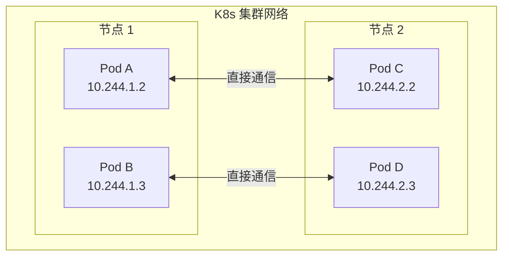
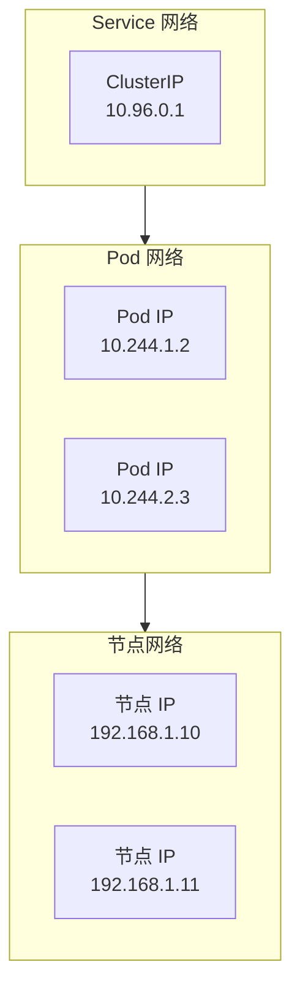
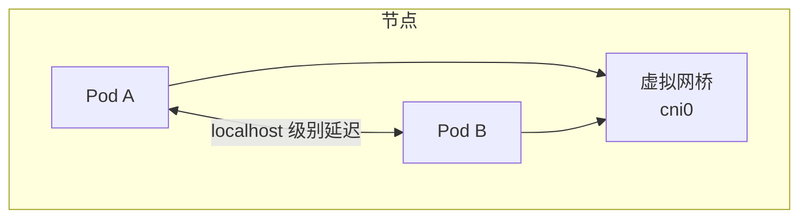
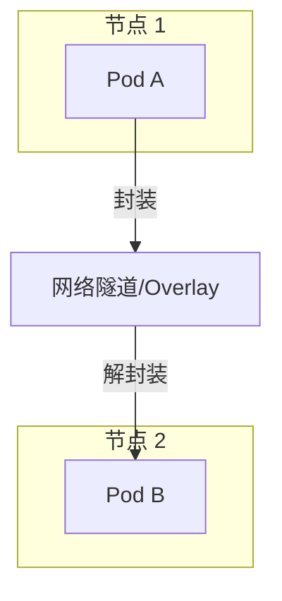
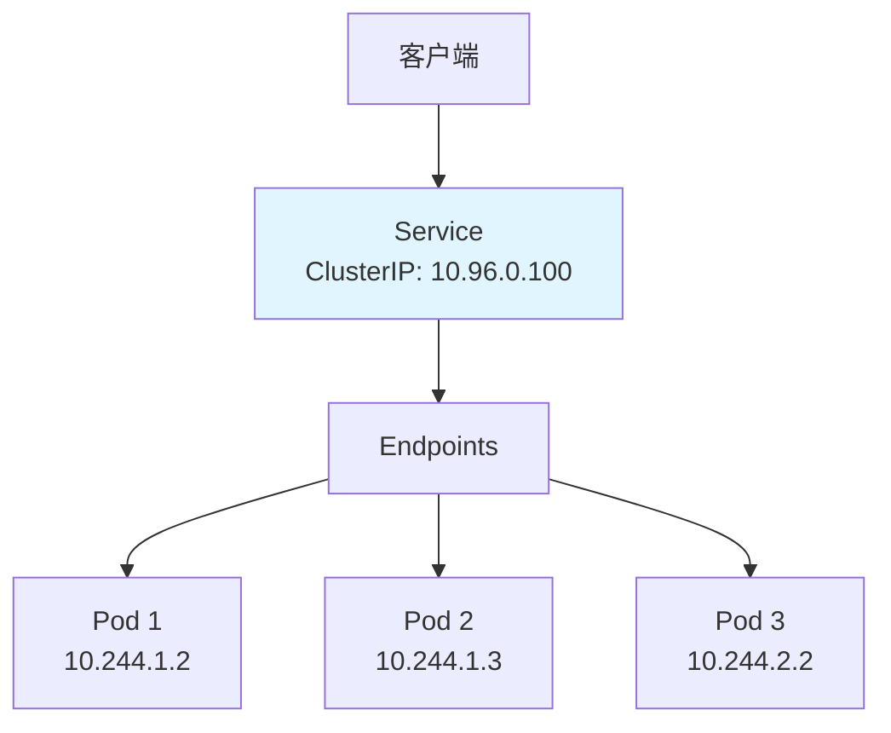
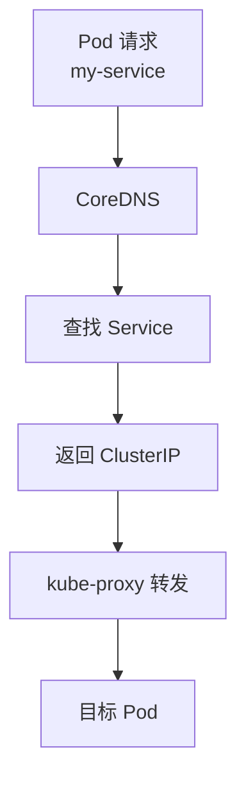
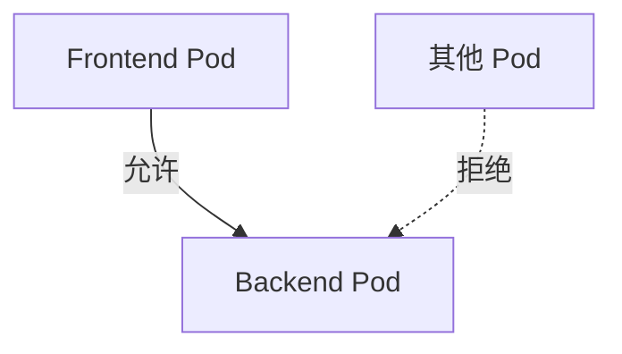

# 网络模型

Kubernetes 网络是最复杂但也最核心的部分之一。本节帮助你理解 K8s 的网络模型。

## 前置知识

> 💡 阅读本章前，请确保已完成：
> - [基础概念](/ops/kubernetes/concepts/) - 理解 Pod、Service 等概念
> - [环境搭建](/ops/kubernetes/setup/) - 有可用的本地环境

## K8s 网络的核心原则

Kubernetes 网络遵循以下核心原则：

1. **每个 Pod 有独立 IP**：Pod 之间可以直接通信
2. **所有 Pod 在同一平面网络**：不需要 NAT
3. **节点和 Pod 可以直接通信**：不需要 NAT



## 三层网络

K8s 网络可以分为三层：



### 1. 节点网络（Node Network）

- 物理机或虚拟机的网络
- IP 地址由基础设施分配
- 例如：`192.168.1.10`

### 2. Pod 网络（Pod Network）

- 由 CNI 插件（如 Calico、Flannel）管理
- 每个 Pod 获得唯一 IP
- 例如：`10.244.1.2`

### 3. Service 网络（Service Network）

- 虚拟 IP，由 kube-proxy 维护
- 提供负载均衡和服务发现
- 例如：`10.96.0.1`

## Pod 间通信

### 同节点 Pod 通信

同一节点上的 Pod 通过虚拟网桥直接通信：



### 跨节点 Pod 通信

不同节点上的 Pod 通过 CNI 插件实现的网络隧道通信：



## Service 网络

**Service**（服务）解决了 Pod IP 不稳定的问题：



### Service 的作用

| 问题 | Service 如何解决 |
|------|------------------|
| Pod IP 会变化 | Service IP 固定不变 |
| 需要负载均衡 | Service 自动分发请求 |
| 需要服务发现 | 可以通过 DNS 名称访问 |

### Service 类型

| 类型 | 说明 | 访问方式 |
|------|------|----------|
| **ClusterIP** | 集群内部访问（默认） | `<service-name>:<port>` |
| **NodePort** | 节点端口暴露 | `<node-ip>:<node-port>` |
| **LoadBalancer** | 云厂商负载均衡 | `<external-ip>:<port>` |
| **ExternalName** | DNS 别名 | CNAME 记录 |

## DNS 服务发现

K8s 内置 DNS 服务（CoreDNS），支持服务发现：

```bash
# 在 Pod 内部，可以直接用服务名访问
curl http://my-service           # 同命名空间
curl http://my-service.default   # 指定命名空间
curl http://my-service.default.svc.cluster.local  # 完整 FQDN
```

### DNS 解析流程



## kube-proxy 工作模式

kube-proxy 负责维护网络规则，有三种工作模式：

### 1. iptables 模式（默认）

使用 iptables 规则实现负载均衡：
- 性能好
- 不支持会话保持（默认）
- 随机选择后端 Pod

### 2. IPVS 模式

使用 Linux IPVS 实现负载均衡：
- 性能更好（大规模集群）
- 支持多种负载均衡算法
- 需要内核支持

### 3. userspace 模式（已弃用）

早期模式，性能较差。

## 网络策略

**NetworkPolicy** 用于控制 Pod 间的网络访问：

```yaml
apiVersion: networking.k8s.io/v1
kind: NetworkPolicy
metadata:
  name: allow-frontend
spec:
  podSelector:
    matchLabels:
      app: backend        # 应用于 backend Pod
  ingress:
  - from:
    - podSelector:
        matchLabels:
          app: frontend   # 只允许 frontend 访问
    ports:
    - port: 8080
```



## 小结

- K8s 网络遵循"每个 Pod 一个 IP"原则
- 三层网络：节点网络 → Pod 网络 → Service 网络
- Service 提供稳定的访问入口和负载均衡
- CoreDNS 实现服务发现
- kube-proxy 维护网络规则

## 下一步

了解网络模型后，让我们来实践创建 ClusterIP Service。

[下一节：ClusterIP Service](/ops/kubernetes/networking/service-clusterip)
