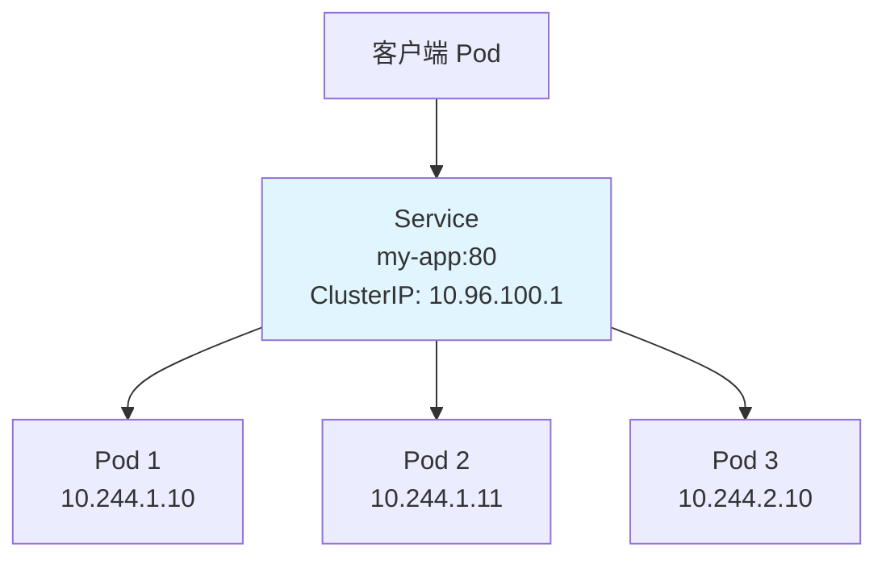
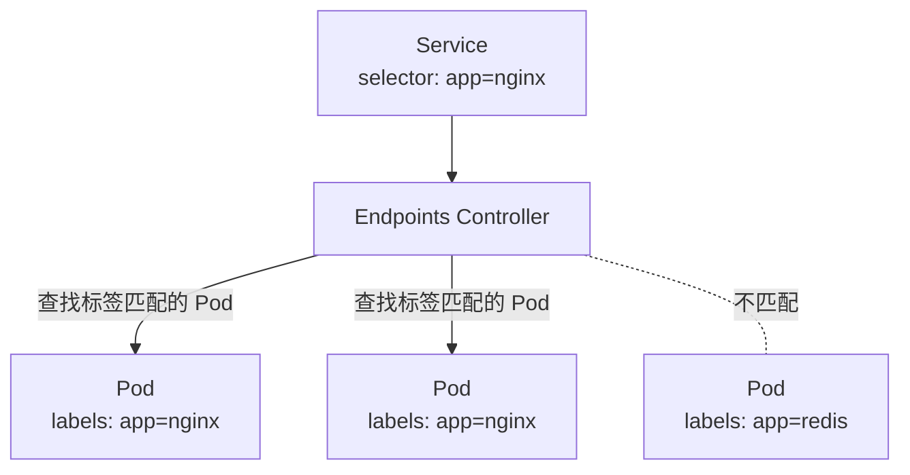

# ClusterIP Service

**ClusterIP** 是 Service 的默认类型，用于集群内部的服务发现和负载均衡。

[🔗 Kubernetes 官方文档 - Service](https://kubernetes.io/docs/concepts/services-networking/service/){target="_blank" rel="noopener"}

## 前置知识

> 💡 阅读本章前，请确保已完成：
> - [网络模型](/ops/kubernetes/networking/network-model) - 理解 K8s 网络基础

## ClusterIP 工作原理

ClusterIP Service 为一组 Pod 分配一个虚拟 IP，集群内部的 Pod 可以通过这个 IP 或 DNS 名称访问服务。



## 创建 ClusterIP Service

### 步骤 1：创建 Deployment

首先创建一组 Pod：

```yaml
# deployment.yaml
apiVersion: apps/v1
kind: Deployment
metadata:
  name: nginx-deployment
spec:
  replicas: 3                    # 3 个副本
  selector:
    matchLabels:
      app: nginx                 # 选择器
  template:
    metadata:
      labels:
        app: nginx               # Pod 标签
    spec:
      containers:
      - name: nginx
        image: nginx:1.21
        ports:
        - containerPort: 80      # 容器端口
```

```bash
kubectl apply -f deployment.yaml
```

### 步骤 2：创建 ClusterIP Service

```yaml
# service-clusterip.yaml
apiVersion: v1
kind: Service
metadata:
  name: nginx-service            # Service 名称
spec:
  type: ClusterIP                # 类型（默认值，可省略）
  selector:
    app: nginx                   # 选择带有此标签的 Pod
  ports:
  - protocol: TCP
    port: 80                     # Service 端口
    targetPort: 80               # Pod 端口
```

```bash
kubectl apply -f service-clusterip.yaml
```

### 步骤 3：验证 Service

```bash
# 查看 Service
kubectl get svc nginx-service

# 输出示例：
# NAME            TYPE        CLUSTER-IP      EXTERNAL-IP   PORT(S)   AGE
# nginx-service   ClusterIP   10.96.100.1     <none>        80/TCP    10s

# 查看 Endpoints（后端 Pod 列表）
kubectl get endpoints nginx-service

# 输出示例：
# NAME            ENDPOINTS                                      AGE
# nginx-service   10.244.1.10:80,10.244.1.11:80,10.244.2.10:80   10s
```

## 在集群内访问 Service

### 方式 1：通过 ClusterIP 访问

```bash
# 创建一个临时 Pod 测试
kubectl run test-pod --image=busybox --rm -it -- sh

# 在 test-pod 内执行
wget -qO- http://10.96.100.1
# 或
wget -qO- http://nginx-service
```

### 方式 2：通过 DNS 名称访问

```bash
# 在 test-pod 内执行
# 同命名空间
wget -qO- http://nginx-service

# 跨命名空间（假设 Service 在 default 命名空间）
wget -qO- http://nginx-service.default

# 完整 FQDN
wget -qO- http://nginx-service.default.svc.cluster.local
```

## Service 选择器机制

Service 通过 `selector` 找到匹配的 Pod：



### 多标签选择器

```yaml
spec:
  selector:
    app: nginx
    env: production        # 只选择同时满足两个标签的 Pod
```

## 端口配置详解

```yaml
spec:
  ports:
  - name: http             # 端口名称（多端口时必须）
    protocol: TCP          # 协议：TCP（默认）或 UDP
    port: 80               # Service 端口（外部访问用）
    targetPort: 8080       # Pod 端口（实际服务端口）
```

### 多端口配置

```yaml
spec:
  ports:
  - name: http
    port: 80
    targetPort: 8080
  - name: https
    port: 443
    targetPort: 8443
```

### 使用命名端口

```yaml
# Deployment 中定义命名端口
spec:
  containers:
  - name: app
    ports:
    - name: web
      containerPort: 8080

# Service 中引用命名端口
spec:
  ports:
  - port: 80
    targetPort: web        # 引用 Pod 的端口名称
```

## 会话保持

默认情况下，Service 随机选择后端 Pod。可以配置会话保持：

```yaml
spec:
  sessionAffinity: ClientIP    # 基于客户端 IP 的会话保持
  sessionAffinityConfig:
    clientIP:
      timeoutSeconds: 3600     # 会话超时时间
```

## 无选择器 Service

Service 也可以不指定 selector，手动指定 Endpoints：

```yaml
# 用于代理外部服务
apiVersion: v1
kind: Service
metadata:
  name: external-db
spec:
  ports:
  - port: 3306
---
apiVersion: v1
kind: Endpoints
metadata:
  name: external-db          # 必须与 Service 同名
subsets:
- addresses:
  - ip: 192.168.1.100        # 外部数据库 IP
  ports:
  - port: 3306
```

## 实战练习

### 完整示例：Web 应用 + Redis

```yaml
# app-with-redis.yaml
---
# Redis Deployment
apiVersion: apps/v1
kind: Deployment
metadata:
  name: redis
spec:
  replicas: 1
  selector:
    matchLabels:
      app: redis
  template:
    metadata:
      labels:
        app: redis
    spec:
      containers:
      - name: redis
        image: redis:7
        ports:
        - containerPort: 6379
---
# Redis Service
apiVersion: v1
kind: Service
metadata:
  name: redis
spec:
  selector:
    app: redis
  ports:
  - port: 6379
---
# Web Deployment
apiVersion: apps/v1
kind: Deployment
metadata:
  name: web
spec:
  replicas: 2
  selector:
    matchLabels:
      app: web
  template:
    metadata:
      labels:
        app: web
    spec:
      containers:
      - name: web
        image: nginx:1.21
        ports:
        - containerPort: 80
        env:
        - name: REDIS_HOST
          value: redis          # 通过 Service 名称访问 Redis
---
# Web Service
apiVersion: v1
kind: Service
metadata:
  name: web
spec:
  selector:
    app: web
  ports:
  - port: 80
```

```bash
# 应用配置
kubectl apply -f app-with-redis.yaml

# 验证
kubectl get pods
kubectl get svc

# 测试 Web 访问 Redis
kubectl exec -it $(kubectl get pod -l app=web -o jsonpath='{.items[0].metadata.name}') -- \
  sh -c 'apt-get update && apt-get install -y redis-tools && redis-cli -h redis ping'
# 应该输出：PONG
```

## 小结

- **ClusterIP** 是 Service 的默认类型
- 提供集群内部的服务发现和负载均衡
- 通过 **selector** 匹配后端 Pod
- 支持 **DNS 名称** 访问：`<service-name>.<namespace>`
- ClusterIP **只能在集群内部访问**

## 下一步

ClusterIP 只能在集群内部访问，如果需要从外部访问服务，需要使用 NodePort。

[下一节：NodePort Service](/ops/kubernetes/networking/service-nodeport)
