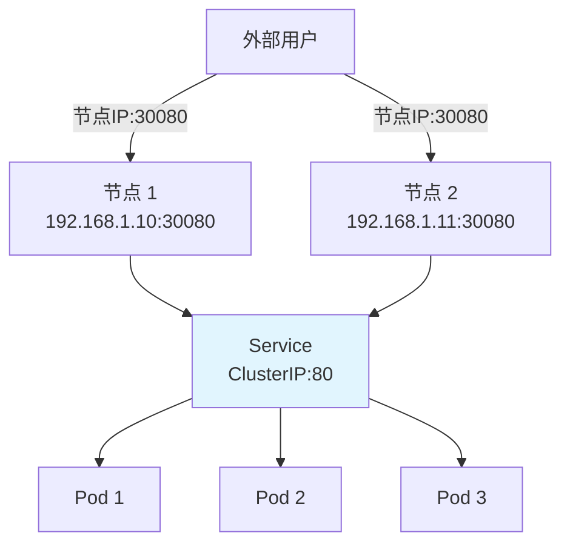
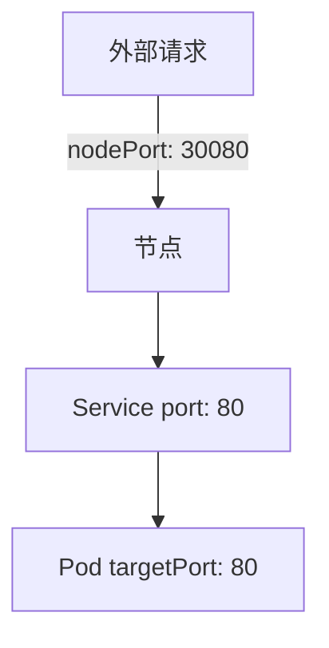
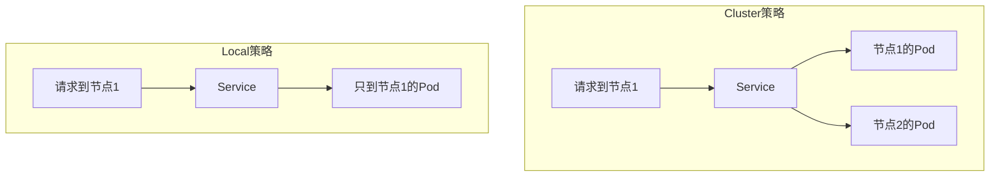

# NodePort Service

**NodePort** 类型的 Service 在每个节点上开放一个端口，允许从集群外部访问服务。

## 前置知识

> 💡 阅读本章前，请确保已完成：
> - [ClusterIP Service](/ops/kubernetes/networking/service-clusterip) - 理解 ClusterIP 的工作原理

## NodePort 工作原理

NodePort 在 ClusterIP 基础上，额外在每个节点上开放一个端口（范围 30000-32767）：



## 创建 NodePort Service

### 步骤 1：创建 Deployment（如果没有）

```yaml
# deployment.yaml
apiVersion: apps/v1
kind: Deployment
metadata:
  name: nginx-deployment
spec:
  replicas: 3
  selector:
    matchLabels:
      app: nginx
  template:
    metadata:
      labels:
        app: nginx
    spec:
      containers:
      - name: nginx
        image: nginx:1.21
        ports:
        - containerPort: 80
```

### 步骤 2：创建 NodePort Service

```yaml
# service-nodeport.yaml
apiVersion: v1
kind: Service
metadata:
  name: nginx-nodeport
spec:
  type: NodePort                 # 指定类型为 NodePort
  selector:
    app: nginx
  ports:
  - protocol: TCP
    port: 80                     # Service 端口（集群内访问）
    targetPort: 80               # Pod 端口
    nodePort: 30080              # 节点端口（可选，不指定则自动分配）
```

```bash
kubectl apply -f service-nodeport.yaml
```

### 步骤 3：验证 Service

```bash
# 查看 Service
kubectl get svc nginx-nodeport

# 输出示例：
# NAME             TYPE       CLUSTER-IP      EXTERNAL-IP   PORT(S)        AGE
# nginx-nodeport   NodePort   10.96.100.50    <none>        80:30080/TCP   10s
```

## 访问 NodePort Service

### 方式 1：使用 Minikube

```bash
# 获取访问 URL
minikube service nginx-nodeport --url

# 输出示例：
# http://192.168.49.2:30080

# 或直接在浏览器打开
minikube service nginx-nodeport
```

### 方式 2：手动获取节点 IP

```bash
# 获取节点 IP
kubectl get nodes -o wide

# 或获取 Minikube IP
minikube ip

# 然后访问 http://<节点IP>:30080
curl http://$(minikube ip):30080
```

## 端口说明

NodePort Service 涉及三个端口：

| 端口 | 说明 | 范围 |
|------|------|------|
| `port` | Service 端口（集群内访问） | 1-65535 |
| `targetPort` | Pod 端口（实际服务端口） | 1-65535 |
| `nodePort` | 节点端口（外部访问） | 30000-32767 |



## 自动分配 vs 手动指定 nodePort

### 自动分配

```yaml
spec:
  type: NodePort
  ports:
  - port: 80
    targetPort: 80
    # 不指定 nodePort，K8s 自动分配
```

### 手动指定

```yaml
spec:
  type: NodePort
  ports:
  - port: 80
    targetPort: 80
    nodePort: 30080        # 手动指定（需确保未被占用）
```

> 💡 **建议**：在测试环境手动指定方便记忆，生产环境建议自动分配避免冲突。

## 流量策略

### externalTrafficPolicy

控制外部流量的路由策略：

```yaml
spec:
  type: NodePort
  externalTrafficPolicy: Cluster   # 默认值
  # 或
  externalTrafficPolicy: Local
```

| 策略 | 说明 | 优点 | 缺点 |
|------|------|------|------|
| `Cluster` | 流量可能跨节点转发 | 负载均衡更均匀 | 多一跳，延迟略高 |
| `Local` | 只转发到本节点的 Pod | 保留源 IP，延迟低 | 负载可能不均匀 |



## 多端口配置

```yaml
apiVersion: v1
kind: Service
metadata:
  name: multi-port-service
spec:
  type: NodePort
  selector:
    app: myapp
  ports:
  - name: http
    port: 80
    targetPort: 8080
    nodePort: 30080
  - name: https
    port: 443
    targetPort: 8443
    nodePort: 30443
```

## 实战练习：暴露 Web 应用

```yaml
# web-nodeport.yaml
apiVersion: apps/v1
kind: Deployment
metadata:
  name: web-app
spec:
  replicas: 3
  selector:
    matchLabels:
      app: web
  template:
    metadata:
      labels:
        app: web
    spec:
      containers:
      - name: web
        image: nginx:1.21
        ports:
        - containerPort: 80
---
apiVersion: v1
kind: Service
metadata:
  name: web-nodeport
spec:
  type: NodePort
  selector:
    app: web
  ports:
  - port: 80
    targetPort: 80
    nodePort: 30000
```

```bash
# 部署
kubectl apply -f web-nodeport.yaml

# 验证
kubectl get svc web-nodeport
kubectl get pods -l app=web

# 访问（Minikube）
minikube service web-nodeport

# 或使用 curl
curl http://$(minikube ip):30000
```

## NodePort 的局限性

| 局限 | 说明 |
|------|------|
| 端口范围限制 | 只能使用 30000-32767 |
| 每个 Service 一个端口 | 不能共享端口 |
| 需要知道节点 IP | 客户端需要知道具体的节点地址 |
| 安全性 | 直接暴露节点端口 |

## NodePort vs ClusterIP

| 特性 | ClusterIP | NodePort |
|------|-----------|----------|
| 访问范围 | 集群内部 | 集群内外 |
| 使用场景 | 微服务间通信 | 外部访问、测试 |
| 端口 | Service 端口 | 节点端口 (30000-32767) |
| 负载均衡 | 有 | 有 |

## 小结

- **NodePort** 在每个节点上开放端口（30000-32767）
- 允许从集群外部通过 `<节点IP>:<nodePort>` 访问服务
- 使用 `minikube service` 命令快速获取访问 URL
- `externalTrafficPolicy` 控制流量路由策略
- 生产环境通常使用 **Ingress** 或 **LoadBalancer** 代替

## 下一步

NodePort 需要知道节点 IP，不够灵活。Ingress 提供了更优雅的 HTTP 路由方案。

[下一节：Ingress 入门](/ops/kubernetes/networking/ingress)
