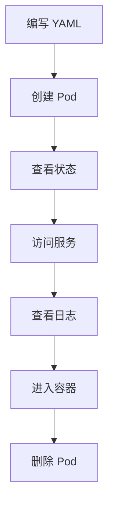

# 第一个 Pod

本节帮助你在 Kubernetes 中部署第一个 Pod，完整体验 K8s 的工作流程。

## 前置知识

> 💡 阅读本章前，请确保已完成：
> - [kubectl 基础](/ops/kubernetes/setup/kubectl-basics) - 掌握基本命令
> - Minikube 集群正在运行

## 我们要做什么

我们将部署一个 nginx Web 服务器，然后：

1. 创建 Pod
2. 查看 Pod 状态
3. 访问 Pod 中的服务
4. 查看日志
5. 进入 Pod 容器
6. 删除 Pod



## 步骤 1：创建 Pod 配置文件

创建一个名为 `nginx-pod.yaml` 的文件：

```yaml
# nginx-pod.yaml
# 这是我们的第一个 Pod 配置文件

apiVersion: v1              # API 版本，Pod 使用 v1
kind: Pod                   # 资源类型：Pod
metadata:                   # 元数据
  name: my-nginx            # Pod 名称（必须唯一）
  labels:                   # 标签（用于组织和选择）
    app: nginx              # 自定义标签
    env: learning           # 自定义标签
spec:                       # Pod 规格
  containers:               # 容器列表
  - name: nginx             # 容器名称
    image: nginx:1.21       # 使用的镜像
    ports:                  # 暴露的端口
    - containerPort: 80     # 容器端口
```

> 💡 **提示**：你可以用任何文本编辑器创建这个文件，例如 VS Code、Notepad++ 或 vim。

## 步骤 2：创建 Pod

```bash
# 应用配置文件创建 Pod
kubectl apply -f nginx-pod.yaml

# 输出：
# pod/my-nginx created
```

## 步骤 3：查看 Pod 状态

```bash
# 查看 Pod 列表
kubectl get pods

# 输出示例：
# NAME       READY   STATUS    RESTARTS   AGE
# my-nginx   1/1     Running   0          30s
```

如果看到 `STATUS` 是 `ContainerCreating`，等待几秒后再次查看。

### 理解输出列

| 列名 | 说明 |
|------|------|
| NAME | Pod 名称 |
| READY | 就绪的容器数/总容器数 |
| STATUS | Pod 状态 |
| RESTARTS | 重启次数 |
| AGE | 运行时间 |

### 查看更多详情

```bash
# 宽格式输出（显示 IP 和节点）
kubectl get pods -o wide

# 输出示例：
# NAME       READY   STATUS    RESTARTS   AGE   IP           NODE
# my-nginx   1/1     Running   0          1m    10.244.0.5   minikube

# 查看 Pod 详细信息
kubectl describe pod my-nginx
```

## 步骤 4：访问 Pod 中的服务

Pod 有自己的 IP，但只能在集群内部访问。我们使用端口转发来从本地访问：

```bash
# 将本地 8080 端口转发到 Pod 的 80 端口
kubectl port-forward my-nginx 8080:80

# 输出：
# Forwarding from 127.0.0.1:8080 -> 80
# Forwarding from [::1]:8080 -> 80
```

现在打开浏览器，访问 `http://localhost:8080`，你应该能看到 nginx 的欢迎页面！

> 💡 **注意**：端口转发命令会占用终端，需要新开一个终端窗口执行后续命令。按 `Ctrl+C` 可以停止端口转发。

## 步骤 5：查看日志

```bash
# 查看 Pod 日志
kubectl logs my-nginx

# 如果 Pod 有多个容器，指定容器名
kubectl logs my-nginx -c nginx

# 实时查看日志（类似 tail -f）
kubectl logs -f my-nginx
```

访问几次 `http://localhost:8080` 后，你会在日志中看到访问记录：

```
10.244.0.1 - - [15/Dec/2024:10:30:00 +0000] "GET / HTTP/1.1" 200 615 "-" "Mozilla/5.0..."
```

## 步骤 6：进入 Pod 容器

```bash
# 进入容器的 shell
kubectl exec -it my-nginx -- /bin/bash

# 现在你在容器内部了！
# 查看 nginx 配置
cat /etc/nginx/nginx.conf

# 查看网页文件
cat /usr/share/nginx/html/index.html

# 退出容器
exit
```

### 在容器内执行单个命令

```bash
# 不进入交互模式，直接执行命令
kubectl exec my-nginx -- cat /etc/nginx/nginx.conf

# 查看容器内的进程
kubectl exec my-nginx -- ps aux
```

## 步骤 7：删除 Pod

```bash
# 删除 Pod
kubectl delete pod my-nginx

# 输出：
# pod "my-nginx" deleted

# 验证 Pod 已删除
kubectl get pods

# 输出：
# No resources found in default namespace.
```

## 快速创建方式

除了 YAML 文件，还可以用命令行快速创建 Pod（适合测试）：

```bash
# 快速运行一个 Pod（不推荐生产使用）
kubectl run nginx-quick --image=nginx:1.21

# 查看
kubectl get pods

# 删除
kubectl delete pod nginx-quick
```

## 完整练习

让我们做一个完整的练习，部署一个带有自定义内容的 nginx：

### 1. 创建 ConfigMap 存储网页内容

```yaml
# custom-nginx.yaml
apiVersion: v1
kind: ConfigMap
metadata:
  name: nginx-html
data:
  index.html: |
    <!DOCTYPE html>
    <html>
    <head>
        <title>My First K8s Pod</title>
    </head>
    <body>
        <h1>Hello from Kubernetes!</h1>
        <p>This is my first Pod running on K8s.</p>
    </body>
    </html>
---
apiVersion: v1
kind: Pod
metadata:
  name: custom-nginx
spec:
  containers:
  - name: nginx
    image: nginx:1.21
    ports:
    - containerPort: 80
    volumeMounts:
    - name: html-volume
      mountPath: /usr/share/nginx/html
  volumes:
  - name: html-volume
    configMap:
      name: nginx-html
```

### 2. 应用配置

```bash
kubectl apply -f custom-nginx.yaml
```

### 3. 访问自定义页面

```bash
kubectl port-forward custom-nginx 8080:80
# 访问 http://localhost:8080 查看自定义页面
```

### 4. 清理

```bash
kubectl delete -f custom-nginx.yaml
```

## 小结

- 使用 `kubectl apply -f` 创建资源
- 使用 `kubectl get pods` 查看 Pod 状态
- 使用 `kubectl port-forward` 访问 Pod 服务
- 使用 `kubectl logs` 查看日志
- 使用 `kubectl exec -it` 进入容器
- 使用 `kubectl delete` 删除资源

## 下一步

恭喜你成功部署了第一个 Pod！如果遇到问题，请查看故障排查指南。

[下一节：故障排查](/ops/kubernetes/setup/troubleshooting)
