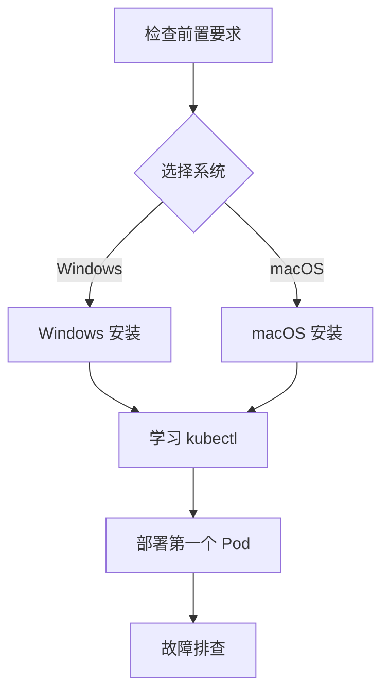

# 环境搭建

本章帮助你在本地搭建 Kubernetes 开发环境，让你能够动手实践所学的概念。

## 前置知识

> 💡 阅读本章前，请确保已完成：
> - [基础概念](/ops/kubernetes/concepts/) - 理解 K8s 的核心概念

## 本章内容

我们将使用 **Minikube**（迷你 K8s，本地单节点 K8s 集群）来搭建开发环境：

### 学习路径

1. **[前置要求](/ops/kubernetes/setup/prerequisites)** - 检查硬件和软件要求
2. **[Windows 安装](/ops/kubernetes/setup/minikube-windows)** - Windows 系统安装指南
3. **[macOS 安装](/ops/kubernetes/setup/minikube-macos)** - macOS 系统安装指南
4. **[kubectl 基础](/ops/kubernetes/setup/kubectl-basics)** - 学习 K8s 命令行工具
5. **[第一个 Pod](/ops/kubernetes/setup/first-pod)** - 部署你的第一个应用
6. **[故障排查](/ops/kubernetes/setup/troubleshooting)** - 常见问题解决方案

## 学习目标

完成本章后，你将能够：

- 在本地成功运行 Minikube 集群
- 使用 kubectl 与集群交互
- 部署、查看、删除 Pod
- 解决常见的安装和运行问题

## 预计时间

约 30-60 分钟（取决于网络速度和系统配置）

## 下一步

首先检查你的电脑是否满足运行要求。

[开始：检查前置要求](/ops/kubernetes/setup/prerequisites)
