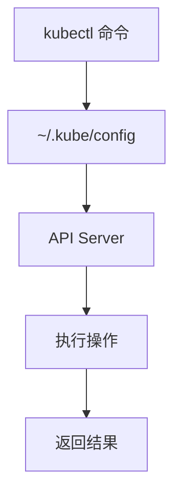

# kubectl 基础

**kubectl**（读作 "kube-control" 或 "kube-cuddle"）是 Kubernetes 的命令行工具，用于与集群交互。

## 前置知识

> 💡 阅读本章前，请确保已完成：
> - [Minikube 安装](/ops/kubernetes/setup/minikube-windows) 或 [macOS 安装](/ops/kubernetes/setup/minikube-macos)
> - Minikube 集群正在运行

## kubectl 工作原理



kubectl 通过 `~/.kube/config` 文件中的配置连接到 K8s 集群的 API Server。

## 命令结构

kubectl 命令的基本结构：

```bash
kubectl [动作] [资源类型] [资源名称] [选项]
```

示例：
```bash
kubectl get pods nginx-pod -o yaml
#       ↑    ↑    ↑         ↑
#      动作  类型  名称      选项
```

## 核心命令速查表

### 查看资源

| 命令 | 说明 |
|------|------|
| `kubectl get pods` | 列出所有 Pod |
| `kubectl get pods -o wide` | 显示更多信息（IP、节点等） |
| `kubectl get all` | 列出所有资源 |
| `kubectl get nodes` | 列出所有节点 |
| `kubectl get services` | 列出所有 Service |
| `kubectl get deployments` | 列出所有 Deployment |

### 详细信息

| 命令 | 说明 |
|------|------|
| `kubectl describe pod <名称>` | 查看 Pod 详情 |
| `kubectl describe node <名称>` | 查看节点详情 |
| `kubectl logs <pod名称>` | 查看 Pod 日志 |
| `kubectl logs -f <pod名称>` | 实时查看日志 |

### 创建和删除

| 命令 | 说明 |
|------|------|
| `kubectl apply -f <文件>` | 应用配置文件 |
| `kubectl delete -f <文件>` | 删除配置文件中的资源 |
| `kubectl delete pod <名称>` | 删除指定 Pod |
| `kubectl create deployment <名称> --image=<镜像>` | 快速创建 Deployment |

### 交互操作

| 命令 | 说明 |
|------|------|
| `kubectl exec -it <pod名称> -- /bin/bash` | 进入 Pod 容器 |
| `kubectl port-forward <pod名称> 8080:80` | 端口转发 |
| `kubectl cp <本地路径> <pod名称>:<容器路径>` | 复制文件到 Pod |

## 实战练习

### 练习 1：查看集群状态

```bash
# 查看集群信息
kubectl cluster-info

# 输出示例：
# Kubernetes control plane is running at https://127.0.0.1:32768
# CoreDNS is running at https://127.0.0.1:32768/api/v1/namespaces/kube-system/services/kube-dns:dns/proxy

# 查看节点
kubectl get nodes

# 输出示例：
# NAME       STATUS   ROLES           AGE   VERSION
# minikube   Ready    control-plane   10m   v1.28.3
```

### 练习 2：使用不同输出格式

```bash
# 默认输出
kubectl get pods

# 宽格式（显示更多列）
kubectl get pods -o wide

# YAML 格式
kubectl get pods -o yaml

# JSON 格式
kubectl get pods -o json

# 自定义列
kubectl get pods -o custom-columns=NAME:.metadata.name,STATUS:.status.phase
```

### 练习 3：查看系统 Pod

```bash
# 查看 kube-system 命名空间的 Pod
kubectl get pods -n kube-system

# 输出示例：
# NAME                               READY   STATUS    RESTARTS   AGE
# coredns-5dd5756b68-xxxxx           1/1     Running   0          10m
# etcd-minikube                      1/1     Running   0          10m
# kube-apiserver-minikube            1/1     Running   0          10m
# kube-controller-manager-minikube   1/1     Running   0          10m
# kube-proxy-xxxxx                   1/1     Running   0          10m
# kube-scheduler-minikube            1/1     Running   0          10m
# storage-provisioner                1/1     Running   0          10m
```

## 常用快捷方式

kubectl 支持资源类型的简写：

| 全称 | 简写 |
|------|------|
| pods | po |
| services | svc |
| deployments | deploy |
| namespaces | ns |
| configmaps | cm |
| secrets | - |
| persistentvolumes | pv |
| persistentvolumeclaims | pvc |

示例：
```bash
# 这两个命令等价
kubectl get pods
kubectl get po

# 这两个命令等价
kubectl get services
kubectl get svc
```

## 上下文和配置

### 查看当前上下文

```bash
# 查看当前连接的集群
kubectl config current-context
# 输出：minikube

# 查看所有上下文
kubectl config get-contexts
```

### 切换上下文

```bash
# 如果有多个集群，可以切换
kubectl config use-context <上下文名称>
```

## 命令自动补全

### Bash（Linux/macOS）

```bash
# 启用自动补全
echo 'source <(kubectl completion bash)' >> ~/.bashrc
source ~/.bashrc
```

### Zsh（macOS 默认）

```bash
# 启用自动补全
echo 'source <(kubectl completion zsh)' >> ~/.zshrc
source ~/.zshrc
```

### PowerShell（Windows）

```powershell
# 启用自动补全
kubectl completion powershell | Out-String | Invoke-Expression
```

## 常见问题

### Q: 命令报错 "The connection to the server localhost:8080 was refused"

说明 kubectl 没有连接到集群。确保 Minikube 正在运行：

```bash
minikube status
minikube start  # 如果没有运行
```

### Q: 如何查看命令帮助？

```bash
# 查看所有命令
kubectl --help

# 查看特定命令的帮助
kubectl get --help
kubectl describe --help
```

### Q: 如何查看资源的 API 版本？

```bash
kubectl api-resources
```

## 小结

- kubectl 是与 K8s 集群交互的命令行工具
- 基本命令：`get`（查看）、`describe`（详情）、`apply`（应用）、`delete`（删除）
- 使用 `-n` 指定命名空间，`-o` 指定输出格式
- 启用自动补全可以提高效率

## 下一步

掌握了 kubectl 基础后，让我们来部署第一个 Pod！

[下一节：第一个 Pod](/ops/kubernetes/setup/first-pod)
