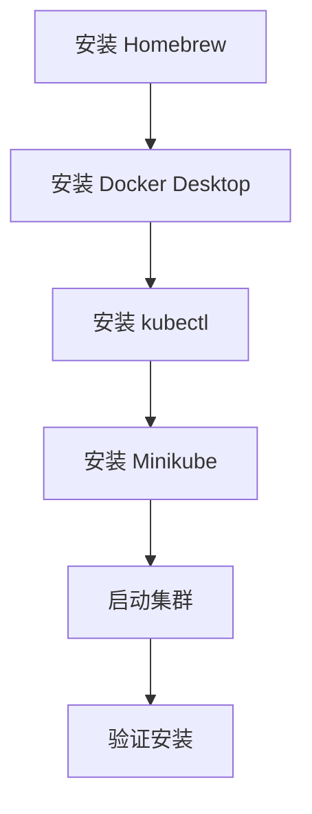

# macOS 安装 Minikube

本指南帮助你在 macOS 系统上安装 Minikube 和 kubectl。

## 前置知识

> 💡 阅读本章前，请确保已完成：
> - [前置要求](/ops/kubernetes/setup/prerequisites) - 确认硬件和软件满足要求

## 安装流程



## 步骤 1：安装 Homebrew（如果尚未安装）

**Homebrew** 是 macOS 上最流行的包管理器。

```bash
# 安装 Homebrew
/bin/bash -c "$(curl -fsSL https://raw.githubusercontent.com/Homebrew/install/HEAD/install.sh)"

# 验证安装
brew --version
```

## 步骤 2：安装 Docker Desktop

### 2.1 使用 Homebrew 安装

```bash
# 安装 Docker Desktop
brew install --cask docker

# 安装完成后，从"应用程序"中打开 Docker
# 首次运行需要授权
```

### 2.2 验证安装

```bash
# 确保 Docker Desktop 已启动后运行
docker --version
# 输出示例：Docker version 24.0.6, build ed223bc

docker run hello-world
# 如果看到 "Hello from Docker!" 说明安装成功
```

## 步骤 3：安装 kubectl

```bash
# 使用 Homebrew 安装
brew install kubectl

# 验证安装
kubectl version --client
# 输出示例：Client Version: v1.29.0
```

## 步骤 4：安装 Minikube

```bash
# 使用 Homebrew 安装
brew install minikube

# 验证安装
minikube version
# 输出示例：minikube version: v1.32.0
```

## 步骤 5：启动 Minikube 集群

### 5.1 首次启动

```bash
# 使用 Docker 驱动启动（推荐）
minikube start --driver=docker

# 如果在中国大陆，使用镜像加速
minikube start --driver=docker --image-mirror-country=cn
```

### 5.2 启动输出示例

```
😄  minikube v1.32.0 on Darwin 14.0 (arm64)
✨  Using the docker driver based on user configuration
📌  Using Docker Desktop driver with root privileges
👍  Starting control plane node minikube in cluster minikube
🚜  Pulling base image ...
🔥  Creating docker container (CPUs=2, Memory=4000MB) ...
🐳  Preparing Kubernetes v1.28.3 on Docker 24.0.7 ...
🔎  Verifying Kubernetes components...
🌟  Enabled addons: storage-provisioner, default-storageclass
🏄  Done! kubectl is now configured to use "minikube" cluster
```

## 步骤 6：验证集群

```bash
# 查看集群状态
minikube status

# 输出应该类似：
# minikube
# type: Control Plane
# host: Running
# kubelet: Running
# apiserver: Running
# kubeconfig: Configured

# 查看节点
kubectl get nodes

# 输出示例：
# NAME       STATUS   ROLES           AGE   VERSION
# minikube   Ready    control-plane   1m    v1.28.3
```

## 常用 Minikube 命令

```bash
# 启动集群
minikube start

# 停止集群（不删除数据）
minikube stop

# 删除集群
minikube delete

# 查看状态
minikube status

# 打开 K8s Dashboard
minikube dashboard

# SSH 进入 Minikube 节点
minikube ssh

# 查看 IP 地址
minikube ip
```

## Apple Silicon (M1/M2/M3) 注意事项

如果你使用的是 Apple Silicon Mac：

```bash
# 使用 Docker 驱动（推荐）
minikube start --driver=docker

# 或者使用 QEMU 驱动
minikube start --driver=qemu
```

> 💡 **提示**：Docker Desktop 已经原生支持 Apple Silicon，是最推荐的方式。

## 国内镜像配置

如果下载镜像速度很慢，可以配置国内镜像源：

```bash
# 停止并删除现有集群
minikube delete

# 使用阿里云镜像启动
minikube start --driver=docker \
  --image-mirror-country=cn \
  --registry-mirror=https://registry.cn-hangzhou.aliyuncs.com
```

## 常见问题

### Q: 启动时提示 "Docker Desktop is not running"

确保 Docker Desktop 已启动。在菜单栏中查看 Docker 图标，确认其状态为运行中。

### Q: 启动时提示权限错误

确保当前用户有权限运行 Docker：

```bash
# 查看 Docker 信息
docker info
```

如果报错，重新打开 Docker Desktop 并授权。

### Q: kubectl 命令无法连接集群

确保 Minikube 正在运行：

```bash
minikube status
# 如果没有运行，执行：
minikube start
```

### Q: 镜像拉取超时

使用国内镜像源：

```bash
minikube start --image-mirror-country=cn
```

## 一键安装脚本

如果你想快速安装所有组件，可以使用以下脚本：

```bash
#!/bin/bash
# 安装 Kubernetes 本地开发环境

# 检查 Homebrew
if ! command -v brew &> /dev/null; then
    echo "Installing Homebrew..."
    /bin/bash -c "$(curl -fsSL https://raw.githubusercontent.com/Homebrew/install/HEAD/install.sh)"
fi

# 安装 Docker Desktop
echo "Installing Docker Desktop..."
brew install --cask docker

# 安装 kubectl
echo "Installing kubectl..."
brew install kubectl

# 安装 Minikube
echo "Installing minikube..."
brew install minikube

echo "Installation complete!"
echo "Please start Docker Desktop, then run: minikube start --driver=docker"
```

## 小结

- 安装顺序：Homebrew → Docker Desktop → kubectl → Minikube
- 使用 `minikube start --driver=docker` 启动集群
- Apple Silicon Mac 推荐使用 Docker 驱动
- 国内用户建议使用 `--image-mirror-country=cn` 参数

## 下一步

安装完成后，让我们学习 kubectl 的基本使用。

[下一节：kubectl 基础](/ops/kubernetes/setup/kubectl-basics)
