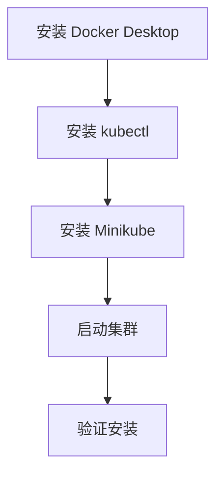

# Windows 安装 Minikube

本指南帮助你在 Windows 系统上安装 Minikube 和 kubectl。

## 前置知识

> 💡 阅读本章前，请确保已完成：
> - [前置要求](/ops/kubernetes/setup/prerequisites) - 确认硬件和软件满足要求

## 安装流程



## 步骤 1：安装 Docker Desktop

Docker Desktop 是 Windows 上运行容器的最简单方式。

### 1.1 下载安装

1. 访问 [Docker Desktop 官网](https://www.docker.com/products/docker-desktop/)
2. 下载 Windows 版本
3. 双击安装程序，按提示完成安装
4. 安装完成后重启电脑

### 1.2 验证安装

```powershell
# 打开 PowerShell，运行
docker --version
# 输出示例：Docker version 24.0.6, build ed223bc

docker run hello-world
# 如果看到 "Hello from Docker!" 说明安装成功
```

## 步骤 2：安装 kubectl

**kubectl**（K8s 命令行工具，读作 "kube-control"）是与 K8s 集群交互的命令行工具。

### 2.1 使用 Chocolatey 安装（推荐）

如果已安装 [Chocolatey](https://chocolatey.org/)：

```powershell
# 以管理员身份运行 PowerShell
choco install kubernetes-cli -y
```

### 2.2 手动安装

```powershell
# 下载 kubectl（以管理员身份运行 PowerShell）
curl.exe -LO "https://dl.k8s.io/release/v1.29.0/bin/windows/amd64/kubectl.exe"

# 创建目录
mkdir C:\kubectl

# 移动文件
Move-Item kubectl.exe C:\kubectl\

# 添加到环境变量（需要管理员权限）
[Environment]::SetEnvironmentVariable("Path", $env:Path + ";C:\kubectl", "Machine")

# 重新打开 PowerShell 后验证
kubectl version --client
```

### 2.3 验证安装

```powershell
kubectl version --client
# 输出示例：Client Version: v1.29.0
```

## 步骤 3：安装 Minikube

### 3.1 使用 Chocolatey 安装（推荐）

```powershell
# 以管理员身份运行 PowerShell
choco install minikube -y
```

### 3.2 手动安装

```powershell
# 下载 Minikube（以管理员身份运行 PowerShell）
curl.exe -LO https://storage.googleapis.com/minikube/releases/latest/minikube-windows-amd64.exe

# 创建目录并移动文件
mkdir C:\minikube
Move-Item minikube-windows-amd64.exe C:\minikube\minikube.exe

# 添加到环境变量
[Environment]::SetEnvironmentVariable("Path", $env:Path + ";C:\minikube", "Machine")
```

### 3.3 验证安装

```powershell
# 重新打开 PowerShell
minikube version
# 输出示例：minikube version: v1.32.0
```

## 步骤 4：启动 Minikube 集群

### 4.1 首次启动

```powershell
# 使用 Docker 驱动启动（推荐）
minikube start --driver=docker

# 如果在中国大陆，使用镜像加速
minikube start --driver=docker --image-mirror-country=cn
```

首次启动会下载必要的镜像，可能需要几分钟。

### 4.2 启动输出示例

```
😄  minikube v1.32.0 on Microsoft Windows 11
✨  Using the docker driver based on user configuration
📌  Using Docker Desktop driver with root privileges
👍  Starting control plane node minikube in cluster minikube
🚜  Pulling base image ...
🔥  Creating docker container (CPUs=2, Memory=4000MB) ...
🐳  Preparing Kubernetes v1.28.3 on Docker 24.0.7 ...
🔎  Verifying Kubernetes components...
🌟  Enabled addons: storage-provisioner, default-storageclass
🏄  Done! kubectl is now configured to use "minikube" cluster
```

## 步骤 5：验证集群

```powershell
# 查看集群状态
minikube status

# 输出应该类似：
# minikube
# type: Control Plane
# host: Running
# kubelet: Running
# apiserver: Running
# kubeconfig: Configured

# 查看节点
kubectl get nodes

# 输出示例：
# NAME       STATUS   ROLES           AGE   VERSION
# minikube   Ready    control-plane   1m    v1.28.3
```

## 常用 Minikube 命令

```powershell
# 启动集群
minikube start

# 停止集群（不删除数据）
minikube stop

# 删除集群
minikube delete

# 查看状态
minikube status

# 打开 K8s Dashboard
minikube dashboard

# SSH 进入 Minikube 节点
minikube ssh
```

## 国内镜像配置

如果下载镜像速度很慢，可以配置国内镜像源：

```powershell
# 停止并删除现有集群
minikube delete

# 使用阿里云镜像启动
minikube start --driver=docker `
  --image-mirror-country=cn `
  --registry-mirror=https://registry.cn-hangzhou.aliyuncs.com
```

## 常见问题

### Q: 启动时提示 "Docker Desktop is not running"

确保 Docker Desktop 已启动。在系统托盘中查看 Docker 图标，确认其状态为运行中。

### Q: 启动时提示内存不足

尝试减少 Minikube 的内存配置：

```powershell
minikube start --driver=docker --memory=2048
```

### Q: kubectl 命令无法连接集群

确保 Minikube 正在运行：

```powershell
minikube status
# 如果没有运行，执行：
minikube start
```

### Q: 镜像拉取超时

使用国内镜像源或配置代理：

```powershell
minikube start --image-mirror-country=cn
```

## 小结

- 安装顺序：Docker Desktop → kubectl → Minikube
- 使用 `minikube start --driver=docker` 启动集群
- 国内用户建议使用 `--image-mirror-country=cn` 参数
- 使用 `kubectl get nodes` 验证集群状态

## 下一步

安装完成后，让我们学习 kubectl 的基本使用。

[下一节：kubectl 基础](/ops/kubernetes/setup/kubectl-basics)
