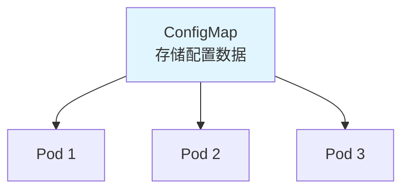

# ConfigMap

**ConfigMap**（配置映射）用于存储非敏感的配置数据，实现配置与应用代码的分离。

[🔗 Kubernetes 官方文档 - ConfigMap](https://kubernetes.io/docs/concepts/configuration/configmap/){target="_blank" rel="noopener"}

## 前置知识

> 💡 阅读本章前，请确保已完成：
> - [Pod 详解](/ops/kubernetes/concepts/pod) - 理解 Pod 的基本概念
> - [Deployment 详解](/ops/kubernetes/workloads/deployment) - 理解 Deployment 的使用

## 为什么需要 ConfigMap

传统方式的问题：

| 方式 | 问题 |
|------|------|
| 硬编码在代码中 | 修改配置需要重新构建镜像 |
| 写在 Dockerfile 中 | 不同环境需要不同镜像 |
| 环境变量写在 YAML 中 | 配置分散，难以管理 |

ConfigMap 的优势：

- **配置集中管理**
- **配置与镜像解耦**
- **支持热更新**（Volume 挂载方式）



## 创建 ConfigMap

### 方式 1：命令行创建

```bash
# 从字面量创建
kubectl create configmap app-config \
  --from-literal=DATABASE_URL=mysql://localhost:3306 \
  --from-literal=LOG_LEVEL=info

# 从文件创建
kubectl create configmap nginx-config \
  --from-file=nginx.conf

# 从目录创建（目录下所有文件）
kubectl create configmap configs \
  --from-file=./config-dir/
```

### 方式 2：YAML 文件创建

```yaml
# configmap.yaml
apiVersion: v1
kind: ConfigMap
metadata:
  name: app-config
data:
  # 简单键值对
  DATABASE_URL: "mysql://localhost:3306"
  LOG_LEVEL: "info"

  # 多行配置文件
  app.properties: |
    server.port=8080
    server.name=myapp
    logging.level=DEBUG

  # JSON 配置
  config.json: |
    {
      "database": {
        "host": "localhost",
        "port": 3306
      }
    }
```

```bash
kubectl apply -f configmap.yaml
```

### 查看 ConfigMap

```bash
# 列出所有 ConfigMap
kubectl get configmaps
kubectl get cm     # 简写

# 查看详情
kubectl describe configmap app-config

# 查看 YAML 格式
kubectl get configmap app-config -o yaml
```

## 使用 ConfigMap

### 方式 1：作为环境变量

#### 引用单个值

```yaml
apiVersion: v1
kind: Pod
metadata:
  name: env-pod
spec:
  containers:
  - name: app
    image: nginx
    env:
    - name: DATABASE_URL          # 环境变量名
      valueFrom:
        configMapKeyRef:
          name: app-config        # ConfigMap 名称
          key: DATABASE_URL       # ConfigMap 中的 key
```

#### 引用所有值

```yaml
apiVersion: v1
kind: Pod
metadata:
  name: env-all-pod
spec:
  containers:
  - name: app
    image: nginx
    envFrom:
    - configMapRef:
        name: app-config          # 导入所有键值对为环境变量
```

### 方式 2：作为 Volume 挂载

```yaml
apiVersion: v1
kind: Pod
metadata:
  name: volume-pod
spec:
  containers:
  - name: app
    image: nginx
    volumeMounts:
    - name: config-volume
      mountPath: /etc/config      # 挂载路径
      readOnly: true
  volumes:
  - name: config-volume
    configMap:
      name: app-config            # ConfigMap 名称
```

挂载后，每个 key 会变成文件：
```
/etc/config/
├── DATABASE_URL              # 文件内容：mysql://localhost:3306
├── LOG_LEVEL                 # 文件内容：info
├── app.properties            # 多行配置文件
└── config.json               # JSON 文件
```

#### 挂载特定 key

```yaml
volumes:
- name: config-volume
  configMap:
    name: app-config
    items:                        # 只挂载指定的 key
    - key: app.properties
      path: application.properties   # 自定义文件名
```

## ConfigMap 热更新

当 ConfigMap 以 Volume 方式挂载时，更新 ConfigMap 后文件会自动更新：

```bash
# 更新 ConfigMap
kubectl edit configmap app-config

# 或重新 apply
kubectl apply -f configmap.yaml
```

> ⚠️ **注意**：
> - 环境变量方式**不会**自动更新，需要重启 Pod
> - Volume 方式更新有延迟（约 1 分钟）
> - 应用需要支持配置热加载才能生效

## 不可变 ConfigMap

Kubernetes 1.21+ 支持不可变 ConfigMap：

```yaml
apiVersion: v1
kind: ConfigMap
metadata:
  name: immutable-config
data:
  key: value
immutable: true               # 设置为不可变
```

优势：
- 防止意外修改
- 提高集群性能（不需要 watch）

## 实战练习

### 完整示例：Nginx 自定义配置

```yaml
# nginx-configmap.yaml
---
apiVersion: v1
kind: ConfigMap
metadata:
  name: nginx-config
data:
  nginx.conf: |
    user nginx;
    worker_processes auto;
    error_log /var/log/nginx/error.log;
    events {
        worker_connections 1024;
    }
    http {
        server {
            listen 80;
            location / {
                root /usr/share/nginx/html;
                index index.html;
            }
            location /health {
                return 200 'healthy';
            }
        }
    }
  index.html: |
    <!DOCTYPE html>
    <html>
    <head><title>Hello ConfigMap</title></head>
    <body>
        <h1>Hello from ConfigMap!</h1>
        <p>This page is served by Nginx with custom configuration.</p>
    </body>
    </html>
---
apiVersion: apps/v1
kind: Deployment
metadata:
  name: nginx-custom
spec:
  replicas: 2
  selector:
    matchLabels:
      app: nginx-custom
  template:
    metadata:
      labels:
        app: nginx-custom
    spec:
      containers:
      - name: nginx
        image: nginx:1.21
        ports:
        - containerPort: 80
        volumeMounts:
        - name: nginx-config
          mountPath: /etc/nginx/nginx.conf
          subPath: nginx.conf                    # 只挂载单个文件
        - name: nginx-config
          mountPath: /usr/share/nginx/html/index.html
          subPath: index.html
      volumes:
      - name: nginx-config
        configMap:
          name: nginx-config
---
apiVersion: v1
kind: Service
metadata:
  name: nginx-custom
spec:
  selector:
    app: nginx-custom
  ports:
  - port: 80
```

```bash
# 部署
kubectl apply -f nginx-configmap.yaml

# 测试
kubectl port-forward svc/nginx-custom 8080:80
# 访问 http://localhost:8080
```

## ConfigMap 限制

| 限制 | 说明 |
|------|------|
| 大小限制 | 单个 ConfigMap 最大 1MB |
| 命名空间 | ConfigMap 是命名空间级别的资源 |
| 安全性 | 不适合存储敏感数据（使用 Secret） |

## 小结

- **ConfigMap** 用于存储非敏感配置数据
- 两种使用方式：**环境变量**和 **Volume 挂载**
- Volume 挂载支持**热更新**
- 敏感数据应使用 **Secret**

## 下一步

ConfigMap 不适合存储敏感信息，让我们学习 Secret。

[下一节：Secret](/ops/kubernetes/storage/secret)
