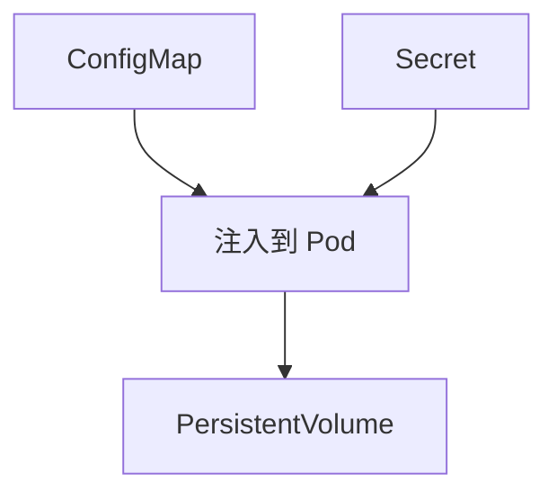

# 配置与存储

本章帮助你学习如何管理应用配置和持久化数据。

## 前置知识

> 💡 阅读本章前，请确保已完成：
> - [基础概念](/ops/kubernetes/concepts/) - 理解 Pod 等核心概念
> - [工作负载](/ops/kubernetes/workloads/) - 理解 Deployment 的使用

## 本章内容

配置管理和持久化存储是生产环境应用的基础需求：

### 学习路径

1. **[ConfigMap](/ops/kubernetes/storage/configmap)** - 存储非敏感配置数据
2. **[Secret](/ops/kubernetes/storage/secret)** - 安全存储敏感信息
3. **[持久化存储](/ops/kubernetes/storage/persistent-volume)** - 数据持久化方案

## 学习目标

完成本章后，你将能够：

- 创建 ConfigMap 并注入到 Pod
- 创建 Secret 安全存储敏感信息
- 配置 PersistentVolume 实现数据持久化

## 预计时间

约 1 小时

## 下一步

首先学习如何使用 ConfigMap 管理配置。

[开始：ConfigMap](/ops/kubernetes/storage/configmap)
