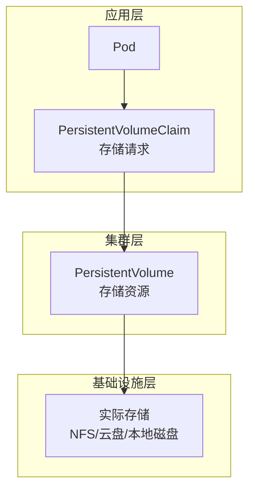
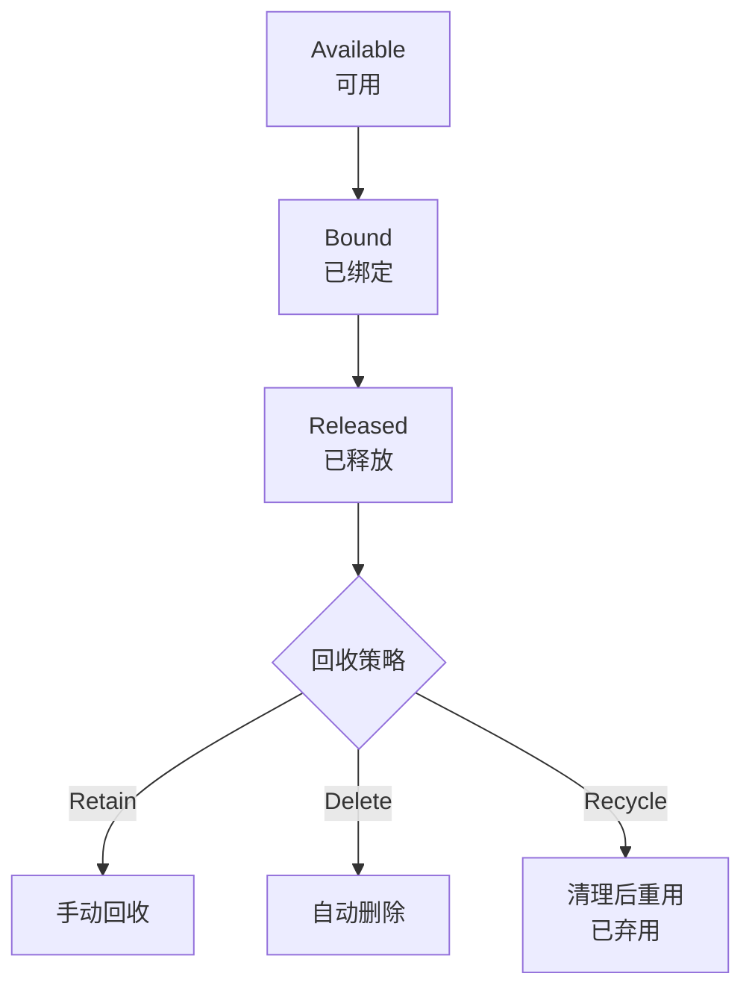

# 持久化存储

Pod 默认是临时的，数据会随 Pod 删除而丢失。**PersistentVolume**（持久卷）和 **PersistentVolumeClaim**（持久卷声明）提供持久化存储能力。

## 前置知识

> 💡 阅读本章前，请确保已完成：
> - [Secret](/ops/kubernetes/storage/secret) - 理解配置和密钥管理

## 存储层级

Kubernetes 存储涉及三个层级：



## 核心概念

### PersistentVolume (PV)

> 💡 **类比**：PV 是"储物柜"，由管理员预先配置好

**PV**（持久卷，集群级别的存储资源）特点：
- 由管理员创建或动态供应
- 集群级别资源（不属于命名空间）
- 独立于 Pod 的生命周期

### PersistentVolumeClaim (PVC)

> 💡 **类比**：PVC 是"储物柜申请单"，用户填写需要多大的柜子

**PVC**（持久卷声明，用户对存储的请求）特点：
- 由用户创建
- 命名空间级别资源
- 描述存储需求（大小、访问模式等）

### StorageClass

> 💡 **类比**：StorageClass 是"储物柜类型"，如普通柜、保险柜

**StorageClass**（存储类，定义存储类型）特点：
- 定义存储的"类型"（SSD、HDD、NFS 等）
- 支持动态供应 PV
- 管理员预先定义

## 访问模式

| 模式 | 简写 | 说明 |
|------|------|------|
| ReadWriteOnce | RWO | 单节点读写 |
| ReadOnlyMany | ROX | 多节点只读 |
| ReadWriteMany | RWX | 多节点读写 |
| ReadWriteOncePod | RWOP | 单 Pod 读写（K8s 1.22+） |

## 创建 PV 和 PVC

### 静态供应

管理员手动创建 PV，用户创建 PVC 绑定。

#### 1. 创建 PV

```yaml
# pv.yaml
apiVersion: v1
kind: PersistentVolume
metadata:
  name: my-pv
spec:
  capacity:
    storage: 5Gi                    # 存储大小
  accessModes:
    - ReadWriteOnce                 # 访问模式
  persistentVolumeReclaimPolicy: Retain   # 回收策略
  storageClassName: manual          # 存储类名称
  hostPath:                         # 存储类型（这里用 hostPath 测试）
    path: /data/pv
```

```bash
kubectl apply -f pv.yaml
kubectl get pv
```

#### 2. 创建 PVC

```yaml
# pvc.yaml
apiVersion: v1
kind: PersistentVolumeClaim
metadata:
  name: my-pvc
spec:
  accessModes:
    - ReadWriteOnce               # 必须与 PV 匹配
  resources:
    requests:
      storage: 5Gi                # 请求大小
  storageClassName: manual        # 存储类名称
```

```bash
kubectl apply -f pvc.yaml
kubectl get pvc
```

#### 3. 在 Pod 中使用

```yaml
# pod-with-pvc.yaml
apiVersion: v1
kind: Pod
metadata:
  name: pod-with-pvc
spec:
  containers:
  - name: app
    image: nginx
    volumeMounts:
    - name: data
      mountPath: /data            # 挂载路径
  volumes:
  - name: data
    persistentVolumeClaim:
      claimName: my-pvc           # PVC 名称
```

### 动态供应

使用 StorageClass 自动创建 PV。

#### 1. 查看可用 StorageClass

```bash
kubectl get storageclass

# Minikube 默认有 standard StorageClass
```

#### 2. 创建 PVC（自动创建 PV）

```yaml
# dynamic-pvc.yaml
apiVersion: v1
kind: PersistentVolumeClaim
metadata:
  name: dynamic-pvc
spec:
  accessModes:
    - ReadWriteOnce
  resources:
    requests:
      storage: 1Gi
  storageClassName: standard      # 使用 standard StorageClass
```

```bash
kubectl apply -f dynamic-pvc.yaml

# 查看自动创建的 PV
kubectl get pv
kubectl get pvc
```

## PV 生命周期



### 回收策略

| 策略 | 说明 |
|------|------|
| Retain | 保留数据，需手动处理 |
| Delete | 删除 PV 和底层存储 |
| Recycle | 清除数据后重用（已弃用） |

## 实战练习：持久化 MySQL 数据

```yaml
# mysql-persistent.yaml
---
# PVC
apiVersion: v1
kind: PersistentVolumeClaim
metadata:
  name: mysql-pvc
spec:
  accessModes:
    - ReadWriteOnce
  resources:
    requests:
      storage: 1Gi
  storageClassName: standard
---
# Secret
apiVersion: v1
kind: Secret
metadata:
  name: mysql-secret
type: Opaque
stringData:
  MYSQL_ROOT_PASSWORD: rootpassword
---
# Deployment
apiVersion: apps/v1
kind: Deployment
metadata:
  name: mysql
spec:
  replicas: 1
  selector:
    matchLabels:
      app: mysql
  template:
    metadata:
      labels:
        app: mysql
    spec:
      containers:
      - name: mysql
        image: mysql:8.0
        ports:
        - containerPort: 3306
        env:
        - name: MYSQL_ROOT_PASSWORD
          valueFrom:
            secretKeyRef:
              name: mysql-secret
              key: MYSQL_ROOT_PASSWORD
        volumeMounts:
        - name: mysql-data
          mountPath: /var/lib/mysql
      volumes:
      - name: mysql-data
        persistentVolumeClaim:
          claimName: mysql-pvc
---
# Service
apiVersion: v1
kind: Service
metadata:
  name: mysql
spec:
  selector:
    app: mysql
  ports:
  - port: 3306
```

```bash
# 部署
kubectl apply -f mysql-persistent.yaml

# 验证
kubectl get pods -l app=mysql
kubectl get pvc mysql-pvc

# 测试数据持久化
# 1. 连接 MySQL 创建数据
kubectl exec -it $(kubectl get pod -l app=mysql -o jsonpath='{.items[0].metadata.name}') \
  -- mysql -u root -prootpassword -e "CREATE DATABASE testdb; SHOW DATABASES;"

# 2. 删除 Pod（Deployment 会重建）
kubectl delete pod -l app=mysql

# 3. 等待新 Pod 启动后验证数据还在
kubectl exec -it $(kubectl get pod -l app=mysql -o jsonpath='{.items[0].metadata.name}') \
  -- mysql -u root -prootpassword -e "SHOW DATABASES;"
# testdb 数据库应该还在！
```

## 常用存储类型

### 本地存储

```yaml
# hostPath - 仅用于测试
spec:
  hostPath:
    path: /data
    type: DirectoryOrCreate

# Local Persistent Volume
spec:
  local:
    path: /mnt/disks/ssd1
  nodeAffinity:
    required:
      nodeSelectorTerms:
      - matchExpressions:
        - key: kubernetes.io/hostname
          operator: In
          values:
          - node1
```

### 网络存储

```yaml
# NFS
spec:
  nfs:
    server: nfs-server.example.com
    path: /exports/data

# iSCSI
spec:
  iscsi:
    targetPortal: 10.0.0.1:3260
    iqn: iqn.2001-04.com.example:storage
    lun: 0
```

### 云存储

```yaml
# AWS EBS
spec:
  awsElasticBlockStore:
    volumeID: vol-xxxxx
    fsType: ext4

# Azure Disk
spec:
  azureDisk:
    diskName: myDisk
    diskURI: /subscriptions/.../myDisk

# GCE Persistent Disk
spec:
  gcePersistentDisk:
    pdName: my-disk
    fsType: ext4
```

## 扩容 PVC

Kubernetes 1.11+ 支持在线扩容（需要 StorageClass 支持）：

```yaml
# StorageClass 需要启用扩容
apiVersion: storage.k8s.io/v1
kind: StorageClass
metadata:
  name: expandable-storage
provisioner: kubernetes.io/gce-pd
allowVolumeExpansion: true        # 启用扩容
```

```bash
# 扩容 PVC
kubectl patch pvc my-pvc -p '{"spec":{"resources":{"requests":{"storage":"10Gi"}}}}'
```

## 小结

- **PV** 是集群级别的存储资源
- **PVC** 是用户对存储的请求
- **StorageClass** 支持动态供应
- 访问模式：RWO、ROX、RWX
- 回收策略：Retain、Delete

## 下一步

恭喜你完成了配置与存储章节！现在你已经掌握了 K8s 的配置管理和持久化存储。

接下来，让我们学习如何构建 CI/CD 流水线。

[下一章：CI/CD](/ops/kubernetes/cicd/)
