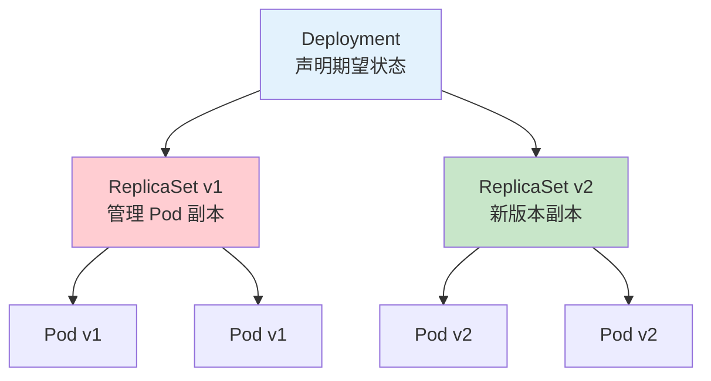

# Deployment 详解

**Deployment**（部署）是 Kubernetes 中最常用的工作负载资源，用于声明式地管理 Pod 和 ReplicaSet。

[🔗 Kubernetes 官方文档 - Deployment](https://kubernetes.io/docs/concepts/workloads/controllers/deployment/){target="_blank" rel="noopener"}

## 前置知识

> 💡 阅读本章前，请确保已完成：
> - [Pod 详解](/ops/kubernetes/concepts/pod) - 理解 Pod 的概念
> - [核心组件](/ops/kubernetes/concepts/components) - 理解 ReplicaSet 的作用

## 为什么需要 Deployment

直接创建 Pod 有以下问题：

| 问题 | Deployment 如何解决 |
|------|---------------------|
| Pod 挂了不会自动重建 | 自动维护指定数量的 Pod |
| 手动更新麻烦 | 声明式更新，自动滚动 |
| 无法快速回滚 | 保留历史版本，一键回滚 |
| 扩缩容需要手动操作 | 修改副本数即可 |

## Deployment、ReplicaSet、Pod 的关系



- **Deployment**：最高层，定义期望状态
- **ReplicaSet**：中间层，确保 Pod 副本数
- **Pod**：最底层，实际运行容器

> 💡 **类比**：Deployment 是餐厅经理（制定策略），ReplicaSet 是领班（执行策略），Pod 是服务员（实际工作）。

## 创建 Deployment

### 基础示例

```yaml
# nginx-deployment.yaml
apiVersion: apps/v1              # API 版本
kind: Deployment                 # 资源类型
metadata:
  name: nginx-deployment         # Deployment 名称
  labels:
    app: nginx
spec:
  replicas: 3                    # 副本数
  selector:                      # 选择器（必须匹配 template.labels）
    matchLabels:
      app: nginx
  template:                      # Pod 模板
    metadata:
      labels:
        app: nginx               # Pod 标签（必须匹配 selector）
    spec:
      containers:
      - name: nginx
        image: nginx:1.21
        ports:
        - containerPort: 80
        resources:               # 资源限制（推荐设置）
          requests:
            memory: "64Mi"
            cpu: "100m"
          limits:
            memory: "128Mi"
            cpu: "200m"
```

```bash
# 创建 Deployment
kubectl apply -f nginx-deployment.yaml

# 查看 Deployment
kubectl get deployments

# 输出示例：
# NAME               READY   UP-TO-DATE   AVAILABLE   AGE
# nginx-deployment   3/3     3            3           30s
```

### 理解输出列

| 列名 | 说明 |
|------|------|
| NAME | Deployment 名称 |
| READY | 就绪/期望 Pod 数 |
| UP-TO-DATE | 已更新到最新版本的 Pod 数 |
| AVAILABLE | 可用的 Pod 数 |
| AGE | 创建时间 |

## 查看 Deployment 详情

```bash
# 查看 Deployment 详情
kubectl describe deployment nginx-deployment

# 查看关联的 ReplicaSet
kubectl get rs

# 查看所有相关资源
kubectl get all -l app=nginx
```

## Deployment 策略

### 滚动更新策略（默认）

```yaml
spec:
  strategy:
    type: RollingUpdate          # 滚动更新
    rollingUpdate:
      maxSurge: 25%              # 最多超出期望副本数的比例
      maxUnavailable: 25%        # 最多不可用副本数的比例
```

### 重建策略

```yaml
spec:
  strategy:
    type: Recreate               # 先删除所有旧 Pod，再创建新 Pod
```

| 策略 | 特点 | 适用场景 |
|------|------|----------|
| RollingUpdate | 零停机，渐进更新 | 大多数场景 |
| Recreate | 有停机，完全替换 | 不支持多版本共存的应用 |

## 副本数管理

### 修改副本数

```bash
# 方式 1：命令行
kubectl scale deployment nginx-deployment --replicas=5

# 方式 2：编辑 YAML
kubectl edit deployment nginx-deployment

# 方式 3：patch
kubectl patch deployment nginx-deployment -p '{"spec":{"replicas":5}}'
```

### 查看扩缩容过程

```bash
# 实时查看 Pod 变化
kubectl get pods -w
```

## 标签选择器

Deployment 使用 `selector` 来识别它管理的 Pod：

```yaml
spec:
  selector:
    matchLabels:
      app: nginx                 # 简单匹配
    matchExpressions:            # 表达式匹配
    - key: environment
      operator: In
      values:
      - production
      - staging
```

> ⚠️ **重要**：`selector` 一旦创建就不能修改。`template.labels` 必须包含 `selector.matchLabels` 中的所有标签。

## 实战练习

### 创建完整的 Web 应用 Deployment

```yaml
# web-deployment.yaml
apiVersion: apps/v1
kind: Deployment
metadata:
  name: web-app
  labels:
    app: web
    tier: frontend
spec:
  replicas: 3
  selector:
    matchLabels:
      app: web
      tier: frontend
  strategy:
    type: RollingUpdate
    rollingUpdate:
      maxSurge: 1
      maxUnavailable: 0          # 确保始终有足够的 Pod
  template:
    metadata:
      labels:
        app: web
        tier: frontend
    spec:
      containers:
      - name: web
        image: nginx:1.21
        ports:
        - containerPort: 80
        resources:
          requests:
            cpu: "100m"
            memory: "128Mi"
          limits:
            cpu: "200m"
            memory: "256Mi"
        livenessProbe:           # 存活探针
          httpGet:
            path: /
            port: 80
          initialDelaySeconds: 5
          periodSeconds: 10
        readinessProbe:          # 就绪探针
          httpGet:
            path: /
            port: 80
          initialDelaySeconds: 5
          periodSeconds: 5
```

```bash
# 部署
kubectl apply -f web-deployment.yaml

# 验证
kubectl get deployment web-app
kubectl get pods -l app=web

# 查看事件
kubectl describe deployment web-app
```

## 常用命令总结

```bash
# 创建/更新
kubectl apply -f deployment.yaml

# 查看
kubectl get deployments
kubectl describe deployment <name>

# 扩缩容
kubectl scale deployment <name> --replicas=5

# 删除
kubectl delete deployment <name>

# 查看历史
kubectl rollout history deployment <name>

# 暂停/恢复
kubectl rollout pause deployment <name>
kubectl rollout resume deployment <name>
```

## 小结

- **Deployment** 是管理无状态应用的最佳方式
- 管理层级：Deployment → ReplicaSet → Pod
- 支持**声明式更新**和**自动扩缩容**
- 默认使用 **RollingUpdate** 策略实现零停机更新
- 必须设置 **selector** 来匹配 Pod

## 下一步

了解 Deployment 后，让我们学习如何进行滚动更新。

[下一节：滚动更新](/ops/kubernetes/workloads/rolling-update)
