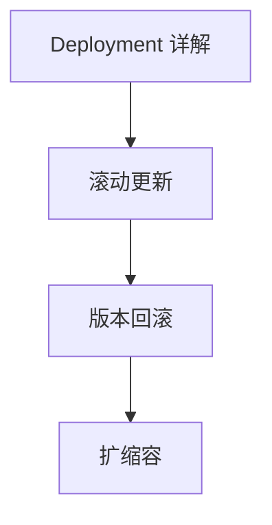

# 工作负载

本章帮助你学习如何使用 Deployment 声明式地管理应用的生命周期。

## 前置知识

> 💡 阅读本章前，请确保已完成：
> - [基础概念](/ops/kubernetes/concepts/) - 理解 Pod 等核心概念
> - [环境搭建](/ops/kubernetes/setup/) - 已有可用的本地 K8s 环境

## 本章内容

**Deployment**（部署，声明式管理 Pod 的控制器）是 K8s 中最常用的工作负载资源：

### 学习路径

1. **[Deployment 详解](/ops/kubernetes/workloads/deployment)** - 理解 Deployment 与 ReplicaSet、Pod 的关系
2. **[滚动更新](/ops/kubernetes/workloads/rolling-update)** - 零停机更新应用
3. **[版本回滚](/ops/kubernetes/workloads/rollback)** - 快速恢复到之前版本
4. **[扩缩容](/ops/kubernetes/workloads/scaling)** - 手动和自动调整副本数

## 学习目标

完成本章后，你将能够：

- 创建 Deployment 管理应用
- 执行滚动更新并观察更新过程
- 回滚到之前的版本
- 手动和自动扩缩容

## 预计时间

约 1-1.5 小时

## 下一步

首先深入理解 Deployment 的工作原理。

[开始：Deployment 详解](/ops/kubernetes/workloads/deployment)
