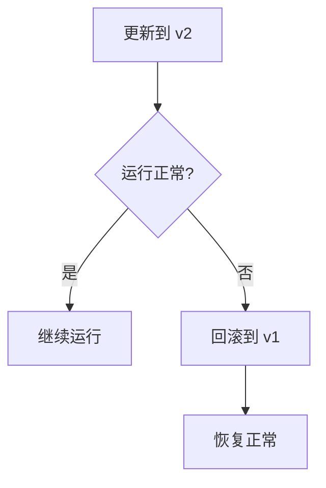
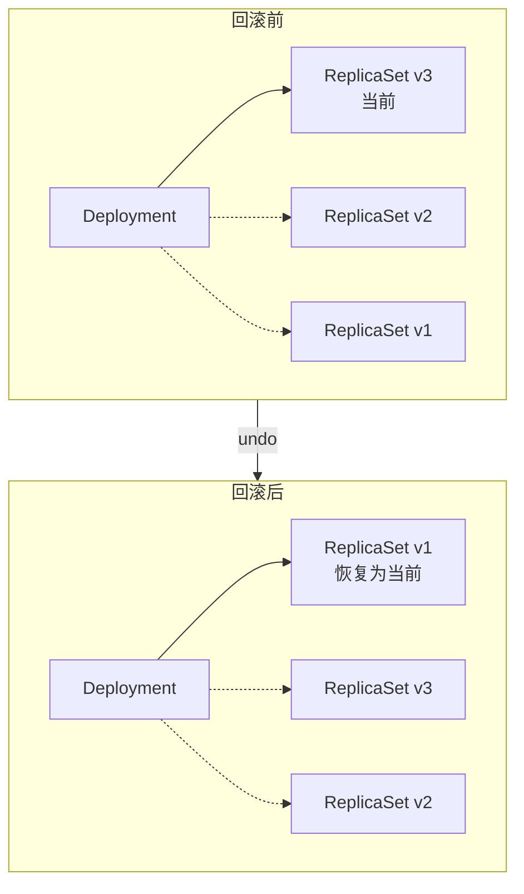

# 版本回滚

当滚动更新出现问题时，Kubernetes 允许你快速回滚到之前的版本。

## 前置知识

> 💡 阅读本章前，请确保已完成：
> - [滚动更新](/ops/kubernetes/workloads/rolling-update) - 理解滚动更新机制

## 为什么需要回滚

更新可能失败的原因：

- 新版本有 bug
- 配置错误
- 资源不足
- 镜像问题



## 查看更新历史

```bash
# 查看 Deployment 更新历史
kubectl rollout history deployment nginx-deployment

# 输出示例：
# REVISION  CHANGE-CAUSE
# 1         <none>
# 2         <none>
# 3         <none>
```

### 添加更新原因

```bash
# 更新时添加原因（推荐）
kubectl set image deployment/nginx-deployment nginx=nginx:1.22 \
  --record=true

# 或者手动添加 annotation
kubectl annotate deployment nginx-deployment \
  kubernetes.io/change-cause="Update to nginx 1.22"
```

### 查看特定版本详情

```bash
# 查看特定版本的配置
kubectl rollout history deployment nginx-deployment --revision=2
```

## 执行回滚

### 回滚到上一版本

```bash
# 回滚到上一版本
kubectl rollout undo deployment nginx-deployment

# 输出：
# deployment.apps/nginx-deployment rolled back
```

### 回滚到指定版本

```bash
# 回滚到指定版本
kubectl rollout undo deployment nginx-deployment --to-revision=1
```

### 观察回滚过程

```bash
# 查看回滚状态
kubectl rollout status deployment nginx-deployment

# 查看 Pod 变化
kubectl get pods -w
```

## 回滚原理

回滚实际上是将 Deployment 的 Pod 模板恢复到指定 ReplicaSet 的模板：



## 历史版本保留

默认保留 10 个 ReplicaSet 历史版本：

```yaml
spec:
  revisionHistoryLimit: 10    # 保留的历史版本数
```

### 调整保留数量

```yaml
spec:
  revisionHistoryLimit: 5     # 只保留 5 个版本
  # 设置为 0 表示不保留历史，无法回滚
```

## 实战练习：模拟故障和回滚

### 1. 创建初始 Deployment

```yaml
# deployment-v1.yaml
apiVersion: apps/v1
kind: Deployment
metadata:
  name: rollback-demo
  annotations:
    kubernetes.io/change-cause: "Initial deployment with nginx:1.21"
spec:
  replicas: 3
  selector:
    matchLabels:
      app: rollback-demo
  template:
    metadata:
      labels:
        app: rollback-demo
    spec:
      containers:
      - name: nginx
        image: nginx:1.21
        ports:
        - containerPort: 80
```

```bash
kubectl apply -f deployment-v1.yaml
kubectl get pods -l app=rollback-demo
```

### 2. 更新到新版本

```bash
# 更新到 1.22
kubectl set image deployment/rollback-demo nginx=nginx:1.22
kubectl annotate deployment rollback-demo \
  kubernetes.io/change-cause="Update to nginx 1.22" --overwrite

# 查看历史
kubectl rollout history deployment rollback-demo
```

### 3. 模拟错误更新

```bash
# 更新到不存在的镜像版本
kubectl set image deployment/rollback-demo nginx=nginx:invalid-version
kubectl annotate deployment rollback-demo \
  kubernetes.io/change-cause="Update to invalid version" --overwrite

# 查看状态（会看到 ImagePullBackOff）
kubectl rollout status deployment rollback-demo --timeout=30s
kubectl get pods -l app=rollback-demo
```

### 4. 执行回滚

```bash
# 回滚到上一版本
kubectl rollout undo deployment rollback-demo

# 验证回滚
kubectl rollout status deployment rollback-demo
kubectl get pods -l app=rollback-demo

# 查看当前镜像版本
kubectl describe deployment rollback-demo | grep Image
```

### 5. 查看完整历史

```bash
kubectl rollout history deployment rollback-demo

# 输出示例：
# REVISION  CHANGE-CAUSE
# 1         Initial deployment with nginx:1.21
# 3         Update to invalid version
# 4         Update to nginx 1.22
```

> 💡 **注意**：回滚后，被恢复的版本会成为新的版本号（如 v2 回滚后变成 v4）。

## 自动回滚

虽然 K8s 不直接支持自动回滚，但可以通过以下方式实现：

### 1. 使用 progressDeadlineSeconds

```yaml
spec:
  progressDeadlineSeconds: 300    # 5 分钟超时
```

更新超时后，Deployment 会标记为失败，但不会自动回滚。

### 2. 结合 CI/CD 工具

在 CI/CD 流水线中：
1. 执行更新
2. 运行健康检查
3. 检查失败则执行 `kubectl rollout undo`

## 回滚最佳实践

1. **总是记录更新原因**
   ```bash
   kubectl annotate deployment <name> \
     kubernetes.io/change-cause="<reason>"
   ```

2. **保留足够的历史版本**
   ```yaml
   spec:
     revisionHistoryLimit: 10
   ```

3. **更新前验证镜像存在**
   ```bash
   docker pull <image>:<tag>
   ```

4. **使用健康检查**
   ```yaml
   livenessProbe: ...
   readinessProbe: ...
   ```

5. **监控更新状态**
   ```bash
   kubectl rollout status deployment <name>
   ```

## 常用命令总结

```bash
# 查看历史
kubectl rollout history deployment <name>
kubectl rollout history deployment <name> --revision=<n>

# 回滚
kubectl rollout undo deployment <name>
kubectl rollout undo deployment <name> --to-revision=<n>

# 状态
kubectl rollout status deployment <name>

# 暂停/恢复
kubectl rollout pause deployment <name>
kubectl rollout resume deployment <name>
```

## 小结

- 使用 `kubectl rollout history` 查看更新历史
- 使用 `kubectl rollout undo` 回滚到上一版本
- 使用 `--to-revision` 回滚到指定版本
- `revisionHistoryLimit` 控制保留的历史版本数
- **推荐**：总是记录更新原因，方便追溯

## 下一步

学会了更新和回滚，让我们来看看如何进行扩缩容。

[下一节：扩缩容](/ops/kubernetes/workloads/scaling)
