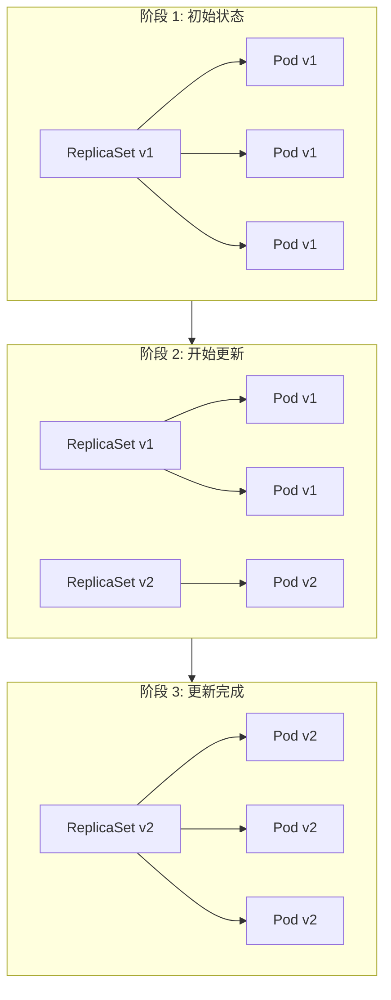
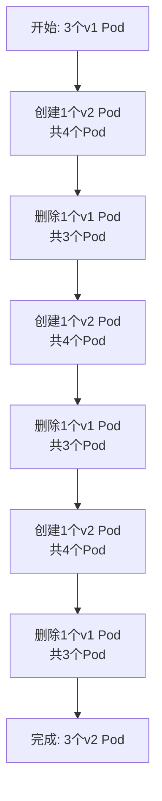

# 滚动更新

**滚动更新**（Rolling Update）是 Kubernetes 的默认更新策略，允许逐步将应用从一个版本更新到另一个版本，实现零停机。

## 前置知识

> 💡 阅读本章前，请确保已完成：
> - [Deployment 详解](/ops/kubernetes/workloads/deployment) - 理解 Deployment 基础

## 滚动更新原理

滚动更新的过程：

1. 创建新版本的 ReplicaSet
2. 逐步增加新版本 Pod
3. 逐步减少旧版本 Pod
4. 直到所有 Pod 都是新版本



## 触发滚动更新

滚动更新在以下情况触发：

- 修改 Pod 模板（`spec.template`）
- 常见：更新镜像版本、修改环境变量、修改资源限制

### 方式 1：修改 YAML 文件

```yaml
# 修改 image 版本
spec:
  template:
    spec:
      containers:
      - name: nginx
        image: nginx:1.22     # 从 1.21 更新到 1.22
```

```bash
kubectl apply -f deployment.yaml
```

### 方式 2：命令行更新镜像

```bash
# 更新镜像
kubectl set image deployment/nginx-deployment nginx=nginx:1.22

# 语法：kubectl set image deployment/<name> <container>=<image>
```

### 方式 3：编辑 Deployment

```bash
kubectl edit deployment nginx-deployment
# 在编辑器中修改 image，保存退出
```

## 观察滚动更新过程

```bash
# 实时查看更新状态
kubectl rollout status deployment nginx-deployment

# 输出示例：
# Waiting for deployment "nginx-deployment" rollout to finish: 1 out of 3 new replicas have been updated...
# Waiting for deployment "nginx-deployment" rollout to finish: 2 out of 3 new replicas have been updated...
# deployment "nginx-deployment" successfully rolled out

# 实时查看 Pod 变化
kubectl get pods -w

# 查看 ReplicaSet
kubectl get rs
```

## 更新策略参数

```yaml
spec:
  strategy:
    type: RollingUpdate
    rollingUpdate:
      maxSurge: 25%           # 最多超出的 Pod 数量
      maxUnavailable: 25%     # 最多不可用的 Pod 数量
```

### maxSurge

- 更新过程中，可以**额外创建**的 Pod 数量
- 可以是数字或百分比
- 值越大，更新越快，但资源消耗越多

### maxUnavailable

- 更新过程中，可以**不可用**的 Pod 数量
- 可以是数字或百分比
- 值越大，更新越快，但可用性越低

### 策略示例

| 场景 | maxSurge | maxUnavailable | 效果 |
|------|----------|----------------|------|
| 保守更新 | 1 | 0 | 先加后减，始终有足够 Pod |
| 快速更新 | 50% | 50% | 快速，但可能有短暂不可用 |
| 默认 | 25% | 25% | 平衡速度和可用性 |

```yaml
# 保守策略：确保服务始终可用
spec:
  replicas: 3
  strategy:
    type: RollingUpdate
    rollingUpdate:
      maxSurge: 1
      maxUnavailable: 0
```

## 更新过程详解

假设有 3 个副本，使用默认策略（maxSurge=25%, maxUnavailable=25%）：



## 暂停和恢复更新

### 暂停更新

```bash
# 暂停滚动更新
kubectl rollout pause deployment nginx-deployment

# 可以进行多次修改
kubectl set image deployment/nginx-deployment nginx=nginx:1.22
kubectl set resources deployment/nginx-deployment -c nginx --limits=cpu=200m,memory=256Mi

# 恢复更新（一次性应用所有修改）
kubectl rollout resume deployment nginx-deployment
```

### 使用场景

- 需要进行多个相关修改
- 想要一次性应用所有变更
- 金丝雀发布的手动控制

## minReadySeconds

设置 Pod 就绪后等待时间，再继续更新：

```yaml
spec:
  minReadySeconds: 10    # Pod 就绪后等待 10 秒
```

用途：
- 确保 Pod 真正稳定运行
- 发现问题时有时间中止更新

## progressDeadlineSeconds

设置更新超时时间：

```yaml
spec:
  progressDeadlineSeconds: 600   # 10 分钟超时
```

如果更新进度停滞超过此时间，Deployment 状态会变为失败。

## 实战练习：模拟滚动更新

```bash
# 1. 创建 Deployment
kubectl create deployment nginx-update --image=nginx:1.21 --replicas=3

# 2. 查看初始状态
kubectl get pods -l app=nginx-update -w &

# 3. 触发滚动更新
kubectl set image deployment/nginx-update nginx=nginx:1.22

# 4. 观察更新过程
kubectl rollout status deployment nginx-update

# 5. 验证更新完成
kubectl describe deployment nginx-update | grep Image

# 6. 查看 ReplicaSet 历史
kubectl get rs

# 7. 清理
kubectl delete deployment nginx-update
```

## 常见问题

### 更新卡住怎么办？

```bash
# 查看 Deployment 状态
kubectl describe deployment <name>

# 查看 Pod 事件
kubectl describe pod <pod-name>

# 常见原因：
# - 镜像拉取失败
# - 资源不足
# - 健康检查失败
```

### 如何快速回滚？

```bash
# 回滚到上一版本
kubectl rollout undo deployment nginx-deployment
```

详见下一节：版本回滚。

## 小结

- **滚动更新**通过逐步替换 Pod 实现零停机
- 修改 **Pod 模板**会触发滚动更新
- **maxSurge** 和 **maxUnavailable** 控制更新速度
- 使用 `kubectl rollout status` 监控更新进度
- 可以**暂停**和**恢复**更新

## 下一步

更新出问题怎么办？让我们学习版本回滚。

[下一节：版本回滚](/ops/kubernetes/workloads/rollback)
