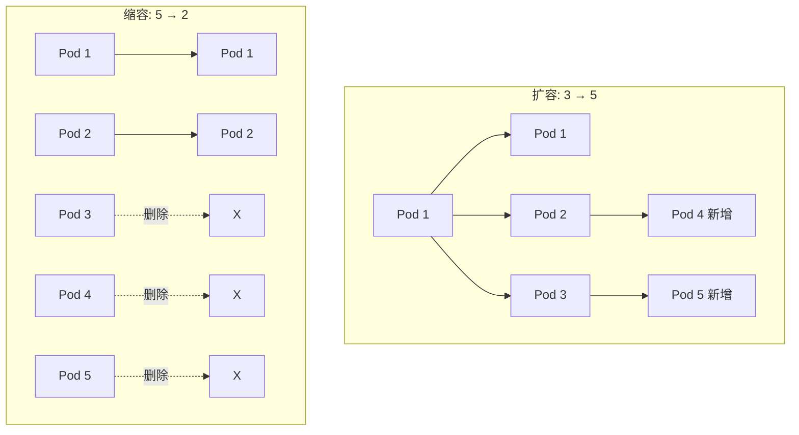
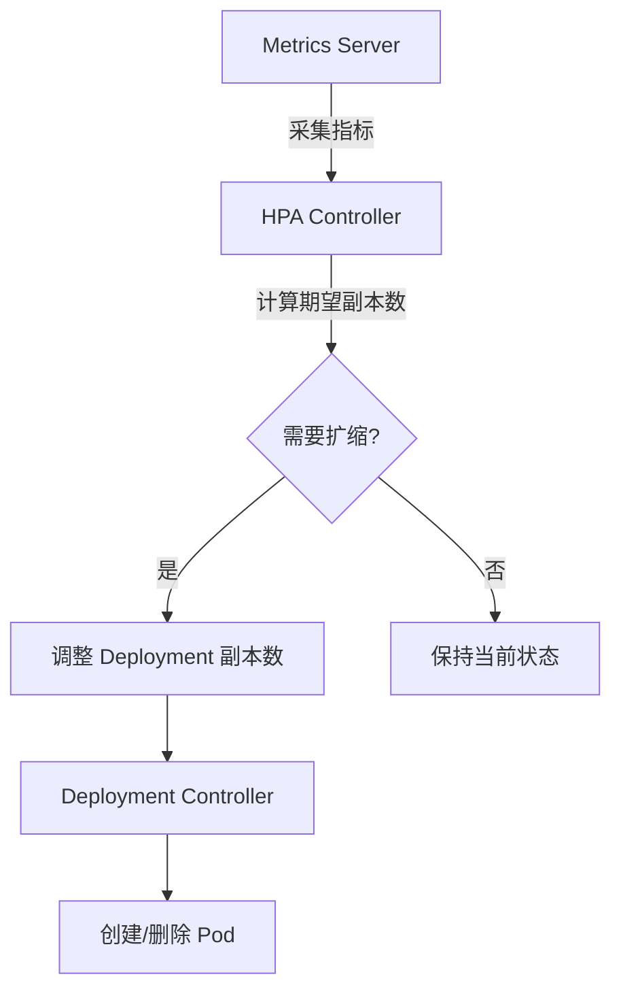

# 扩缩容

扩缩容是调整应用副本数量的过程，Kubernetes 支持手动和自动两种方式。

## 前置知识

> 💡 阅读本章前，请确保已完成：
> - [Deployment 详解](/ops/kubernetes/workloads/deployment) - 理解 Deployment 基础

## 手动扩缩容

### 方式 1：命令行

```bash
# 扩容到 5 个副本
kubectl scale deployment nginx-deployment --replicas=5

# 缩容到 2 个副本
kubectl scale deployment nginx-deployment --replicas=2
```

### 方式 2：修改 YAML

```yaml
spec:
  replicas: 5    # 修改副本数
```

```bash
kubectl apply -f deployment.yaml
```

### 方式 3：patch 命令

```bash
kubectl patch deployment nginx-deployment \
  -p '{"spec":{"replicas":5}}'
```

### 观察扩缩容过程

```bash
# 实时查看 Pod 变化
kubectl get pods -w

# 查看 Deployment 状态
kubectl get deployment nginx-deployment
```

## 扩缩容过程



## 条件扩缩容

只在满足条件时扩容：

```bash
# 当前副本数为 3 时，才扩容到 5
kubectl scale deployment nginx-deployment \
  --current-replicas=3 --replicas=5
```

## 自动扩缩容 (HPA)

**HPA**（Horizontal Pod Autoscaler，水平 Pod 自动扩缩器）根据 CPU/内存使用率自动调整副本数。

### 前提条件

需要安装 Metrics Server：

```bash
# Minikube 启用 metrics-server
minikube addons enable metrics-server

# 验证
kubectl top pods
```

### 创建 HPA

#### 方式 1：命令行创建

```bash
# 基于 CPU 使用率自动扩缩
kubectl autoscale deployment nginx-deployment \
  --min=2 \
  --max=10 \
  --cpu-percent=50
```

#### 方式 2：YAML 配置

```yaml
# hpa.yaml
apiVersion: autoscaling/v2
kind: HorizontalPodAutoscaler
metadata:
  name: nginx-hpa
spec:
  scaleTargetRef:
    apiVersion: apps/v1
    kind: Deployment
    name: nginx-deployment
  minReplicas: 2           # 最小副本数
  maxReplicas: 10          # 最大副本数
  metrics:
  - type: Resource
    resource:
      name: cpu
      target:
        type: Utilization
        averageUtilization: 50    # CPU 使用率目标 50%
```

```bash
kubectl apply -f hpa.yaml
```

### 查看 HPA 状态

```bash
# 查看 HPA
kubectl get hpa

# 输出示例：
# NAME        REFERENCE                     TARGETS   MINPODS   MAXPODS   REPLICAS   AGE
# nginx-hpa   Deployment/nginx-deployment   10%/50%   2         10        3          1m

# 查看详情
kubectl describe hpa nginx-hpa
```

### HPA 工作原理



### 扩缩算法

```
期望副本数 = ceil(当前副本数 × (当前指标值 / 目标指标值))
```

示例：
- 当前 3 个副本，CPU 使用率 75%，目标 50%
- 期望副本数 = ceil(3 × 75/50) = ceil(4.5) = 5

## 多指标 HPA

可以基于多个指标进行扩缩：

```yaml
apiVersion: autoscaling/v2
kind: HorizontalPodAutoscaler
metadata:
  name: multi-metric-hpa
spec:
  scaleTargetRef:
    apiVersion: apps/v1
    kind: Deployment
    name: nginx-deployment
  minReplicas: 2
  maxReplicas: 10
  metrics:
  - type: Resource
    resource:
      name: cpu
      target:
        type: Utilization
        averageUtilization: 50
  - type: Resource
    resource:
      name: memory
      target:
        type: Utilization
        averageUtilization: 70
```

多指标时，取计算出的最大副本数。

## 基于自定义指标

除了 CPU/内存，还可以基于自定义指标：

```yaml
metrics:
- type: Pods
  pods:
    metric:
      name: requests_per_second
    target:
      type: AverageValue
      averageValue: 1000
```

> 💡 **注意**：自定义指标需要额外配置 Prometheus Adapter 等组件。

## 扩缩容行为控制

控制扩缩容的速度和稳定性：

```yaml
apiVersion: autoscaling/v2
kind: HorizontalPodAutoscaler
spec:
  behavior:
    scaleDown:
      stabilizationWindowSeconds: 300   # 缩容稳定窗口
      policies:
      - type: Percent
        value: 10                        # 每次最多缩容 10%
        periodSeconds: 60
    scaleUp:
      stabilizationWindowSeconds: 0      # 立即扩容
      policies:
      - type: Percent
        value: 100                       # 可以翻倍扩容
        periodSeconds: 15
      - type: Pods
        value: 4                         # 或每次最多加 4 个
        periodSeconds: 15
      selectPolicy: Max                  # 取两个策略的最大值
```

## 实战练习：测试 HPA

### 1. 创建 Deployment（设置资源请求）

```yaml
# hpa-demo.yaml
apiVersion: apps/v1
kind: Deployment
metadata:
  name: hpa-demo
spec:
  replicas: 1
  selector:
    matchLabels:
      app: hpa-demo
  template:
    metadata:
      labels:
        app: hpa-demo
    spec:
      containers:
      - name: hpa-demo
        image: registry.k8s.io/hpa-example
        ports:
        - containerPort: 80
        resources:
          requests:
            cpu: 200m         # 必须设置 CPU 请求
          limits:
            cpu: 500m
```

### 2. 创建 HPA

```bash
kubectl apply -f hpa-demo.yaml
kubectl autoscale deployment hpa-demo --cpu-percent=50 --min=1 --max=10
```

### 3. 产生负载

```bash
# 在另一个终端运行
kubectl run -it load-generator --rm --image=busybox --restart=Never -- \
  /bin/sh -c "while sleep 0.01; do wget -q -O- http://hpa-demo; done"
```

### 4. 观察扩容

```bash
# 查看 HPA 和 Pod 变化
kubectl get hpa hpa-demo -w
kubectl get pods -l app=hpa-demo -w
```

### 5. 停止负载，观察缩容

停止 load-generator（Ctrl+C），观察 Pod 数量逐渐减少。

## 扩缩容最佳实践

1. **设置合理的资源请求**
   ```yaml
   resources:
     requests:
       cpu: 100m
       memory: 128Mi
   ```

2. **设置最小副本数 ≥ 2**
   - 确保高可用

3. **使用 PDB 防止过度缩容**
   ```yaml
   apiVersion: policy/v1
   kind: PodDisruptionBudget
   metadata:
     name: nginx-pdb
   spec:
     minAvailable: 2
     selector:
       matchLabels:
         app: nginx
   ```

4. **预热流量前提前扩容**
   - 大促前手动扩容
   - 或使用定时扩容

## 小结

- **手动扩缩容**：`kubectl scale` 或修改 `replicas`
- **自动扩缩容**：HPA 根据指标自动调整
- HPA 需要 **Metrics Server** 和 **资源请求** 配置
- 使用 **behavior** 控制扩缩容速度
- **最佳实践**：设置资源请求、最小副本数、PDB

## 下一步

恭喜你完成了工作负载章节！现在你已经掌握了 Deployment 的完整管理。

接下来，让我们学习配置管理和持久化存储。

[下一章：配置与存储](/ops/kubernetes/storage/)
