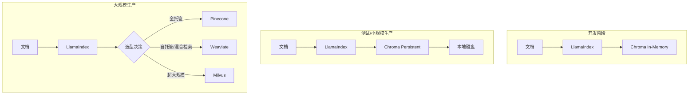
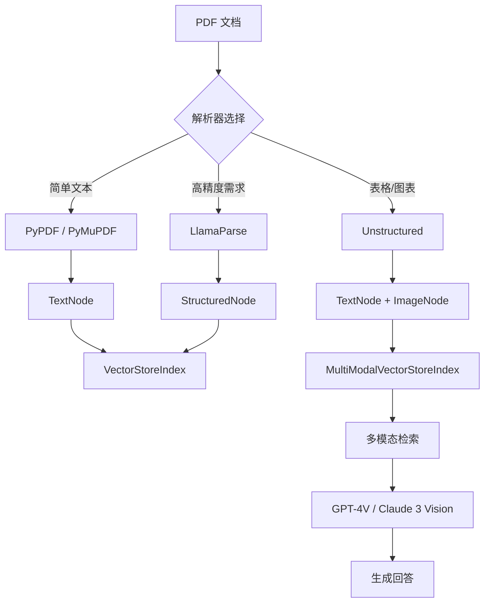

# 架构设计：向量数据库与多模态教程

## Context

### 背景
现有 LlamaIndex 中文教程覆盖了 RAG 基础、数据加载、索引构建、查询引擎和 Agent 等核心主题。然而，随着 RAG 应用走向生产，两个关键领域需要补充：

1. **向量数据库持久化存储**：当前仅有内存存储和简单 Chroma 示例
2. **多模态文档处理**：真实场景中 PDF 常包含图表、图片等非文本内容

### 约束条件
- 目标受众：零基础学员（有前端开发背景）
- 编码：必须 UTF-8
- 框架版本：LlamaIndex 0.10.x+
- 可视化：复杂逻辑必须使用 Mermaid 流程图
- 不修改存量内容

### 相关方
- 教程读者（零基础学员）
- 项目维护者

## Goals / Non-Goals

### Goals
1. 提供向量数据库选型的系统性指导
2. 深度讲解 Chroma 的完整用法（从开发到生产）
3. 教会学员处理包含图表/图片的 PDF 文档
4. 所有代码示例可直接运行，且基于最新 API

### Non-Goals
1. 不覆盖所有向量数据库的详细教程（仅 Chroma 深度讲解）
2. 不涉及视频/音频等其他多模态类型
3. 不讲解分布式向量数据库集群部署

## Decisions

### D1: 向量数据库教程结构

**决策**: 采用"对比 + 深度"两段式结构

```
向量数据库选型
├── 第一部分：四大数据库横向对比
│   ├── 功能对比表
│   ├── 性能基准（延迟、吞吐量）
│   ├── 使用场景匹配
│   └── 成本分析
└── 第二部分：Chroma 完整指南
    ├── 安装与基础用法
    ├── 持久化存储
    ├── 元数据过滤
    ├── 批量操作与性能优化
    └── 从 Chroma 迁移到其他数据库
```

**替代方案考虑**:
- ❌ 每个数据库独立章节：内容过长，学员难以选择
- ❌ 仅讲 Chroma：缺乏全局视野
- ✅ 对比 + 深度：兼顾广度和深度

### D2: 多模态教程技术栈

**决策**: 使用 LlamaParse + Unstructured 双轨方案

| 场景 | 推荐方案 | 理由 |
|------|----------|------|
| 简单 PDF（纯文本） | SimpleDirectoryReader | 内置支持，无需额外依赖 |
| 复杂 PDF（表格/图表） | Unstructured | 开源免费，本地运行 |
| 高精度需求 | LlamaParse | 云服务，精度最高但收费 |

**替代方案考虑**:
- ❌ 仅 LlamaParse：收费服务，不利于学员实践
- ❌ 仅 Unstructured：某些场景精度不足
- ✅ 双轨方案：满足不同场景需求

### D3: 文档结构与导航

**决策**: 在 VitePress 侧边栏新增"进阶应用"分组

```typescript
{
  text: '进阶应用',
  collapsed: false,
  items: [
    { text: '向量数据库选型', link: '/ai/llamaindex/guide/vector-databases' },
    { text: '多模态 RAG', link: '/ai/llamaindex/guide/multimodal-rag' },
  ],
}
```

**理由**:
- 与现有"基础"、"进阶"、"生产"分组逻辑一致
- 学员完成基础教程后自然进入进阶内容

## Architecture

### 向量数据库集成架构



### 多模态 RAG 数据流



## Risks / Trade-offs

### R1: Chroma 扩展性限制
- **风险**: Chroma 设计为单机使用，不支持分布式部署
- **缓解**: 明确告知学员 Chroma 适用规模（< 1000 万向量），超出后建议迁移

### R2: 多模态 API 变化频繁
- **风险**: LlamaIndex 多模态 API 仍在快速迭代
- **缓解**: 代码示例标注 `适用版本: LlamaIndex 0.10.x+`，后续持续更新

### R3: LlamaParse 收费问题
- **风险**: 学员可能对云服务收费敏感
- **缓解**: 优先推荐免费的 Unstructured，LlamaParse 作为可选高级方案

## Migration Plan

本提案为纯增量内容，无需迁移现有内容。

### 实施顺序
1. 创建向量数据库教程（依赖：无）
2. 创建多模态教程（依赖：无）
3. 更新 VitePress 配置（依赖：1、2 完成）
4. 更新首页 features（可选）

### 回滚策略
如教程内容有误，可直接修改 Markdown 文件，无代码层面回滚需求。

## Open Questions

1. **Q: 是否需要在首页 index.md 添加新 feature 卡片？**
   - 建议：暂不添加，避免首页过于拥挤。可在章节稳定后考虑。

2. **Q: 是否需要提供可运行的 Jupyter Notebook？**
   - 建议：首期以 Markdown 代码块为主，后续根据反馈决定是否补充 Notebook。

3. **Q: 多模态教程是否需要提供示例 PDF？**
   - 建议：是，应在 `docs/ai/llamaindex/assets/` 目录提供 1-2 个示例 PDF 供学员下载练习。
