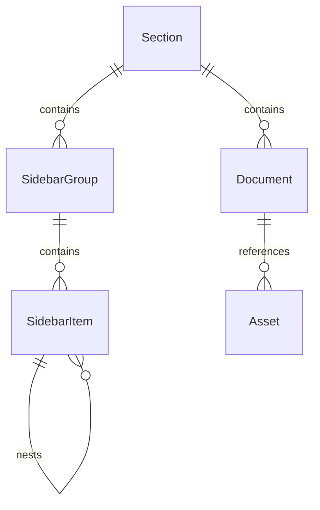

# Data Model: 文档站点整合

**Feature**: 001-docs-site-setup
**Date**: 2025-11-26

## 实体定义

### Section（板块）

文档的顶级分类单元。

| 字段        | 类型   | 必填 | 描述                                         |
| ----------- | ------ | ---- | -------------------------------------------- |
| id          | string | ✓    | 唯一标识符（如 `frontend`, `backend`, `ai`） |
| displayName | string | ✓    | 显示名称（如 `前端`, `后端`, `AI`）          |
| urlPrefix   | string | ✓    | URL 路径前缀（如 `/frontend/`）              |
| docsPath    | string | ✓    | 文档目录相对路径（如 `docs/frontend/`）      |
| icon        | string | ✗    | 板块图标（可选）                             |
| description | string | ✗    | 板块描述文字                                 |

**状态**:

- `active`: 包含文档内容
- `placeholder`: 预留占位

### SidebarGroup（侧边栏分组）

侧边栏中的一个可折叠分组。

| 字段      | 类型          | 必填 | 描述                       |
| --------- | ------------- | ---- | -------------------------- |
| text      | string        | ✓    | 分组标题                   |
| collapsed | boolean       | ✗    | 是否默认折叠（默认 false） |
| items     | SidebarItem[] | ✓    | 子项列表                   |

### SidebarItem（侧边栏项）

侧边栏中的单个链接项。

| 字段  | 类型          | 必填 | 描述                      |
| ----- | ------------- | ---- | ------------------------- |
| text  | string        | ✓    | 显示文字                  |
| link  | string        | ✓    | 文档链接路径              |
| items | SidebarItem[] | ✗    | 嵌套子项（支持最多 6 层） |

### Document（文档）

单个 Markdown 文档文件。

| 字段       | 类型    | 必填 | 描述                          |
| ---------- | ------- | ---- | ----------------------------- |
| title      | string  | ✓    | 文档标题（frontmatter 或 h1） |
| sourcePath | string  | ✓    | 源文件绝对路径                |
| targetPath | string  | ✓    | 目标文件相对路径              |
| sectionId  | string  | ✓    | 所属板块 ID                   |
| assets     | Asset[] | ✗    | 关联资源列表                  |

### Asset（资源文件）

图片、附件等非 Markdown 文件。

| 字段         | 类型     | 必填 | 描述                                     |
| ------------ | -------- | ---- | ---------------------------------------- |
| type         | enum     | ✓    | 资源类型：`image`, `attachment`, `other` |
| sourcePath   | string   | ✓    | 源文件绝对路径                           |
| targetPath   | string   | ✓    | 目标文件相对路径                         |
| referencedIn | string[] | ✗    | 引用此资源的文档列表                     |

## 关系图



## 配置结构

### VitePress 配置对象

```typescript
interface VitePressConfig {
  title: string
  description: string
  lang: string
  themeConfig: {
    nav: NavItem[]
    sidebar: Record<string, SidebarGroup[]>
    search: { provider: 'local' }
    socialLinks?: SocialLink[]
    footer?: {
      message: string
      copyright: string
    }
  }
  mermaid?: MermaidConfig
}

interface NavItem {
  text: string
  link: string
}

interface SocialLink {
  icon: string
  link: string
}
```

## 目录映射

### 源目录 → 目标目录

| 源路径                                    | 目标路径          | 板块 |
| ----------------------------------------- | ----------------- | ---- |
| `D:\szy\learn\python\docs\*`              | `docs/backend/*`  | 后端 |
| `D:\szy\learn\python\docs\public\*`       | `docs/public\*`   | 共享 |
| `D:\szy\learn\langchain-v1\docs\*`        | `docs/ai/*`       | AI   |
| `D:\szy\learn\langchain-v1\docs\public\*` | `docs/public/*`   | 共享 |
| (新建)                                    | `docs/frontend/*` | 前端 |

### 后端板块详细映射

| 源子目录         | 目标子目录               | 说明       |
| ---------------- | ------------------------ | ---------- |
| guide/           | backend/guide/           | 迁移指南   |
| basics/          | backend/basics/          | 基础语法   |
| data-structures/ | backend/data-structures/ | 数据结构   |
| advanced/        | backend/advanced/        | 高级特性   |
| tooling/         | backend/tooling/         | 工程化工具 |
| libraries/       | backend/libraries/       | 常用库     |
| debugging/       | backend/debugging/       | 调试技巧   |
| deployment/      | backend/deployment/      | 部署指南   |

### AI 板块详细映射

| 源子目录 | 目标子目录 | 说明           |
| -------- | ---------- | -------------- |
| guide/   | ai/guide/  | LangChain 教程 |

## 链接转换规则

### 内部链接更新

文档迁移后，需要更新以下类型的链接：

1. **绝对路径链接**:
   - 源: `/guide/setup` → 目标: `/backend/guide/setup`
   - 源: `/guide/getting-started` → 目标: `/ai/guide/getting-started`

2. **相对路径链接**:
   - 保持相对关系，无需修改

3. **图片引用**:
   - 源: `/images/xxx.png` → 保持不变（public 目录合并）
   - 源: `./images/xxx.png` → 根据实际位置调整

## 验证规则

1. 所有 `link` 必须指向存在的 `.md` 文件
2. 所有图片引用路径必须有效
3. 侧边栏嵌套层级不超过 6 层
4. 每个板块必须有 `index.md` 入口文件
