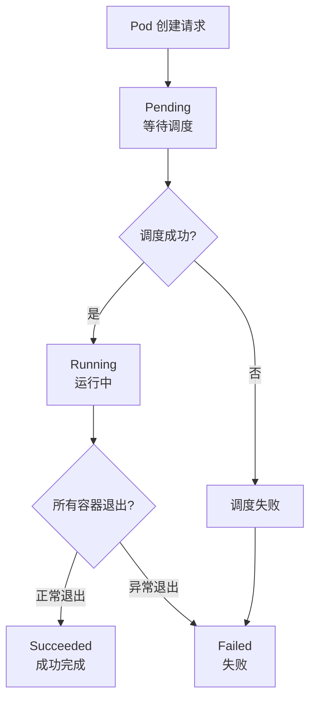
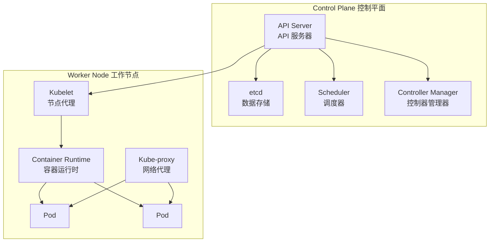
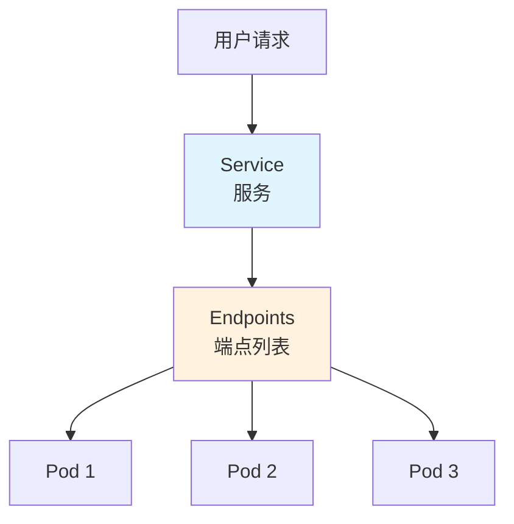
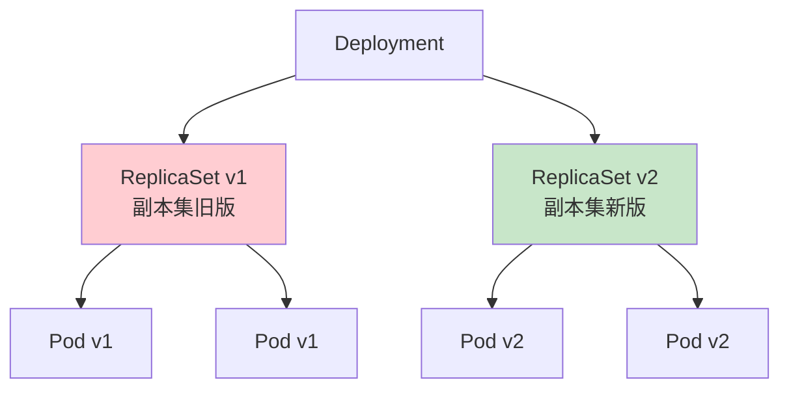

# Content Structure Contract: Kubernetes 教学子模块

**Feature**: 001-ops-k8s-tutorial
**Date**: 2025-12-15

## Overview

本文档定义了 Kubernetes 教学内容的结构契约，确保所有文档页面遵循统一的格式和质量标准。

## Document Template

每个 Markdown 文档必须遵循以下模板结构：

```markdown
---
title: [页面标题] | Kubernetes 教程
description: [SEO 描述，150 字以内]
---

# [页面标题]

[一句话概述本页内容]

## 前置知识

> 💡 阅读本章前，请确保已完成：
> - [前置章节 1](链接)
> - [前置章节 2](链接)

## [核心概念 / 操作步骤]

[主要内容]

### [子节 1]

[内容，包含必要的 Mermaid 图表]

### [子节 2]

[内容，包含代码示例和注释]

## 实践练习

[动手操作内容，如有]

## 常见问题

[FAQ，如有]

## 小结

- 要点 1
- 要点 2
- 要点 3

## 下一步

[引导到下一个学习内容]
```

## Mermaid Diagram Templates

### Pod 生命周期状态图



### K8s 架构概览图



### Service 网络模型图



### Deployment 滚动更新图



## Code Example Templates

### YAML 资源定义模板

```yaml
# Pod 定义示例 - 每行都有注释
apiVersion: v1              # API 版本：v1 是 Pod 的核心 API 版本
kind: Pod                   # 资源类型：Pod（容器组）
metadata:                   # 元数据部分
  name: my-nginx            # Pod 名称，在命名空间内必须唯一
  labels:                   # 标签：用于组织和选择资源
    app: nginx              # 自定义标签键值对
spec:                       # 规格说明：定义 Pod 的期望状态
  containers:               # 容器列表（一个 Pod 可包含多个容器）
  - name: nginx             # 容器名称
    image: nginx:1.21       # 容器镜像（镜像名:版本标签）
    ports:                  # 端口列表
    - containerPort: 80     # 容器监听的端口号
```

### kubectl 命令模板

```bash
# 查看所有 Pod
kubectl get pods

# 查看 Pod 详细信息
kubectl describe pod <pod-name>

# 创建资源
kubectl apply -f <filename.yaml>

# 删除资源
kubectl delete -f <filename.yaml>

# 查看日志
kubectl logs <pod-name>

# 进入容器
kubectl exec -it <pod-name> -- /bin/bash
```

## Terminology Glossary

所有技术术语首次出现时必须包含以下格式的解释：

| 术语 | 中文名 | 通俗解释 | 类比 |
| ---- | ------ | -------- | ---- |
| Pod | 容器组 | K8s 中最小的部署单元 | 合租公寓，里面住着一个或多个室友（容器） |
| Node | 节点 | 运行 Pod 的物理机或虚拟机 | 一栋公寓楼，里面有多个房间（Pod） |
| Cluster | 集群 | 多个节点的集合 | 一个小区，包含多栋公寓楼 |
| Service | 服务 | 暴露 Pod 的抽象层 | 餐厅前台，接待顾客请求并分配给厨师 |
| Deployment | 部署 | 声明式管理 Pod 的控制器 | 餐厅经理，确保始终有足够的厨师在岗 |
| ConfigMap | 配置映射 | 存储非敏感配置数据 | 餐厅的菜单配置，所有人都能看 |
| Secret | 密钥 | 存储敏感数据 | 餐厅的保险柜密码，只有授权人员能访问 |
| Namespace | 命名空间 | 资源隔离的逻辑分区 | 餐厅的不同楼层，各自独立运营 |
| ReplicaSet | 副本集 | 确保指定数量的 Pod 运行 | 确保餐厅始终有 3 个厨师在岗的规则 |
| Ingress | 入口 | HTTP/HTTPS 路由规则 | 餐厅的门牌号和路标指引 |

## VitePress Sidebar Configuration

```typescript
'/ops/kubernetes/': [
  {
    text: '📍 学习路径',
    link: '/ops/kubernetes/',
  },
  {
    text: '基础概念',
    collapsed: false,
    items: [
      { text: '概述', link: '/ops/kubernetes/concepts/' },
      { text: 'K8s 是什么', link: '/ops/kubernetes/concepts/what-is-k8s' },
      { text: '架构概览', link: '/ops/kubernetes/concepts/architecture' },
      { text: 'Pod 详解', link: '/ops/kubernetes/concepts/pod' },
      { text: 'Pod 生命周期', link: '/ops/kubernetes/concepts/pod-lifecycle' },
      { text: '核心组件', link: '/ops/kubernetes/concepts/components' },
    ],
  },
  {
    text: '环境搭建',
    collapsed: false,
    items: [
      { text: '概述', link: '/ops/kubernetes/setup/' },
      { text: '前置要求', link: '/ops/kubernetes/setup/prerequisites' },
      { text: 'Windows 安装', link: '/ops/kubernetes/setup/minikube-windows' },
      { text: 'macOS 安装', link: '/ops/kubernetes/setup/minikube-macos' },
      { text: 'kubectl 基础', link: '/ops/kubernetes/setup/kubectl-basics' },
      { text: '第一个 Pod', link: '/ops/kubernetes/setup/first-pod' },
      { text: '故障排查', link: '/ops/kubernetes/setup/troubleshooting' },
    ],
  },
  {
    text: '网络',
    collapsed: true,
    items: [
      { text: '概述', link: '/ops/kubernetes/networking/' },
      { text: '网络模型', link: '/ops/kubernetes/networking/network-model' },
      { text: 'ClusterIP Service', link: '/ops/kubernetes/networking/service-clusterip' },
      { text: 'NodePort Service', link: '/ops/kubernetes/networking/service-nodeport' },
      { text: 'Ingress 入门', link: '/ops/kubernetes/networking/ingress' },
    ],
  },
  {
    text: '工作负载',
    collapsed: true,
    items: [
      { text: '概述', link: '/ops/kubernetes/workloads/' },
      { text: 'Deployment', link: '/ops/kubernetes/workloads/deployment' },
      { text: '滚动更新', link: '/ops/kubernetes/workloads/rolling-update' },
      { text: '版本回滚', link: '/ops/kubernetes/workloads/rollback' },
      { text: '扩缩容', link: '/ops/kubernetes/workloads/scaling' },
    ],
  },
  {
    text: '配置与存储',
    collapsed: true,
    items: [
      { text: '概述', link: '/ops/kubernetes/storage/' },
      { text: 'ConfigMap', link: '/ops/kubernetes/storage/configmap' },
      { text: 'Secret', link: '/ops/kubernetes/storage/secret' },
      { text: '持久化存储', link: '/ops/kubernetes/storage/persistent-volume' },
    ],
  },
  {
    text: 'CI/CD',
    collapsed: true,
    items: [
      { text: '概述', link: '/ops/kubernetes/cicd/' },
      { text: 'CI/CD 概览', link: '/ops/kubernetes/cicd/overview' },
      { text: 'Docker 镜像构建', link: '/ops/kubernetes/cicd/docker-build' },
      { text: 'GitHub Actions', link: '/ops/kubernetes/cicd/github-actions' },
      { text: '部署到 K8s', link: '/ops/kubernetes/cicd/deploy-to-k8s' },
    ],
  },
]
```

## Quality Checklist

每个文档页面发布前必须通过以下检查：

- [ ] Frontmatter 完整（title, description）
- [ ] 标题层级正确（H1 仅一个，H2-H4 递进）
- [ ] 所有技术术语首次出现有解释
- [ ] 复杂概念有 Mermaid 图表（TD/TB 布局）
- [ ] 代码示例有逐行注释
- [ ] 移动端预览无横向滚动问题
- [ ] 链接正确且可访问
- [ ] 无拼写/语法错误
