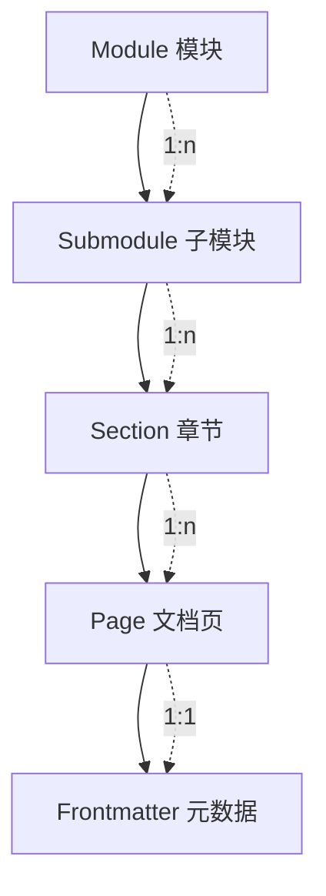

# Data Model: 运维模块 - Kubernetes 教学子模块

**Feature**: 001-ops-k8s-tutorial
**Date**: 2025-12-15

## Overview

本功能为纯文档内容项目，不涉及数据库或后端存储。数据模型描述的是内容组织结构和实体关系。

## Content Entities

### 1. Module（模块）

顶级内容分类单元。

| 属性 | 类型 | 说明 | 示例 |
| ---- | ---- | ---- | ---- |
| id | string | 唯一标识符（目录名） | `ops` |
| name | string | 显示名称 | `运维` |
| description | string | 模块简介 | `运维技术教程` |
| icon | string | 可选图标 | `🔧` |
| path | string | URL 路径 | `/ops/` |
| submodules | Submodule[] | 子模块列表 | - |

### 2. Submodule（子模块）

模块下的技术专题。

| 属性 | 类型 | 说明 | 示例 |
| ---- | ---- | ---- | ---- |
| id | string | 唯一标识符 | `kubernetes` |
| name | string | 显示名称 | `Kubernetes` |
| description | string | 子模块简介 | `Kubernetes 零基础教程` |
| path | string | URL 路径 | `/ops/kubernetes/` |
| parentModule | string | 父模块 ID | `ops` |
| sections | Section[] | 章节列表 | - |
| learningPath | string[] | 学习路径顺序 | `['concepts', 'setup', ...]` |

### 3. Section（章节）

子模块下的学习单元。

| 属性 | 类型 | 说明 | 示例 |
| ---- | ---- | ---- | ---- |
| id | string | 唯一标识符 | `concepts` |
| name | string | 显示名称 | `基础概念` |
| priority | number | 用户故事优先级 | `1` (P1) |
| path | string | URL 路径 | `/ops/kubernetes/concepts/` |
| pages | Page[] | 文档页列表 | - |
| prerequisites | string[] | 前置章节 ID | `[]` |
| collapsed | boolean | 侧边栏默认折叠 | `false` |

### 4. Page（文档页）

最小内容单元。

| 属性 | 类型 | 说明 | 示例 |
| ---- | ---- | ---- | ---- |
| id | string | 唯一标识符（文件名） | `what-is-k8s` |
| title | string | 页面标题 | `K8s 是什么` |
| path | string | URL 路径 | `/ops/kubernetes/concepts/what-is-k8s` |
| section | string | 所属章节 ID | `concepts` |
| order | number | 在章节内的排序 | `1` |
| hasMermaid | boolean | 是否包含 Mermaid 图表 | `true` |
| frontmatter | Frontmatter | 页面元数据 | - |

### 5. Frontmatter（页面元数据）

Markdown 文件头部元数据。

| 属性 | 类型 | 说明 | 示例 |
| ---- | ---- | ---- | ---- |
| title | string | SEO 标题 | `K8s 是什么 | Kubernetes 教程` |
| description | string | SEO 描述 | `了解 Kubernetes 是什么...` |
| prev | string/object | 上一页链接 | `/ops/kubernetes/` |
| next | string/object | 下一页链接 | `/ops/kubernetes/concepts/architecture` |

## Entity Relationships



## Instance Data

### Module Instance

```yaml
- id: ops
  name: 运维
  path: /ops/
  submodules:
    - kubernetes
```

### Submodule Instance

```yaml
- id: kubernetes
  name: Kubernetes
  path: /ops/kubernetes/
  parentModule: ops
  sections:
    - concepts    # P1
    - setup       # P2
    - networking  # P3
    - workloads   # P4
    - storage     # P5
    - cicd        # P6
```

### Section Instances

```yaml
# P1 - 基础概念
- id: concepts
  name: 基础概念
  priority: 1
  path: /ops/kubernetes/concepts/
  prerequisites: []
  pages:
    - what-is-k8s
    - architecture
    - pod
    - pod-lifecycle
    - components

# P2 - 环境搭建
- id: setup
  name: 环境搭建
  priority: 2
  path: /ops/kubernetes/setup/
  prerequisites: [concepts]
  pages:
    - prerequisites
    - minikube-windows
    - minikube-macos
    - kubectl-basics
    - first-pod
    - troubleshooting

# P3 - 网络
- id: networking
  name: 网络
  priority: 3
  path: /ops/kubernetes/networking/
  prerequisites: [setup]
  pages:
    - network-model
    - service-clusterip
    - service-nodeport
    - ingress

# P4 - 工作负载
- id: workloads
  name: 工作负载
  priority: 4
  path: /ops/kubernetes/workloads/
  prerequisites: [setup]
  pages:
    - deployment
    - rolling-update
    - rollback
    - scaling

# P5 - 存储
- id: storage
  name: 配置与存储
  priority: 5
  path: /ops/kubernetes/storage/
  prerequisites: [workloads]
  pages:
    - configmap
    - secret
    - persistent-volume

# P6 - CI/CD
- id: cicd
  name: CI/CD
  priority: 6
  path: /ops/kubernetes/cicd/
  prerequisites: [workloads, storage]
  pages:
    - overview
    - docker-build
    - github-actions
    - deploy-to-k8s
```

## File Count Summary

| 章节 | 文档页数 | Mermaid 图表数（预估） |
| ---- | -------- | ---------------------- |
| 基础概念 | 5 + 1 index | 5 |
| 环境搭建 | 6 + 1 index | 2 |
| 网络 | 4 + 1 index | 3 |
| 工作负载 | 4 + 1 index | 3 |
| 存储 | 3 + 1 index | 2 |
| CI/CD | 4 + 1 index | 2 |
| **总计** | **32** | **17** |
