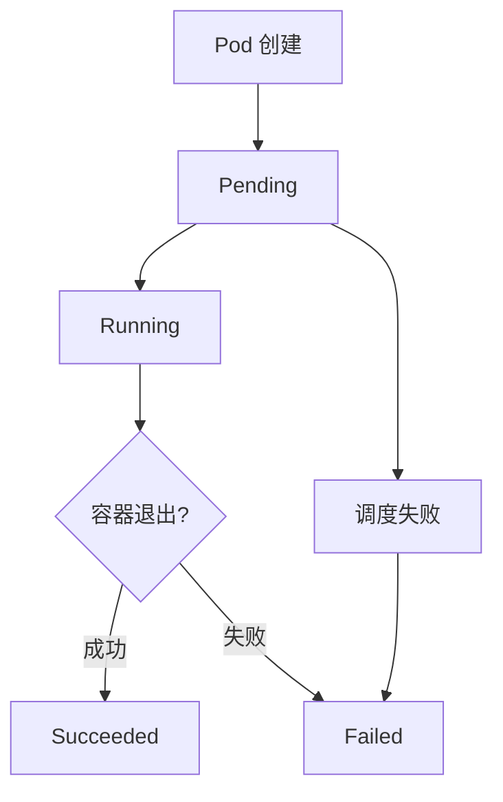

# Implementation Plan: 运维模块 - Kubernetes 教学子模块

**Branch**: `001-ops-k8s-tutorial` | **Date**: 2025-12-15 | **Spec**: [spec.md](./spec.md)
**Input**: Feature specification from `/specs/001-ops-k8s-tutorial/spec.md`

## Summary

在现有 VitePress 文档站点中新增"运维"顶级模块，包含完整的 Kubernetes 教学子模块。内容从零基础概念解析到云原生 CI/CD 实践形成完整闭环。技术栈基于 VitePress + Markdown + Mermaid.js，所有内容为独立 Markdown 文件，不依赖本地 Shell 执行。

## Technical Context

**Language/Version**: TypeScript (VitePress 配置), Markdown (文档内容)
**Primary Dependencies**: VitePress ^1.6.4, vitepress-plugin-mermaid ^2.0.17, Mermaid.js ^11.12.1
**Storage**: 静态文件系统（Markdown 文件）
**Testing**: VitePress 构建验证 (`npm run build`)
**Target Platform**: Web (桌面 + 移动端)
**Project Type**: 文档站点（静态内容生成）
**Performance Goals**: 页面加载 < 3s，移动端首屏渲染 < 2s
**Constraints**: 320px 最小视口支持，Mermaid 图表纵向布局优先
**Scale/Scope**: 6 个用户故事，约 25-30 个 Markdown 文件

## Constitution Check

_GATE: Must pass before Phase 0 research. Re-check after Phase 1 design._

| 原则 | 要求 | 状态 | 说明 |
| ---- | ---- | ---- | ---- |
| I. 文件系统边界约束 | 所有操作限制在 `D:\szy\learn` | ✅ PASS | 所有文件创建在 `docs-site/docs/ops/` 下 |
| II. 只读数据源保护 | 不修改 langchain-v1/ 和 python/ | ✅ PASS | 本功能不涉及这些目录 |
| III. UTF-8 编码强制 | 所有文件使用 UTF-8 无 BOM | ✅ PASS | 所有 Markdown 使用 UTF-8 |
| IV. UI 框架约束 | 使用 VitePress 默认主题 | ✅ PASS | 不安装第三方主题 |
| V. 代码规范工具链 | Prettier + ESLint | ✅ PASS | 使用现有配置 |
| VI. 增量式开发约束 | 不修改现有非新增文件 | ✅ PASS | 仅创建新文件，配置文件仅追加 |
| VII. 视觉风格与语气一致性 | 保持现有站点风格 | ✅ PASS | 参考 Python 教程格式 |
| VIII. 通俗易懂文档标准 | 面向零基础受众 | ✅ PASS | 所有术语配中文解释和类比 |
| IX. Mermaid 图表可视化要求 | 复杂概念配图，TD/TB 布局 | ✅ PASS | Pod 生命周期、网络模型等配图 |
| X. 移动端自适应要求 | 320px 最小宽度支持 | ✅ PASS | 图表纵向布局，表格/代码块可滚动 |

**Gate Status**: ✅ ALL PASS - 可以进入 Phase 0

## Project Structure

### Documentation (this feature)

```text
specs/001-ops-k8s-tutorial/
├── plan.md              # 本文件
├── research.md          # Phase 0 研究输出
├── data-model.md        # Phase 1 数据模型
├── quickstart.md        # Phase 1 快速开始指南
├── contracts/           # Phase 1 内容契约
│   └── content-structure.md
└── checklists/
    └── requirements.md  # 规范质量检查清单
```

### Source Code (repository root)

```text
docs/
├── ops/                           # 运维模块（新增顶级目录）
│   ├── index.md                   # 运维模块首页
│   └── kubernetes/                # Kubernetes 子模块
│       ├── index.md               # K8s 教程首页/学习路径
│       ├── concepts/              # 基础概念章节 (P1)
│       │   ├── index.md           # 概念章节入口
│       │   ├── what-is-k8s.md     # K8s 是什么
│       │   ├── architecture.md    # K8s 架构概览
│       │   ├── pod.md             # Pod 详解
│       │   ├── pod-lifecycle.md   # Pod 生命周期
│       │   └── components.md      # 核心组件关系
│       ├── setup/                 # 环境搭建章节 (P2)
│       │   ├── index.md           # 环境搭建入口
│       │   ├── prerequisites.md   # 前置要求
│       │   ├── minikube-windows.md # Windows 安装
│       │   ├── minikube-macos.md  # macOS 安装
│       │   ├── kubectl-basics.md  # kubectl 基础
│       │   ├── first-pod.md       # 第一个 Pod
│       │   └── troubleshooting.md # 故障排查
│       ├── networking/            # 网络章节 (P3)
│       │   ├── index.md           # 网络章节入口
│       │   ├── network-model.md   # 网络模型概览
│       │   ├── service-clusterip.md # ClusterIP Service
│       │   ├── service-nodeport.md  # NodePort Service
│       │   └── ingress.md         # Ingress 入门
│       ├── workloads/             # 工作负载章节 (P4)
│       │   ├── index.md           # 工作负载入口
│       │   ├── deployment.md      # Deployment 详解
│       │   ├── rolling-update.md  # 滚动更新
│       │   ├── rollback.md        # 版本回滚
│       │   └── scaling.md         # 扩缩容
│       ├── storage/               # 存储章节 (P5)
│       │   ├── index.md           # 存储章节入口
│       │   ├── configmap.md       # ConfigMap
│       │   ├── secret.md          # Secret
│       │   └── persistent-volume.md # 持久化存储
│       └── cicd/                  # CI/CD 章节 (P6)
│           ├── index.md           # CI/CD 入口
│           ├── overview.md        # CI/CD 概览
│           ├── docker-build.md    # Docker 镜像构建
│           ├── github-actions.md  # GitHub Actions 配置
│           └── deploy-to-k8s.md   # 部署到 K8s
└── .vitepress/
    └── config.mts                 # 追加运维模块导航配置
```

**Structure Decision**: 采用文档站点结构，在 `docs/ops/kubernetes/` 下按学习路径组织章节。每个章节对应一个目录，包含 `index.md` 入口页和多个知识点页面。

## Content Generation Guidelines

### Mermaid 图表规范

所有 Mermaid 图表必须遵循以下规范以确保移动端兼容性：

1. **布局方向**: 优先使用 `flowchart TD` 或 `flowchart TB`（纵向布局）
2. **节点数量**: 单个图表节点数 ≤ 15 个
3. **宽度控制**: 图表宽度 ≤ 600px
4. **复杂图表**: 拆分为多个简化图表，分步解释

示例 - Pod 生命周期状态图：


### 文档写作规范

1. **术语处理**: 首次出现的技术术语必须配中文解释
   - 示例: "Pod（容器组，Kubernetes 中最小的部署单元，就像一个'房间'，里面可以住一个或多个'容器住户'）"

2. **类比说明**: 抽象概念必须配日常生活类比
   - 示例: "Service 就像餐厅的前台，无论后厨有多少厨师（Pod），顾客只需要告诉前台要什么菜（请求）"

3. **代码注释**: 所有 YAML/命令必须配逐行注释
   ```yaml
   apiVersion: v1          # API 版本，v1 是核心 API 组
   kind: Pod               # 资源类型：Pod
   metadata:
     name: my-pod          # Pod 名称，集群内唯一
   spec:
     containers:           # 容器列表
     - name: nginx         # 容器名称
       image: nginx:1.21   # 使用的镜像
   ```

## Implementation Phases

### Phase 0: Research (已完成)
- 研究 Kubernetes 官方文档最新内容
- 确认 Mermaid.js 纵向布局最佳实践
- 研究 VitePress 侧边栏配置方式

### Phase 1: Design (已完成)
- 设计内容结构和文件组织
- 定义 Mermaid 图表规范
- 创建内容契约

### Phase 2: Tasks (待执行 - /speckit.tasks)
- 生成具体实现任务列表
- 按用户故事优先级组织任务

## Complexity Tracking

> 无宪法违规，无需记录复杂性权衡。

## Next Steps

执行 `/speckit.tasks` 命令生成具体的实现任务列表。
