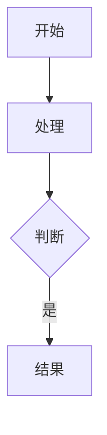

# Quickstart: 运维模块 - Kubernetes 教学子模块

**Feature**: 001-ops-k8s-tutorial
**Date**: 2025-12-15

## 概述

本文档提供快速开始指南，帮助开发者理解如何开始实现 Kubernetes 教学模块。

## 前置条件

1. **环境要求**:
   - Node.js 18+
   - npm 或 pnpm
   - Git

2. **项目设置**:
   ```bash
   # 克隆仓库（如果尚未克隆）
   cd D:\szy\learn\docs-site

   # 安装依赖
   npm install

   # 启动开发服务器
   npm run dev
   ```

## 快速开始

### 步骤 1: 创建目录结构

```bash
# 创建运维模块目录
mkdir -p docs/ops/kubernetes/{concepts,setup,networking,workloads,storage,cicd}
```

### 步骤 2: 创建首页文件

创建 `docs/ops/index.md`:
```markdown
---
title: 运维 | 学习文档站
description: 运维技术教程，包括 Kubernetes、Docker 等
---

# 运维

欢迎来到运维技术教程！

## 教程列表

- [Kubernetes 入门](/ops/kubernetes/) - 从零开始学习 Kubernetes
```

创建 `docs/ops/kubernetes/index.md`:
```markdown
---
title: Kubernetes 教程 | 从零开始
description: 零基础 Kubernetes 入门教程，从概念到实践
---

# Kubernetes 教程

从零开始学习 Kubernetes，掌握容器编排技术。

## 📍 学习路径

1. **基础概念** - 理解 K8s 核心组件
2. **环境搭建** - 安装 Minikube 本地环境
3. **网络** - 理解 Service 和网络模型
4. **工作负载** - 使用 Deployment 管理应用
5. **存储** - ConfigMap、Secret 和持久化
6. **CI/CD** - 构建自动化部署流水线

## 开始学习

👉 [从「K8s 是什么」开始](/ops/kubernetes/concepts/what-is-k8s)
```

### 步骤 3: 更新 VitePress 配置

在 `docs/.vitepress/config.mts` 中追加导航配置：

```typescript
// 在 nav 数组末尾追加
{
  text: '运维',
  items: [{ text: 'Kubernetes', link: '/ops/kubernetes/' }],
}

// 在 sidebar 对象中追加
'/ops/kubernetes/': [
  // ... 侧边栏配置（见 contracts/content-structure.md）
]
```

### 步骤 4: 创建第一个内容页面

创建 `docs/ops/kubernetes/concepts/what-is-k8s.md`:

```markdown
---
title: K8s 是什么 | Kubernetes 教程
description: 了解 Kubernetes 是什么，它解决什么问题，为什么要学习它
---

# K8s 是什么

Kubernetes（简称 K8s）是一个开源的容器编排平台，用于自动化部署、扩展和管理容器化应用程序。

## 为什么需要 Kubernetes？

想象你开了一家餐厅...

[继续编写内容]
```

### 步骤 5: 预览和验证

```bash
# 启动开发服务器
npm run dev

# 访问 http://localhost:5173/ops/kubernetes/

# 验证移动端显示
# 在浏览器中按 F12，切换到移动设备模式
```

## 内容编写指南

### Mermaid 图表

使用纵向布局（TD/TB）：

```markdown

```

### 代码示例

所有代码必须有注释：

```markdown
```yaml
apiVersion: v1          # API 版本
kind: Pod               # 资源类型
metadata:
  name: nginx           # Pod 名称
spec:
  containers:
  - name: nginx         # 容器名称
    image: nginx:1.21   # 镜像
```
```

### 术语解释

首次出现的术语使用以下格式：

```markdown
**Pod**（容器组，K8s 最小部署单元）是...
```

或使用类比：

```markdown
> 💡 **类比**: Pod 就像一个合租公寓，里面可以住一个或多个室友（容器）。
```

## 验证清单

完成内容后，确保：

- [ ] `npm run build` 构建成功
- [ ] 所有链接可访问
- [ ] 移动端无横向滚动
- [ ] Mermaid 图表正常显示
- [ ] 代码高亮正确

## 参考资源

- [VitePress 文档](https://vitepress.dev/)
- [Mermaid.js 文档](https://mermaid.js.org/)
- [Kubernetes 官方文档](https://kubernetes.io/zh-cn/docs/)
- [项目宪法](../../.specify/memory/constitution.md)
- [功能规范](./spec.md)
- [实现计划](./plan.md)
