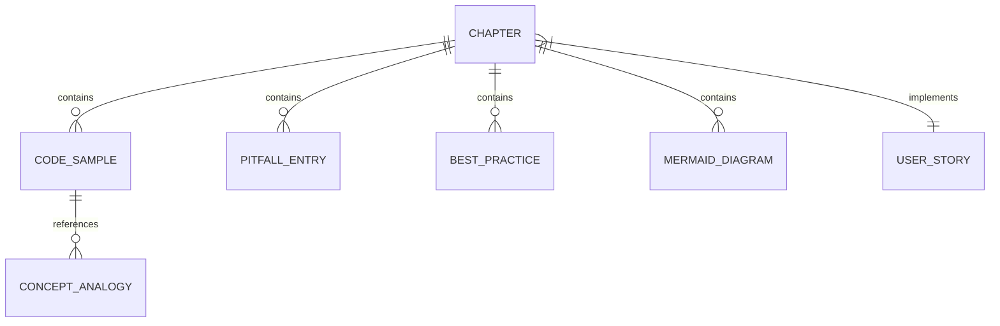

# Data Model: LlamaIndex 学习路线图

**Feature Branch**: `002-llamaindex-tutorial`
**Created**: 2025-12-29

## Overview

本文档定义 LlamaIndex 教程项目的内容数据模型。由于这是一个纯文档项目，"数据模型"主要指文档结构、元数据规范和内容实体定义。

## Content Entities

### 1. Tutorial Chapter (教程章节)

教程的基本组织单元。

**Attributes**:

| 字段 | 类型 | 必填 | 说明 |
|------|------|------|------|
| title | string | ✅ | 章节标题 (用于 frontmatter) |
| description | string | ✅ | 章节描述 (用于 SEO) |
| order | number | ✅ | 章节顺序 (1-8) |
| userStory | string | ✅ | 关联的用户故事 (P1-P5) |
| prerequisites | string[] | ❌ | 前置章节列表 |

**Frontmatter 示例**:
```yaml
---
title: RAG 基础概念
description: 理解检索增强生成的核心原理和工作流程
---
```

**Validation Rules**:
- title 长度 ≤ 50 字符
- description 长度 ≤ 160 字符 (SEO 最佳实践)
- order 范围 [1, 8]

### 2. Code Sample (代码示例)

可独立运行的代码片段。

**Attributes**:

| 字段 | 类型 | 必填 | 说明 |
|------|------|------|------|
| id | string | ✅ | 唯一标识符 (如 `rag-basic-01`) |
| title | string | ✅ | 示例标题 |
| llamaindexVersion | string | ✅ | 适用的 LlamaIndex 版本 |
| language | string | ✅ | 编程语言 (固定为 `python`) |
| code | string | ✅ | 代码内容 |
| explanation | string | ✅ | 代码说明 |
| output | string | ❌ | 预期输出 |
| dependencies | string[] | ❌ | 额外依赖包 |

**Markdown 格式规范**:
```markdown
### 示例 1: [title]

> 适用版本: LlamaIndex [llamaindexVersion]

```python
[code with inline comments]
```

**说明**: [explanation]

**预期输出**:
```
[output]
```
```

**Validation Rules**:
- llamaindexVersion 格式: `0.10.x+` 或具体版本如 `0.14.6`
- 代码必须包含逐行注释
- 代码必须经过实际运行验证

### 3. Pitfall Entry (避坑指南条目)

常见问题及解决方案。

**Attributes**:

| 字段 | 类型 | 必填 | 说明 |
|------|------|------|------|
| id | string | ✅ | 唯一标识符 (如 `pit-env-01`) |
| title | string | ✅ | 问题标题 |
| symptom | string | ✅ | 问题现象/错误信息 |
| cause | string | ✅ | 根因分析 |
| solution | string | ✅ | 解决方案 |
| prevention | string | ✅ | 预防措施 |
| chapter | string | ✅ | 所属章节 |

**Markdown 格式规范**:
```markdown
### ❌ [title]

**现象**: [symptom]

**根因**: [cause]

**解决方案**:
```python
[solution code]
```

**预防措施**: [prevention]
```

**Validation Rules**:
- 每个章节至少 3 个避坑条目
- symptom 应包含实际错误信息或行为描述

### 4. Best Practice (生产最佳实践)

生产环境优化建议。

**Attributes**:

| 字段 | 类型 | 必填 | 说明 |
|------|------|------|------|
| id | string | ✅ | 唯一标识符 (如 `bp-perf-01`) |
| title | string | ✅ | 实践标题 |
| scenario | string | ✅ | 适用场景 |
| recommendation | string | ✅ | 推荐做法 |
| metrics | object | ❌ | 量化指标 |
| tradeoffs | string | ❌ | 权衡取舍说明 |

**Markdown 格式规范**:
```markdown
### [title]

**场景**: [scenario]

**推荐做法**: [recommendation]

| 参数 | 推荐值 | 说明 |
|------|--------|------|
| [param] | [value] | [description] |

**权衡**: [tradeoffs]
```

**Validation Rules**:
- metrics 必须包含具体数值
- recommendation 必须可操作

### 5. Mermaid Diagram (流程图)

可视化技术概念。

**Attributes**:

| 字段 | 类型 | 必填 | 说明 |
|------|------|------|------|
| id | string | ✅ | 唯一标识符 (如 `dia-rag-flow`) |
| title | string | ✅ | 图表标题 |
| type | enum | ✅ | 图表类型 (flowchart/sequenceDiagram/stateDiagram) |
| direction | enum | ✅ | 布局方向 (TD/TB 优先) |
| code | string | ✅ | Mermaid 代码 |
| explanation | string | ✅ | 图表说明 |

**Markdown 格式规范**:
```markdown
### [title]

下图展示了 [概念] 的 [工作流程/组件关系/状态变化]:

```mermaid
[type] [direction]
    [nodes and connections]
```

**说明**: [explanation]
```

**Validation Rules**:
- direction 必须为 TD 或 TB (纵向布局)
- 节点数量 ≤ 15
- 必须配有文字说明

### 6. Concept Analogy (概念类比)

抽象概念的生活化解释。

**Attributes**:

| 字段 | 类型 | 必填 | 说明 |
|------|------|------|------|
| concept | string | ✅ | 技术概念名称 |
| analogy | string | ✅ | 生活化类比 |
| explanation | string | ✅ | 详细解释 |

**Standard Analogies (标准类比表)**:

| 概念 | 类比 |
|------|------|
| RAG | 考试前查阅笔记再作答 |
| Embedding | 将文字转化为计算机能理解的坐标位置 |
| Vector Store | 图书馆的索引卡片系统 |
| Query Engine | 智能问答助手 |
| Retriever | 图书管理员帮你找书 |
| Index | 书籍的目录页 |
| Document | 一本书或一篇文章 |
| Node | 书中的一个段落或章节 |
| Agent | 能自主思考和行动的 AI 助手 |
| ReAct | 思考-行动-观察的循环 |
| Tool | Agent 的工具箱里的工具 |
| Chunk | 把长文章切成小段落 |

## File Structure Model

### Directory Layout

```
docs/ai/llamaindex/
├── index.md                    # Hero 首页
└── guide/
    ├── getting-started.md      # Ch1
    ├── rag-basics.md           # Ch2
    ├── data-connectors.md      # Ch3
    ├── index-building.md       # Ch4
    ├── query-engine.md         # Ch5
    ├── agent-basics.md         # Ch6
    ├── agent-advanced.md       # Ch7
    └── production.md           # Ch8
```

### File Naming Convention

- 使用小写字母
- 使用连字符分隔单词
- 避免使用数字前缀（由侧边栏配置控制顺序）

## Relationships



## Metadata Schema

### Chapter Frontmatter

```yaml
---
title: string           # 章节标题
description: string     # SEO 描述
---
```

### Index Page Frontmatter

```yaml
---
layout: home

hero:
  name: string          # 框架名称
  text: string          # 副标题
  tagline: string       # 标语
  actions:
    - theme: brand
      text: string      # 按钮文字
      link: string      # 按钮链接

features:
  - icon: string        # Emoji 图标
    title: string       # 特性标题
    details: string     # 特性描述
    link: string        # 特性链接
---
```

## Content Validation Checklist

创建或审核章节时，必须验证：

- [ ] frontmatter 符合 schema
- [ ] 包含至少 1 个 Mermaid 图表 (纵向布局)
- [ ] 包含至少 2 个代码示例 (带版本标注)
- [ ] 包含至少 3 个避坑指南条目
- [ ] 包含至少 1 个生产最佳实践
- [ ] 所有专业术语首次出现时有类比解释
- [ ] 代码示例经过实际运行验证
- [ ] 文件使用 UTF-8 编码 (无 BOM)
