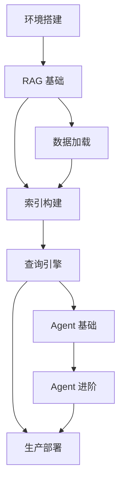

# Implementation Plan: LlamaIndex 学习路线图

**Branch**: `002-llamaindex-tutorial` | **Date**: 2025-12-29 | **Spec**: [spec.md](./spec.md)
**Input**: Feature specification from `/specs/002-llamaindex-tutorial/spec.md`

## Summary

为项目现有的 AI 栏目新增 LlamaIndex 中文教程，覆盖从 RAG 基础概念到高级 Agent 模式的完整学习路径。教程以用户故事和生产场景驱动，每个章节包含：核心概念比喻化解释、标准操作步骤、避坑指南、生产最佳实践。技术选型基于 VitePress + Markdown，所有代码示例基于 LlamaIndex 0.10.x+ 版本验证。

## Technical Context

**Language/Version**: TypeScript (VitePress 配置), Markdown (文档内容), Python 3.8+ (代码示例)
**Primary Dependencies**: VitePress ^1.6.4, vitepress-plugin-mermaid ^2.0.17, LlamaIndex 0.10.x+
**Storage**: 静态文件系统（Markdown 文件）
**Testing**: 代码示例手动验证 + VitePress 构建验证
**Target Platform**: Web (VitePress 静态站点)
**Project Type**: 文档项目 (Documentation)
**Performance Goals**: 页面加载 < 3s，移动端友好
**Constraints**: 增量式开发（不修改现有文件），UTF-8 编码，Mermaid 纵向布局
**Scale/Scope**: 8 个核心章节，约 50+ 代码示例，10+ Mermaid 图表

## Constitution Check

_GATE: Must pass before Phase 0 research. Re-check after Phase 1 design._

| 原则 | 状态 | 说明 |
|------|------|------|
| I. 文件系统边界约束 | ✅ PASS | 所有操作限于 `D:\szy\learn\docs-site/` |
| II. 只读数据源保护 | ✅ PASS | 不涉及 langchain-v1 或 python 目录 |
| III. UTF-8 编码强制 | ✅ PASS | 所有新文件使用 UTF-8 无 BOM |
| IV. UI 框架约束 | ✅ PASS | 使用 VitePress 默认主题 |
| V. 代码规范工具链 | ✅ PASS | 遵循现有 Prettier/ESLint 配置 |
| VI. 增量式开发约束 | ⚠️ ATTENTION | 需追加配置到 config.mts，不修改现有项 |
| VII. 视觉风格与语气一致性 | ✅ PASS | 参照现有 LangChain 教程风格 |
| VIII. 通俗易懂文档标准 | ✅ PASS | 每个概念配比喻，代码配注释 |
| IX. Mermaid 图表可视化要求 | ✅ PASS | RAG 流程使用纵向布局流程图 |
| X. 移动端自适应要求 | ✅ PASS | 图表 < 600px，纵向布局优先 |
| XI. LlamaIndex 教程特定要求 | ✅ PASS | 覆盖核心概念，提供标准类比 |
| XII. API 版本与代码验证要求 | ✅ PASS | 标注 LlamaIndex 版本，验证代码 |

**⚠️ 原则 VI 特别说明**:
- `docs/.vitepress/config.mts` 需要追加 LlamaIndex 侧边栏配置
- 仅在 `sidebar` 对象中添加新键值对 `'/ai/llamaindex/'`
- 在 `nav` 的 AI 菜单 items 中追加 LlamaIndex 链接
- 不修改任何现有配置项

## Project Structure

### Documentation (this feature)

```text
specs/002-llamaindex-tutorial/
├── plan.md              # This file
├── research.md          # Phase 0 output ✅
├── data-model.md        # Phase 1 output
├── quickstart.md        # Phase 1 output
├── contracts/           # N/A (文档项目无 API 合约)
├── checklists/
│   └── requirements.md  # Spec quality checklist ✅
└── tasks.md             # Phase 2 output (/speckit.tasks)
```

### Source Code (repository root)

```text
docs/ai/llamaindex/
├── index.md                    # 首页 (VitePress hero layout)
└── guide/
    ├── getting-started.md      # Ch1: 环境搭建
    ├── rag-basics.md           # Ch2: RAG 基础概念
    ├── data-connectors.md      # Ch3: 数据加载器
    ├── index-building.md       # Ch4: 索引构建
    ├── query-engine.md         # Ch5: 查询引擎调优
    ├── agent-basics.md         # Ch6: Agent 基础
    ├── agent-advanced.md       # Ch7: Agent 进阶
    └── production.md           # Ch8: 生产部署
```

### Configuration Updates (追加内容)

```text
docs/.vitepress/config.mts
├── nav.AI.items += { text: 'LlamaIndex', link: '/ai/llamaindex/' }
└── sidebar += '/ai/llamaindex/': [...]

docs/ai/index.md
└── features += LlamaIndex 入口卡片
```

**Structure Decision**: 采用与现有 LangChain 教程一致的目录结构 (`/ai/[framework]/guide/`)，便于用户导航和维护。

## Chapter Content Structure

每个章节 MUST 包含以下标准化模块：

### 1. 核心概念（比喻化解释）

```markdown
## 核心概念

### 什么是 [概念]？

[概念] 就像 [生活化类比]。

<!-- Mermaid 流程图 (纵向布局) -->
```

### 2. 标准操作步骤

```markdown
## 代码示例

### 示例 1: [标题]

<!-- 版本标注 -->
> 适用版本: LlamaIndex 0.10.x+

```python
# 逐行注释
```

**说明**: [解释为什么这样写]
```

### 3. 避坑指南

```markdown
## 避坑指南

### ❌ 常见问题 1: [问题描述]

**现象**: [错误信息或行为]

**根因**: [原因分析]

**解决方案**:
```python
# 正确做法
```

**预防措施**: [最佳实践建议]
```

### 4. 生产最佳实践

```markdown
## 生产最佳实践

### 性能优化

| 参数 | 推荐值 | 说明 |
|------|--------|------|
| chunk_size | 512-1024 | 平衡检索精度和上下文长度 |
| similarity_top_k | 3-5 | 避免过多不相关结果 |
```

## Complexity Tracking

> **No violations requiring justification**

本项目为纯文档项目，不涉及复杂架构决策。所有内容遵循现有 VitePress 站点结构和宪法约束。

## Implementation Phases

### Phase 1: 基础设施 (P1 User Story)
- 创建目录结构 `docs/ai/llamaindex/`
- 创建首页 `index.md`
- 更新 VitePress 配置（追加 sidebar 和 nav）
- 创建 `getting-started.md` 环境搭建
- 创建 `rag-basics.md` RAG 基础

### Phase 2: 核心组件 (P2 User Story)
- 创建 `data-connectors.md` 数据加载
- 创建 `index-building.md` 索引构建

### Phase 3: 查询优化 (P3 User Story)
- 创建 `query-engine.md` 查询引擎

### Phase 4: Agent 系统 (P4 User Story)
- 创建 `agent-basics.md` Agent 基础
- 创建 `agent-advanced.md` Agent 进阶

### Phase 5: 生产部署 (P5 User Story)
- 创建 `production.md` 部署与优化

## Dependencies

### 章节依赖关系



### 外部依赖

- LlamaIndex 官方文档 (via Context7)
- OpenAI API (代码示例默认后端)
- Ollama (本地模型替代方案)
