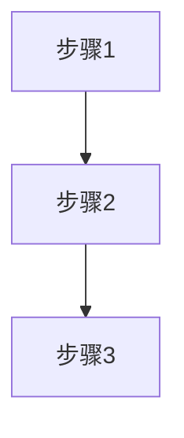

# Quickstart: LlamaIndex 教程开发指南

**Feature Branch**: `002-llamaindex-tutorial`
**Created**: 2025-12-29

## 概述

本文档为开发者提供快速开始 LlamaIndex 教程开发的指南，包括环境设置、内容模板、验证流程和发布检查。

## 前置要求

### 开发环境

- Node.js 18+
- pnpm 或 npm
- Python 3.8+ (用于验证代码示例)
- Git

### 依赖安装

```bash
# 克隆仓库并进入目录
cd D:\szy\learn\docs-site

# 安装 Node.js 依赖
pnpm install

# 创建 Python 虚拟环境用于代码验证
python -m venv .venv
.venv\Scripts\activate  # Windows
pip install llama-index llama-index-llms-openai
```

## 快速开始

### 1. 创建章节文件

```bash
# 创建目录结构
mkdir -p docs/ai/llamaindex/guide

# 创建章节文件
touch docs/ai/llamaindex/index.md
touch docs/ai/llamaindex/guide/getting-started.md
```

### 2. 使用章节模板

每个章节文件使用以下结构：

```markdown
---
title: [章节标题]
description: [SEO 描述，≤160 字符]
---

# [章节标题]

## 概述

[1-2 段落介绍本章内容和学习目标]

## 核心概念

### 什么是 [概念]？

[概念] 就像 [生活化类比]。

[详细解释]



**图表说明**: [解释图表中的关键节点和连接]

## 代码示例

### 示例 1: [标题]

> 适用版本: LlamaIndex 0.10.x+

```python
# 导入必要的模块
from llama_index.core import VectorStoreIndex, SimpleDirectoryReader

# 加载文档
documents = SimpleDirectoryReader("./data/").load_data()

# 创建索引
index = VectorStoreIndex.from_documents(documents)

# 创建查询引擎
query_engine = index.as_query_engine()

# 执行查询
response = query_engine.query("你的问题")
print(response)
```

**说明**: [解释代码的关键步骤和为什么这样写]

## 避坑指南

### ❌ 常见问题 1: [问题描述]

**现象**:
```
[错误信息]
```

**根因**: [原因分析]

**解决方案**:
```python
# 正确做法
```

**预防措施**: [最佳实践建议]

## 生产最佳实践

### [实践标题]

**场景**: [适用场景]

**推荐做法**: [具体建议]

| 参数 | 推荐值 | 说明 |
|------|--------|------|
| chunk_size | 512-1024 | 平衡检索精度和上下文长度 |

## 小结

[总结本章要点，引导到下一章]

## 下一步

- [下一章节链接]
```

### 3. 创建首页

`docs/ai/llamaindex/index.md`:

```markdown
---
layout: home

hero:
  name: LlamaIndex
  text: 中文教程
  tagline: 从零基础到生产级 RAG 应用
  actions:
    - theme: brand
      text: 开始学习
      link: /ai/llamaindex/guide/getting-started
    - theme: alt
      text: 查看 GitHub
      link: https://github.com/run-llama/llama_index

features:
  - icon: 🚀
    title: RAG 基础
    details: 理解检索增强生成的核心原理，构建你的第一个问答系统
    link: /ai/llamaindex/guide/rag-basics
  - icon: 📚
    title: 数据加载
    details: 掌握 PDF、网页、数据库等多种数据源的加载方法
    link: /ai/llamaindex/guide/data-connectors
  - icon: 🔍
    title: 查询优化
    details: 调优 Query Engine，提升检索精度和回答质量
    link: /ai/llamaindex/guide/query-engine
  - icon: 🤖
    title: Agent 模式
    details: 构建能自主思考、调用工具的智能代理系统
    link: /ai/llamaindex/guide/agent-basics
  - icon: 🏭
    title: 生产部署
    details: 性能优化、成本控制、监控告警最佳实践
    link: /ai/llamaindex/guide/production
  - icon: ⚠️
    title: 避坑指南
    details: 每个阶段的常见问题和解决方案
---
```

### 4. 更新 VitePress 配置

在 `docs/.vitepress/config.mts` 中追加配置：

```typescript
// 在 nav 的 AI items 中追加
{
  text: 'AI',
  items: [
    { text: 'LangChain', link: '/ai/langchain/' },
    { text: 'LlamaIndex', link: '/ai/llamaindex/' },  // 新增
  ],
},

// 在 sidebar 中追加
'/ai/llamaindex/': [
  {
    text: '基础',
    items: [
      { text: '环境搭建', link: '/ai/llamaindex/guide/getting-started' },
      { text: 'RAG 基础', link: '/ai/llamaindex/guide/rag-basics' },
      { text: '数据加载', link: '/ai/llamaindex/guide/data-connectors' },
      { text: '索引构建', link: '/ai/llamaindex/guide/index-building' },
    ],
  },
  {
    text: '进阶',
    items: [
      { text: '查询引擎', link: '/ai/llamaindex/guide/query-engine' },
      { text: 'Agent 基础', link: '/ai/llamaindex/guide/agent-basics' },
      { text: 'Agent 进阶', link: '/ai/llamaindex/guide/agent-advanced' },
    ],
  },
  {
    text: '生产',
    items: [
      { text: '部署与优化', link: '/ai/llamaindex/guide/production' },
    ],
  },
],
```

## 代码示例验证流程

### 1. 创建测试环境

```bash
# 激活 Python 虚拟环境
.venv\Scripts\activate  # Windows
source .venv/bin/activate  # macOS/Linux

# 设置 API Key
export OPENAI_API_KEY="your-key-here"
```

### 2. 运行代码示例

```bash
# 创建测试数据目录
mkdir -p test_data
echo "This is a test document about LlamaIndex." > test_data/test.txt

# 运行示例代码
python -c "
from llama_index.core import VectorStoreIndex, SimpleDirectoryReader

documents = SimpleDirectoryReader('./test_data/').load_data()
index = VectorStoreIndex.from_documents(documents)
query_engine = index.as_query_engine()
response = query_engine.query('What is this document about?')
print(response)
"
```

### 3. 验证检查清单

- [ ] 代码无语法错误
- [ ] 代码可在 LlamaIndex 0.10.x+ 运行
- [ ] 输出符合预期
- [ ] 无 DeprecationWarning

## 本地预览

```bash
# 启动开发服务器
pnpm docs:dev

# 访问 http://localhost:5173/ai/llamaindex/
```

## 发布前检查

### 1. 格式化检查

```bash
pnpm format
pnpm lint
```

### 2. 构建验证

```bash
pnpm docs:build
```

### 3. 内容检查清单

- [ ] 所有章节包含 frontmatter
- [ ] 所有 Mermaid 图表使用纵向布局 (TD/TB)
- [ ] 所有代码示例标注版本
- [ ] 所有专业术语首次出现有类比解释
- [ ] 避坑指南覆盖常见问题
- [ ] 移动端预览正常

### 4. 移动端验证

1. 打开浏览器开发者工具
2. 切换到移动端模拟器 (320px 宽度)
3. 检查：
   - Mermaid 图表不超出屏幕
   - 代码块可横向滚动
   - 表格可横向滚动
   - 触摸目标足够大

## 常用命令

| 命令 | 说明 |
|------|------|
| `pnpm docs:dev` | 启动开发服务器 |
| `pnpm docs:build` | 构建生产版本 |
| `pnpm format` | 格式化代码 |
| `pnpm lint` | 运行 ESLint |

## 参考资源

- [LlamaIndex 官方文档](https://docs.llamaindex.ai/)
- [VitePress 文档](https://vitepress.dev/)
- [Mermaid 语法参考](https://mermaid.js.org/)
- [项目宪法](/.specify/memory/constitution.md)
