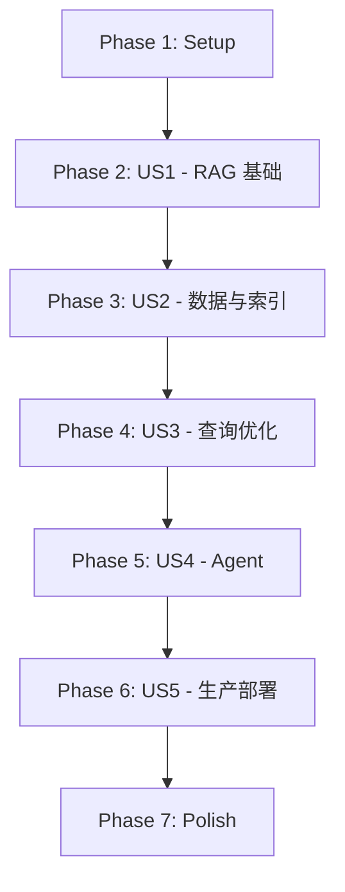
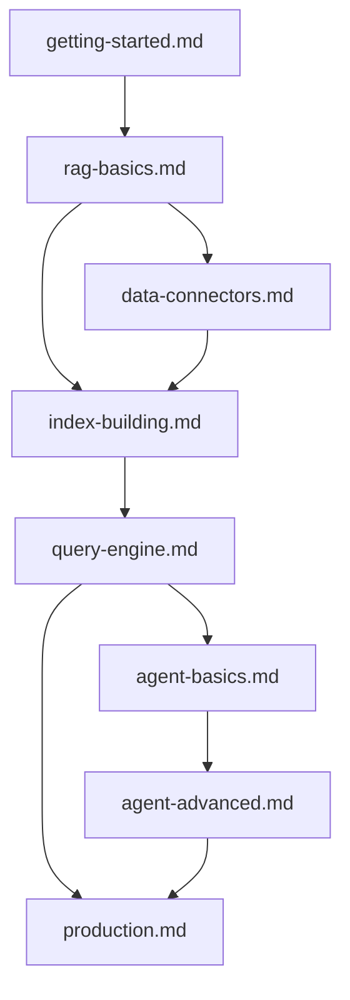

# Tasks: LlamaIndex 学习路线图

**Input**: Design documents from `/specs/002-llamaindex-tutorial/`
**Prerequisites**: plan.md ✅, spec.md ✅, data-model.md ✅, research.md ✅, quickstart.md ✅

**Tests**: 本项目为纯文档项目，不包含自动化测试任务。代码示例需手动验证。

**Organization**: 任务按用户故事分组，每个用户故事可独立完成和验证。

## Format: `[ID] [P?] [Story] Description`

- **[P]**: Can run in parallel (different files, no dependencies)
- **[Story]**: Which user story this task belongs to (e.g., US1, US2, US3)
- Include exact file paths in descriptions

## Path Conventions

- **文档目录**: `docs/ai/llamaindex/` 和 `docs/ai/llamaindex/guide/`
- **配置文件**: `docs/.vitepress/config.mts`
- **规范目录**: `specs/002-llamaindex-tutorial/`

---

## Phase 1: Setup (Infrastructure)

**Purpose**: 项目目录结构创建与 VitePress 配置更新

- [x] T001 [P] 创建目录结构 `docs/ai/llamaindex/` 和 `docs/ai/llamaindex/guide/`
- [x] T002 [P] 创建首页 `docs/ai/llamaindex/index.md` (VitePress hero layout)
- [x] T003 更新 `docs/.vitepress/config.mts` 追加 LlamaIndex 侧边栏和导航配置

**Checkpoint**: 目录结构就绪，VitePress 能识别新增路由

---

## Phase 2: User Story 1 - 零基础学员完成 RAG 基础入门 (Priority: P1) 🎯 MVP

**Goal**: 学员理解 RAG 概念，能够运行最小 RAG 应用

**Independent Test**: 学员能独立运行"对本地 PDF 文档进行问答"的示例程序

### Implementation for User Story 1

- [x] T004 [P] [US1] 创建环境搭建章节 `docs/ai/llamaindex/guide/getting-started.md`
  - 包含: Python/pip 安装、依赖安装、API Key 配置
  - 包含: 避坑指南 (版本不兼容、依赖冲突、网络问题)
  - 包含: 验证安装成功的示例代码
- [x] T005 [P] [US1] 创建 RAG 基础章节 `docs/ai/llamaindex/guide/rag-basics.md`
  - 包含: RAG 概念比喻化解释 ("考试前查笔记再答题")
  - 包含: RAG 工作流程 Mermaid 流程图 (纵向布局)
  - 包含: 最小可运行 RAG 示例 (PDF 问答)
  - 包含: 核心组件解释 (Document, Node, Index, Query Engine)
  - 包含: 避坑指南 (API Key 问题、文档编码问题)
  - 包含: 生产最佳实践 (初始参数推荐)

**Checkpoint**: 学员完成 P1 后可独立运行 RAG Demo

---

## Phase 3: User Story 2 - 掌握 Data Connectors 与 Index 构建 (Priority: P2)

**Goal**: 开发者能从多种数据源加载数据并构建持久化索引

**Independent Test**: 能实现从多数据源加载、构建并持久化向量索引

### Implementation for User Story 2

- [x] T006 [P] [US2] 创建数据加载章节 `docs/ai/llamaindex/guide/data-connectors.md`
  - 包含: SimpleDirectoryReader 基础用法
  - 包含: 支持的文件格式列表 (PDF, Markdown, Word, etc.)
  - 包含: 自定义文件解析器扩展
  - 包含: 远程数据源加载 (S3, Web)
  - 包含: 数据加载流程 Mermaid 图
  - 包含: 避坑指南 (编码问题、大文件内存溢出、PDF 解析失败)
  - 包含: 生产最佳实践 (批量加载、异步加载)
- [x] T007 [P] [US2] 创建索引构建章节 `docs/ai/llamaindex/guide/index-building.md`
  - 包含: VectorStoreIndex 基础用法
  - 包含: SummaryIndex 适用场景
  - 包含: 索引持久化与加载
  - 包含: Chunk 策略详解 (chunk_size, chunk_overlap)
  - 包含: Embedding 模型选择 (OpenAI vs 本地模型)
  - 包含: 向量存储后端集成 (Chroma, Pinecone)
  - 包含: 索引构建流程 Mermaid 图
  - 包含: 避坑指南 (Embedding 下载失败、维度不匹配、持久化权限)
  - 包含: 生产最佳实践 (chunk_size 512-1024, 向量数据库选型)

**Checkpoint**: 开发者能构建持久化索引并重新加载

---

## Phase 4: User Story 3 - 优化 Query Engine 实现精准检索 (Priority: P3)

**Goal**: 开发者能调优 Query Engine 提升问答准确性

**Independent Test**: 对比默认与调优后 Query Engine 的回答质量差异

### Implementation for User Story 3

- [x] T008 [US3] 创建查询引擎章节 `docs/ai/llamaindex/guide/query-engine.md`
  - 包含: as_query_engine() 参数详解
  - 包含: similarity_top_k 调优
  - 包含: response_mode 选择 (tree_summarize, compact, refine)
  - 包含: 重排序后处理器 (Reranker)
  - 包含: 流式响应配置
  - 包含: 多模态查询 (文本 + 图像)
  - 包含: Citation 引用来源功能
  - 包含: 查询流程 Mermaid 图
  - 包含: 避坑指南 (回答不相关、上下文过长、响应超时)
  - 包含: 生产最佳实践 (top_k 3-5, 重排序推荐)

**Checkpoint**: 开发者能识别并解决检索质量问题

---

## Phase 5: User Story 4 - 构建自主 Agent 系统 (Priority: P4)

**Goal**: 高级开发者能构建多步骤智能代理系统

**Independent Test**: 能构建一个多步骤 Agent (查询 → 推理 → 执行)

### Implementation for User Story 4

- [x] T009 [P] [US4] 创建 Agent 基础章节 `docs/ai/llamaindex/guide/agent-basics.md`
  - 包含: Agent 概念比喻化解释 ("能自主思考的 AI 助手")
  - 包含: ReAct 模式解释 ("思考-行动-观察循环")
  - 包含: FunctionTool 自定义工具
  - 包含: QueryEngineTool RAG 工具集成
  - 包含: ReActAgent 基础用法
  - 包含: Agent 执行流程 Mermaid 图
  - 包含: 避坑指南 (工具参数类型错误、无限循环、Token 超限)
  - 包含: 生产最佳实践 (工具设计原则、退出条件)
- [x] T010 [P] [US4] 创建 Agent 进阶章节 `docs/ai/llamaindex/guide/agent-advanced.md`
  - 包含: 多工具 Agent
  - 包含: 任务分解与子任务执行
  - 包含: Agent 流式事件处理
  - 包含: Agent 可观测性与调试
  - 包含: Agent 与 RAG 联合使用
  - 包含: 复杂 Agent 架构 Mermaid 图
  - 包含: 避坑指南 (状态管理、并发控制)
  - 包含: 生产最佳实践 (Agent 监控、成本控制)

**Checkpoint**: 开发者能构建并调试多步骤 Agent

---

## Phase 6: User Story 5 - 生产环境部署 (Priority: P5)

**Goal**: 运维人员能将 RAG 应用部署到生产环境

**Independent Test**: 能完成容器化部署并配置监控告警

### Implementation for User Story 5

- [x] T011 [US5] 创建生产部署章节 `docs/ai/llamaindex/guide/production.md`
  - 包含: 性能优化策略 (缓存、批量处理、异步)
  - 包含: 成本控制方案 (API 调用优化、本地模型替代)
  - 包含: 安全合规 (数据脱敏、访问控制、日志审计)
  - 包含: 监控告警配置 (Metrics, Alerts)
  - 包含: 容器化部署 (Docker, K8s)
  - 包含: 高可用架构设计
  - 包含: 生产架构 Mermaid 图
  - 包含: 避坑指南 (冷启动、内存泄漏、API 限流)
  - 包含: 生产最佳实践 (资源规格、扩缩容策略)

**Checkpoint**: 运维人员能完成端到端生产部署

---

## Phase 7: Polish & Cross-Cutting Concerns

**Purpose**: 验证与完善

- [x] T012 [P] 验证所有代码示例在 LlamaIndex 0.10.x+ 下可运行
- [x] T013 [P] 验证所有 Mermaid 图表使用纵向布局 (TD/TB)
- [x] T014 [P] 验证移动端阅读体验 (320px 宽度测试)
- [x] T015 运行 `pnpm docs:build` 验证构建无错误
- [x] T016 运行 `pnpm format && pnpm lint` 验证代码风格
- [x] T017 执行 quickstart.md 验证流程

---

## Dependencies & Execution Order

### Phase Dependencies

### Chapter Dependencies (内容依赖)

### Parallel Opportunities

- **Phase 1**: T001, T002 可并行 (不同文件)
- **Phase 2**: T004, T005 可并行 (不同章节文件)
- **Phase 3**: T006, T007 可并行 (不同章节文件)
- **Phase 5**: T009, T010 可并行 (不同章节文件)
- **Phase 7**: T012, T013, T014 可并行 (不同验证任务)

---

## Implementation Strategy

### MVP First (US1 Only)

1. Complete Phase 1: Setup
2. Complete Phase 2: US1 (getting-started + rag-basics)
3. **STOP and VALIDATE**: 验证学员能运行 RAG Demo
4. Deploy/Demo if ready

### Incremental Delivery

1. Setup + US1 → 学员可入门 (MVP!)
2. Add US2 → 学员可构建完整数据管道
3. Add US3 → 学员可优化检索质量
4. Add US4 → 学员可构建 Agent
5. Add US5 → 学员可部署生产
6. Polish → 验证质量

---

## Content Validation Checklist (per chapter)

每个章节完成后需验证：

- [ ] frontmatter 包含 title 和 description
- [ ] 至少 1 个 Mermaid 图表 (纵向布局)
- [ ] 至少 2 个代码示例 (带版本标注)
- [ ] 至少 3 个避坑指南条目
- [ ] 至少 1 个生产最佳实践
- [ ] 所有专业术语首次出现时有类比解释
- [ ] 代码示例经过实际运行验证
- [ ] 文件使用 UTF-8 编码 (无 BOM)

---

## Notes

- [P] tasks = 不同文件，无依赖，可并行
- [Story] label = 映射到具体用户故事
- 每个章节应独立可测试
- 每个任务完成后提交 commit
- 任意 checkpoint 可停下来验证
